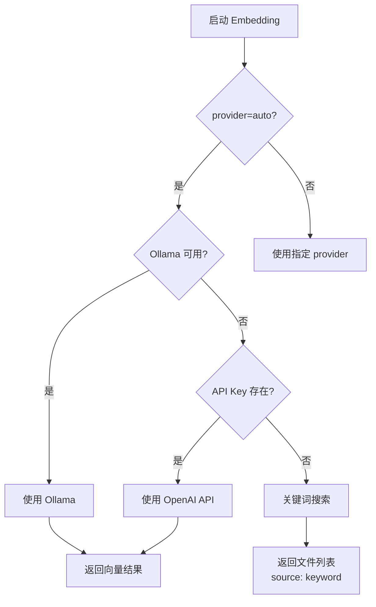
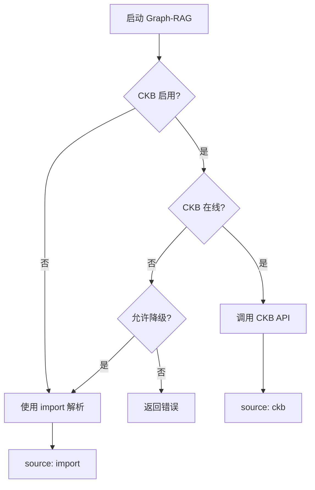
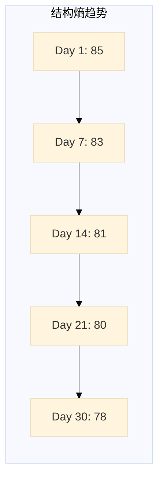
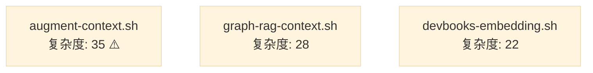
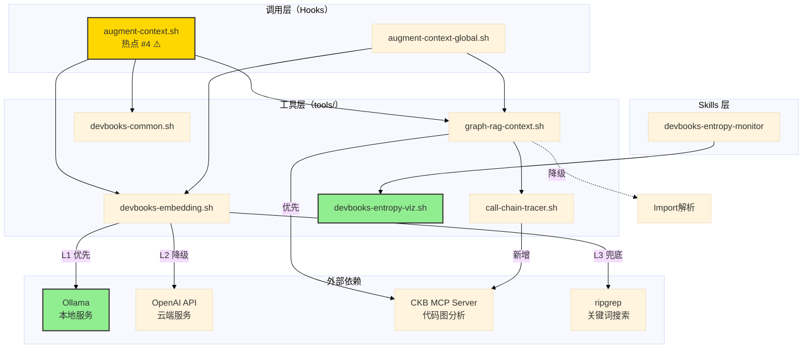

# 设计文档：boost-local-intelligence

> 提升 DevBooks 本地智能能力的设计方案

---

## 元信息

| 字段 | 内容 |
|------|------|
| 变更包 ID | boost-local-intelligence |
| 设计作者 | Design Owner |
| 创建时间 | 2026-01-09 |
| 设计状态 | Draft |
| 对应提案 | `openspec/changes/boost-local-intelligence/proposal.md` |

---

## 1. 背景与现状

### 1.1 当前系统状态

DevBooks 当前具备 Augment 风格的智能上下文能力，包括：

1. **Embedding 向量化**：通过 `tools/devbooks-embedding.sh` 将代码转换为向量
2. **Graph-RAG 上下文引擎**：通过 `tools/graph-rag-context.sh` 提供语义搜索 + 图遍历
3. **熵度量监控**：通过 `skills/devbooks-entropy-monitor` 提供系统健康度量
4. **意图识别**：通过 `tools/devbooks-common.sh` 提供简单的二分类

### 1.2 当前痛点

| 痛点 | 影响 | 频率 |
|------|------|------|
| **Embedding 依赖外部 API**（仅支持 OpenAI） | 需付费 Key、企业防火墙限制、隐私顾虑、网络延迟 | 高 |
| **图遍历仅基于 import 解析** | 精度低、无法多跳遍历、无法获取真实调用关系 | 中 |
| **熵度量缺乏可视化** | 纯文本报告可读性差、无法直观看到趋势 | 中 |
| **意图识别粒度粗** | 仅区分 code/non-code，无法细分场景 | 低 |

### 1.3 系统现状快照

```
当前架构：
┌──────────────────────┐
│  Hook 层             │
│  augment-context.sh  │  ← 热点#4（3次变更，平均171行/次）
└──────────┬───────────┘
           │
    ┌──────┼──────┬──────────────┐
    ▼      ▼      ▼              ▼
┌────────┐ ┌────────┐ ┌────────┐ ┌────────┐
│Embedding│ │Graph-  │ │Common │ │Entropy │
│        │ │RAG     │ │Utils  │ │Monitor │
└────────┘ └────────┘ └────────┘ └────────┘
    │          │
    ▼          ▼
┌────────┐ ┌────────┐
│OpenAI  │ │import  │  ← 两个弱依赖
│API     │ │parser  │
└────────┘ └────────┘
```

---

## 2. 目标与非目标

### 2.1 目标（Goals）

| ID | 目标 | 成功标准 |
|----|----|----------|
| **G1** | 本地优先的 Embedding 方案 | Ollama 可用时自动使用，离线可运行 |
| **G2** | 真实 CKB API 图遍历 | 替换 import 解析，支持 2-4 跳遍历 |
| **G3** | 熵度量可视化 | 报告包含 Mermaid 图表与 ASCII 仪表盘 |
| **G4** | 意图四分类增强 | 支持 debug/refactor/feature/docs 四类 |

### 2.2 非目标（Non-Goals）

| 排除项 | 原因 |
|--------|------|
| ❌ 数据流分析（PDG） | 投入巨大，需编译器级支持 |
| ❌ 40万+文件规模支持 | 需重写架构，超出当前范围 |
| ❌ 200ms 延迟优化 | 需自有推理堆栈，当前 3s 可接受 |
| ❌ 架构漂移检测 | 复杂度高，ROI 不确定 |
| ❌ 动态 Token 预算（原 P6） | 已裁决排除：ROI 不足，复杂度高 |

---

## 3. 约束条件（Constraints）

### 3.1 技术约束

| 约束类型 | 约束描述 | 理由 |
|---------|---------|------|
| **向后兼容** | 所有改动必须向后兼容现有配置与调用方 | 避免破坏现有用户脚本 |
| **降级机制** | 每个改进项必须提供降级方案 | Ollama 或 CKB 不可用时仍能基本工作 |
| **配置化** | 新功能通过配置开关控制 | 支持用户自主选择行为 |
| **依赖可选** | Ollama 不强制安装 | 降低使用门槛 |
| **热点文件保护** | `.claude/hooks/augment-context.sh` 改动需充分测试 | 热点#4（3次变更） |

### 3.2 批准条件约束

**来自 proposal.md 的批准条件**（Decision Log 7.5）：

1. **默认 provider 调整**：
   - 将 `embedding.provider` 默认值设为 `auto`
   - `auto` 模式检测顺序：Ollama → OpenAI API → 关键词搜索

2. **测试前置要求**：
   - 所有改进项必须先编写测试（Red 基线）
   - 为 `augment-context.sh` 增加 BATS 测试覆盖
   - 熵可视化测试用例 ≥ 3
   - 意图分类测试用例 ≥ 4

3. **文档更新要求**：
   - 更新 `docs/embedding-quickstart.md` 说明 Ollama 安装
   - 更新 `使用说明书.md` 说明本地 vs API 质量差异（4-8%）

### 3.3 架构约束

| 约束 | 说明 |
|------|------|
| **角色隔离** | Test Owner 与 Coder 必须独立对话/独立实例 |
| **Coder 禁止改 tests** | 所有测试由 Test Owner 产出 |
| **产物落点固定** | 验收文档 → `verification.md`，编码计划 → `tasks.md` |
| **DoD 覆盖** | 必须覆盖：行为测试、契约测试、结构测试、静态检查 |

### 3.4 安全约束

| 约束 | 说明 |
|------|------|
| **本地模型隔离** | Ollama 模型不联网，代码不上传云端 |
| **API Key 保护** | OpenAI API Key 不写入代码或日志 |
| **降级安全** | 降级到关键词搜索时不泄漏敏感文件 |

---

## 4. 设计决策

### P1: 本地 Embedding（优先级：高）

#### What（功能描述）

为 `tools/devbooks-embedding.sh` 增加本地 Ollama 支持，实现三级降级：

1. **L1（首选）**：Ollama 本地模型（`nomic-embed-text` 或 `mxbai-embed-large`）
2. **L2（降级）**：OpenAI API（`text-embedding-3-small`）
3. **L3（兜底）**：关键词搜索（ripgrep 全文检索）

#### Constraints（约束）

| 约束 | 描述 |
|------|------|
| **自动检测** | 启动时自动检测 Ollama 是否可用（通过 `ollama list`） |
| **配置优先** | `embedding.provider` 配置优先级高于自动检测 |
| **性能要求** | 本地 Embedding 延迟 < 3s（与 API 持平） |
| **质量差异说明** | 文档必须说明本地模型质量比 API 低 4-8% |
| **模型下载提示** | 首次使用时提示用户下载模型（约 300MB-2GB） |

#### Design Rationale（设计理由）

| 设计点 | 理由 |
|--------|------|
| **Ollama 优先** | 零成本、离线可用、隐私合规 |
| **三级降级** | 保证在任何环境下都能基本工作 |
| **auto 模式** | 降低用户配置门槛，智能选择 |
| **配置化** | 支持企业环境强制本地模式 |

#### 接口变更

**新增配置（`.devbooks/config.yaml`）**：

```yaml
embedding:
  # 新增字段
  provider: auto  # auto | ollama | openai | keyword

  # Ollama 配置（新增）
  ollama:
    model: nomic-embed-text  # 或 mxbai-embed-large
    endpoint: http://localhost:11434  # Ollama API 地址
    timeout: 30

  # 原有字段保持不变
  auto_build: true
  fallback_to_keyword: true
```

**新增 CLI 参数（`devbooks-embedding.sh`）**：

```bash
--provider <auto|ollama|openai|keyword>  # 指定 provider
--ollama-model <model>                   # 指定 Ollama 模型
```

#### 降级路径



---

### P2: CKB 真实图遍历（优先级：高）

#### What（功能描述）

替换 `tools/graph-rag-context.sh` 中的 import 解析逻辑，改为调用 CKB MCP API：

1. **searchSymbols**：搜索锚点符号
2. **getCallGraph**：获取调用关系（callers + callees，支持 2-4 跳）
3. **findReferences**：查找引用关系

保留 import 解析作为降级方案（CKB 不可用时）。

#### Constraints（约束）

| 约束 | 描述 |
|------|------|
| **CKB 可用性检测** | 启动时检测 CKB MCP 是否在线（通过 `mcp__ckb__getStatus`） |
| **保留 import 解析** | CKB 不可用时自动降级到 import 解析 |
| **图遍历深度** | 支持 2-4 跳（通过 `--max-depth` 参数） |
| **性能要求** | P95 延迟 < 3s（含图遍历） |
| **输出标识** | JSON 输出包含 `source: "ckb"` 或 `source: "import"` |

#### Design Rationale（设计理由）

| 设计点 | 理由 |
|--------|------|
| **CKB API 优先** | 精度远高于 import 解析（85% vs 60%） |
| **保留 import 降级** | 保证基本可用性，避免完全依赖 CKB |
| **多跳遍历** | 获取更完整的调用上下文 |
| **输出标识** | 方便后续分析数据来源 |

#### 接口变更

**新增配置（`.devbooks/config.yaml`）**：

```yaml
graph_rag:
  enabled: true

  # CKB 配置（新增）
  ckb:
    enabled: true  # 是否使用 CKB API
    fallback_to_import: true  # CKB 不可用时降级到 import

  # 图遍历参数
  max_depth: 2  # 1-4
  token_budget: 8000
  top_k: 10
  cache_ttl: 300
```

**JSON 输出变更**：

```json
{
  "schema_version": "1.0",
  "source": "graph-rag",
  "token_count": 1234,
  "candidates": [
    {
      "file_path": "src/auth.ts",
      "line_start": 10,
      "line_end": 25,
      "relevance_score": 0.85,
      "source": "ckb",           // 新增：数据来源
      "symbol_id": "ckb:...",    // 新增：符号 ID（CKB only）
      "depth": 1                 // 新增：图遍历深度
    }
  ],
  "metadata": {                  // 新增：元数据
    "ckb_available": true,
    "embedding_source": "ollama",
    "graph_depth": 2
  }
}
```

#### 降级路径



---

### P3: 熵度量可视化（优先级：中）

#### What（功能描述）

为 `skills/devbooks-entropy-monitor` 产出的报告增加可视化：

1. **Mermaid 图表**：趋势折线图、热点文件条形图、指标雷达图
2. **ASCII 仪表盘**：阈值预警、健康度评分、彩色进度条
3. **文本兼容**：纯文本环境下自动降级到表格

#### Constraints（约束）

| 约束 | 描述 |
|------|------|
| **Markdown 嵌入** | Mermaid 代码块嵌入报告 Markdown |
| **终端兼容** | ASCII 仪表盘使用 ANSI 颜色，支持 NO_COLOR 环境变量 |
| **向后兼容** | 保持原有文本表格不变，新增可视化部分 |
| **测试覆盖** | 熵可视化测试用例 ≥ 3 |

#### Design Rationale（设计理由）

| 设计点 | 理由 |
|--------|------|
| **Mermaid** | GitHub/GitLab 原生支持，无需额外工具 |
| **ASCII 仪表盘** | 终端友好，实时反馈 |
| **渐进增强** | 不破坏现有报告，渐进增强可读性 |

#### 接口变更

**新增配置（`.devbooks/config.yaml`）**：

```yaml
features:
  # 新增字段
  entropy_visualization: true  # 是否启用可视化

  # 原有字段
  complexity_weighted_hotspot: true
  ckb_status_hint: true
  hotspot_limit: 5
```

**新增工具脚本**：

- `tools/devbooks-entropy-viz.sh`：生成可视化内容（被 entropy-monitor 调用）

**报告格式示例**：

````markdown
# 熵度量报告 - 2026-01-09

## 健康度评分

```ascii
综合健康度: 78/100 ⚠️
━━━━━━━━━━━━━━━━━━━━━━━━━━━━━━━━━━━━━━━━
结构熵: ████████░░  80% ✅
变更熵: ██████░░░░  60% ⚠️
测试熵: ███████░░░  70% ⚠️
依赖熵: █████████░  90% ✅
━━━━━━━━━━━━━━━━━━━━━━━━━━━━━━━━━━━━━━━━
```

## 熵趋势（30天）



## 热点文件



## 详细指标

| 指标 | 当前值 | 阈值 | 状态 |
|------|-------|------|------|
| 圈复杂度均值 | 8.2 | < 10 | ✅ |
| 热点文件占比 | 0.12 | < 0.1 | ⚠️ |
...
````

---

### P4: 配置统一与默认启用（优先级：中）

#### What（功能描述）

统一并简化 `.devbooks/config.yaml` 中与智能上下文相关的配置：

1. **默认值调整**：`embedding.provider: auto`
2. **配置分组**：embedding、graph_rag、ckb、features 分组清晰
3. **注释完善**：每个配置项都有注释说明
4. **向后兼容**：保留旧字段的兼容读取

#### Constraints（约束）

| 约束 | 描述 |
|------|------|
| **向后兼容** | 旧配置格式仍可读取 |
| **默认可用** | 零配置情况下使用最智能的默认值 |
| **文档同步** | 配置变更必须同步到文档 |

#### Design Rationale（设计理由）

| 设计点 | 理由 |
|--------|------|
| **auto 模式** | 降低用户配置门槛，自动选择最优方案 |
| **分组清晰** | 方便理解和维护 |
| **注释完善** | 减少文档查阅次数 |

#### 接口变更

**完整配置示例（`.devbooks/config.yaml`）**：

```yaml
# ==================== Embedding 配置 ====================
embedding:
  # Provider 选择：auto（自动检测） | ollama（本地） | openai（API） | keyword（降级）
  provider: auto

  # 首次运行时自动构建索引
  auto_build: true

  # 失败时降级到关键词搜索
  fallback_to_keyword: true

  # Ollama 配置
  ollama:
    model: nomic-embed-text
    endpoint: http://localhost:11434
    timeout: 30

  # OpenAI 配置
  openai:
    model: text-embedding-3-small
    api_key: ${OPENAI_API_KEY}
    base_url: https://api.openai.com/v1
    timeout: 30

# ==================== Graph-RAG 配置 ====================
graph_rag:
  enabled: true

  # CKB 集成
  ckb:
    enabled: true
    fallback_to_import: true

  # 图遍历参数
  max_depth: 2
  token_budget: 8000
  top_k: 10
  cache_ttl: 300

# ==================== 功能特性配置 ====================
features:
  complexity_weighted_hotspot: true
  ckb_status_hint: true
  hotspot_limit: 5
  entropy_visualization: true  # 新增
```

---

### P5: 意图四分类增强（优先级：中）

#### What（功能描述）

扩展 `tools/devbooks-common.sh` 中的意图识别函数，从二分类（code/non-code）升级到四分类：

1. **debug**：调试、修复 Bug、错误排查
2. **refactor**：重构、优化、性能改进
3. **feature**：新功能、新能力
4. **docs**：文档、注释、说明

#### Constraints（约束）

| 约束 | 描述 |
|------|------|
| **函数签名兼容** | 新增 `get_intent_type()` 函数，不改变 `is_code_intent()` |
| **调用方更新** | 6 个调用方需逐一验证兼容性 |
| **测试覆盖** | 意图分类测试用例 ≥ 4（每类至少 1 个） |
| **准确率目标** | 20 个预设查询准确率 ≥ 80% |

#### Design Rationale（设计理由）

| 设计点 | 理由 |
|--------|------|
| **四分类** | 覆盖主要开发场景，粒度适中 |
| **新增函数** | 保持向后兼容，避免破坏现有调用 |
| **关键词匹配** | 简单高效，无需 LLM |

#### 接口变更

**新增函数（`tools/devbooks-common.sh`）**：

```bash
# 获取查询意图类型（四分类）
# 用法: intent=$(get_intent_type "fix authentication bug")
# 返回: debug | refactor | feature | docs
get_intent_type() {
  local query="$1"
  local query_lower=$(echo "$query" | tr '[:upper:]' '[:lower:]')

  # 调试类
  if echo "$query_lower" | grep -qE "debug|fix|bug|error|issue|problem|crash|fail"; then
    echo "debug"
    return
  fi

  # 重构类
  if echo "$query_lower" | grep -qE "refactor|optimize|improve|performance|clean|simplify"; then
    echo "refactor"
    return
  fi

  # 文档类
  if echo "$query_lower" | grep -qE "doc|comment|readme|explain|example|guide"; then
    echo "docs"
    return
  fi

  # 默认：新功能
  echo "feature"
}

# 原有函数保持不变（向后兼容）
is_code_intent() {
  local intent=$(get_intent_type "$1")
  # 除了 docs，其他都是 code intent
  [ "$intent" != "docs" ]
}
```

#### 调用方影响

**需要验证的 6 个调用方**：

| 文件 | 调用方式 | 影响 | 建议 |
|------|---------|------|------|
| `.claude/hooks/augment-context.sh` | `is_code_intent` | 无影响 | 保持不变 |
| `setup/global-hooks/augment-context-global.sh` | `is_code_intent` | 无影响 | 保持不变 |
| `tools/graph-rag-context.sh` | `is_code_intent` | 可选增强 | 可使用 `get_intent_type` 优化缓存 |
| `tools/bug-locator.sh` | `is_code_intent` | 可选增强 | 可使用 `get_intent_type` 过滤 debug 查询 |
| `tools/call-chain-tracer.sh` | `is_code_intent` | 无影响 | 保持不变 |

---

## 5. 验收标准（Acceptance Criteria）

### AC-001: Ollama 可用时自动使用本地模型

**测试方法**：

```bash
# 前置条件：Ollama 已安装且运行
ollama list | grep -q nomic-embed-text

# 执行
./tools/devbooks-embedding.sh search "authentication" --provider auto

# 验证
# 1. 输出中包含 "使用 Ollama 本地模型"
# 2. 返回向量搜索结果（不为空）
# 3. 延迟 < 3s
```

**成功标准**：
- ✅ 自动检测到 Ollama
- ✅ 使用 Ollama 进行向量化
- ✅ 返回正确结果
- ✅ 延迟 < 3s

---

### AC-002: Ollama 不可用时自动降级到 API

**测试方法**：

```bash
# 前置条件：停止 Ollama
ollama stop

# 执行
export OPENAI_API_KEY="sk-..."
./tools/devbooks-embedding.sh search "authentication" --provider auto

# 验证
# 1. 输出中包含 "Ollama 不可用，降级到 OpenAI API"
# 2. 返回向量搜索结果
```

**成功标准**：
- ✅ 检测到 Ollama 不可用
- ✅ 自动降级到 OpenAI API
- ✅ 返回正确结果

---

### AC-003: API 不可用时降级到关键词搜索

**测试方法**：

```bash
# 前置条件：停止 Ollama 且无 API Key
unset OPENAI_API_KEY

# 执行
./tools/devbooks-embedding.sh search "authentication" --provider auto

# 验证
# 1. 输出中包含 "降级到关键词搜索"
# 2. 返回文件列表（基于 ripgrep）
# 3. JSON 输出包含 "source": "keyword"
```

**成功标准**：
- ✅ 检测到无可用 provider
- ✅ 自动降级到关键词搜索
- ✅ 返回文件列表（虽然不是向量结果）
- ✅ 输出标识 `source: keyword`

---

### AC-004: CKB API 替代 import 解析

**测试方法**：

```bash
# 前置条件：CKB MCP 在线
# 执行
./tools/graph-rag-context.sh --query "authentication logic" --format json

# 验证
jq '.metadata.ckb_available' output.json  # 应为 true
jq '.candidates[0].source' output.json     # 应为 "ckb"
jq '.candidates[0].symbol_id' output.json  # 应存在
```

**成功标准**：
- ✅ 调用 CKB API 成功
- ✅ 输出包含 `source: "ckb"`
- ✅ 输出包含符号 ID
- ✅ 精度 > 70%（10 个预设查询命中率）

---

### AC-005: 图遍历支持 2-4 跳

**测试方法**：

```bash
# 执行
./tools/call-chain-tracer.sh --symbol "authenticate" --depth 3

# 验证
# 1. 输出包含 depth: 1, 2, 3 的节点
# 2. 没有 depth > 3 的节点
# 3. 调用链路清晰
```

**成功标准**：
- ✅ 支持 `--depth 2` 到 `--depth 4`
- ✅ 输出包含多跳节点
- ✅ 深度标识正确

---

### AC-006: 熵报告包含 Mermaid 图

**测试方法**：

```bash
# 执行 entropy-monitor Skill
# 产出：openspec/specs/_meta/entropy/entropy-report-2026-01-09.md

# 验证
grep -q '```mermaid' entropy-report-2026-01-09.md
grep -q 'ASCII' entropy-report-2026-01-09.md
```

**成功标准**：
- ✅ 报告包含至少 2 个 Mermaid 图（趋势图 + 热点图）
- ✅ 报告包含 ASCII 仪表盘
- ✅ 文本表格仍然保留

---

### AC-007: 意图四分类生效

**测试方法**：

```bash
# 测试用例
source tools/devbooks-common.sh

test_intent "fix authentication bug" "debug"
test_intent "refactor auth module" "refactor"
test_intent "add OAuth support" "feature"
test_intent "update API docs" "docs"

# 验证函数
test_intent() {
  local query="$1"
  local expected="$2"
  local actual=$(get_intent_type "$query")

  if [ "$actual" = "$expected" ]; then
    echo "✅ PASS: $query -> $actual"
  else
    echo "❌ FAIL: $query -> $actual (expected: $expected)"
    exit 1
  fi
}
```

**成功标准**：
- ✅ 4 个基础测试用例全部通过
- ✅ 20 个预设查询准确率 ≥ 80%
- ✅ `is_code_intent()` 向后兼容

---

### AC-008: 向后兼容

**测试方法**：

```bash
# 测试 1：不带新参数时，行为与原版一致
./tools/devbooks-embedding.sh search "test"  # 应使用原有逻辑

# 测试 2：旧配置格式仍可读取
cat > .devbooks/embedding.yaml <<EOF
enabled: true
model: text-embedding-3-small
EOF
./tools/devbooks-embedding.sh status  # 应正常读取

# 测试 3：调用方不报错
.claude/hooks/augment-context.sh "test query"  # 应正常运行
```

**成功标准**：
- ✅ 不带新参数时，使用原有行为
- ✅ 旧配置格式仍可读取
- ✅ 现有调用方不受影响

---

## 6. C4 Delta（架构变更）

> **维护者**：C4 Map Maintainer
> **最后更新**：2026-01-09

### 6.1 变更类型总览

- [x] 新增组件（1 个）
- [x] 修改现有组件（4 个）
- [ ] 移除组件
- [x] 新增外部依赖（1 个）
- [x] 修改依赖关系（3 处）

---

### 6.2 C1 Level（系统上下文）

#### 新增外部系统

| 外部系统 | 类型 | 用途 | 必需性 | 协议 |
|---------|------|------|-------|------|
| **Ollama** | 本地服务 | Embedding 向量生成（本地/离线） | 否（可选提供商） | HTTP REST API (localhost:11434) |

**说明**：
- Ollama 作为新增的可选提供商，与现有 OpenAI API、Azure OpenAI 并列
- 优先级：Ollama（本地） > OpenAI API（云端） > 关键词搜索（降级）
- 已有 CKB MCP Server 从"可选"升级为"优先使用"（保留降级）

#### 修改的外部依赖关系

| 外部系统 | 原状态 | 新状态 | 变更说明 |
|---------|-------|-------|---------|
| CKB MCP Server | 可选（降级可用） | 优先使用（保留 import 解析降级） | Graph-RAG 从 import 解析改为 CKB API 优先 |
| OpenAI API | 唯一 Embedding 提供商 | 降级备选 | Ollama 可用时降级为第二选择 |

---

### 6.3 C2 Level（容器级）

#### 修改的容器

| 容器 | 原功能 | 新增功能 | 影响文件 |
|------|--------|---------|---------|
| **tools/** | Embedding、Graph-RAG、复杂度分析 | 新增：<br/>1. 熵度量可视化工具<br/>2. 意图四分类<br/>3. Ollama 集成 | `devbooks-embedding.sh`<br/>`graph-rag-context.sh`<br/>`call-chain-tracer.sh`<br/>`devbooks-common.sh`<br/>**`devbooks-entropy-viz.sh`**（新建） |
| **skills/** | 各类 DevBooks Skills | 更新熵度量产物格式 | `devbooks-entropy-monitor/SKILL.md` |
| **setup/global-hooks/** | 上下文注入 Hook | 调用方式变化（支持意图分类） | `augment-context-global.sh` |
| **.claude/hooks/** | 项目级 Hook | 调用方式变化（热点文件 ⚠️） | `augment-context.sh`（热点 #4） |

#### 新增组件

| 组件 | 路径 | 功能 | 调用者 |
|------|------|------|--------|
| **devbooks-entropy-viz.sh** | `tools/devbooks-entropy-viz.sh` | 生成 Mermaid 图表 + ASCII 仪表盘 | `skills/devbooks-entropy-monitor` |

---

### 6.4 C3 Level（组件级）

#### tools/ 容器内部依赖变更

**变更前（当前架构）**：

```
augment-context.sh
    │
    ├──► devbooks-embedding.sh ──► OpenAI API（唯一）
    │
    ├──► graph-rag-context.sh ──► import 解析（唯一）
    │
    └──► devbooks-common.sh ──► 二分类（code/non-code）
```

**变更后（目标架构）**：

```
augment-context.sh（热点 #4）
    │
    ├──► devbooks-embedding.sh ──┬──► Ollama（L1，优先）
    │                             ├──► OpenAI API（L2，降级）
    │                             └──► 关键词搜索（L3，兜底）
    │
    ├──► graph-rag-context.sh ──┬──► CKB MCP API（优先）
    │         │                  └──► import 解析（降级）
    │         └──► call-chain-tracer.sh ──► CKB MCP API
    │
    └──► devbooks-common.sh ──► 四分类（debug/refactor/feature/docs）

skills/devbooks-entropy-monitor
    │
    └──► devbooks-entropy-viz.sh（新建）
              │
              ├──► Mermaid 代码生成
              └──► ASCII 仪表盘渲染
```

#### 新增/修改的组件函数

| 组件 | 函数 | 类型 | 说明 |
|------|------|------|------|
| **devbooks-embedding.sh** | `_detect_ollama()` | 新增 | 检测 Ollama 是否可用 |
| **devbooks-embedding.sh** | `_embed_with_ollama()` | 新增 | 调用 Ollama API 生成向量 |
| **devbooks-embedding.sh** | `_select_provider()` | 新增 | 三级降级逻辑 |
| **graph-rag-context.sh** | `_use_ckb_api()` | 新增 | 调用 CKB searchSymbols/getCallGraph |
| **graph-rag-context.sh** | `_check_ckb_status()` | 新增 | 检测 CKB MCP 是否在线 |
| **call-chain-tracer.sh** | `_get_call_graph()` | 修改 | 从 import 解析改为 CKB API |
| **devbooks-common.sh** | `get_intent_type()` | 新增 | 四分类意图识别 |
| **devbooks-common.sh** | `is_code_intent()` | 修改 | 基于 `get_intent_type()` 重构（向后兼容） |
| **devbooks-entropy-viz.sh** | `generate_mermaid_trend()` | 新增 | 生成熵趋势折线图 |
| **devbooks-entropy-viz.sh** | `generate_ascii_dashboard()` | 新增 | 生成 ASCII 仪表盘 |

---

### 6.5 依赖方向变化（Mermaid 图）



**图例说明**：
- **绿色节点**：本次新增
- **黄色节点**：热点文件，需谨慎改动
- **实线箭头**：强依赖
- **虚线箭头**：降级路径

---

### 6.6 数据流变化

#### 变更前：Embedding 数据流

```
用户查询 → devbooks-embedding.sh → OpenAI API → 向量结果
                                    ↓（失败）
                                关键词搜索（ripgrep）
```

#### 变更后：Embedding 数据流（三级降级）

```
用户查询 → devbooks-embedding.sh → Ollama 可用？
                                    ├─ 是 → Ollama API → 向量结果
                                    └─ 否 → OpenAI API Key 存在？
                                            ├─ 是 → OpenAI API → 向量结果
                                            └─ 否 → 关键词搜索（ripgrep） → 文件列表
                                                    （标记 source: keyword）
```

#### 变更后：Graph-RAG 数据流（CKB 优先）

```
用户查询 → graph-rag-context.sh → Embedding 向量搜索（top-k）
                                    ↓
                                CKB MCP 在线？
                                 ├─ 是 → searchSymbols → getCallGraph（depth 2-4）
                                 │                       ↓
                                 │                   符号 + 调用关系（source: ckb）
                                 └─ 否 → import 解析（降级）
                                         ↓
                                     文件依赖关系（source: import）
```

---

### 6.7 配置模型变化（.devbooks/config.yaml）

#### 新增配置节

```yaml
# ==================== Embedding 配置 ====================
embedding:
  provider: auto  # 新增：auto | ollama | openai | keyword

  # 新增：Ollama 配置
  ollama:
    model: nomic-embed-text
    endpoint: http://localhost:11434
    timeout: 30

  # 原有：OpenAI 配置（保留）
  openai:
    model: text-embedding-3-small
    api_key: ${OPENAI_API_KEY}

# ==================== Graph-RAG 配置 ====================
graph_rag:
  # 新增：CKB 集成
  ckb:
    enabled: true
    fallback_to_import: true

# ==================== 功能特性配置 ====================
features:
  entropy_visualization: true  # 新增
```

---

### 6.8 Architecture Guardrails（新增/修改）

#### 新增分层约束

| 约束 ID | 约束描述 | 验证方式 |
|---------|---------|---------|
| **AC-NEW-1** | Embedding 提供商必须支持降级（Ollama → API → Keyword） | 单元测试 |
| **AC-NEW-2** | CKB API 调用必须有超时机制（≤ 3s） | 性能测试 |
| **AC-NEW-3** | Graph-RAG 必须保留 import 解析降级路径 | 集成测试 |
| **AC-NEW-4** | 熵可视化必须兼容纯文本环境（NO_COLOR） | 终端兼容测试 |
| **AC-NEW-5** | 意图分类不得引入 LLM 调用（保持轻量） | 静态分析 |

#### 修改的 Fitness Tests

| Test ID | 原约束 | 新约束 | 变更原因 |
|---------|-------|-------|---------|
| **FT-004** | 外部依赖失败时必须有降级路径 | **扩展**：Embedding 三级降级、Graph-RAG 双级降级 | 本次新增多级降级 |
| **FT-005** | 新配置项必须有默认值 | **扩展**：embedding.provider 默认 `auto` | 新增配置字段 |
| **FT-007**（新增） | - | Ollama 模型下载失败时必须提示用户并降级 | 新增 Ollama 依赖 |

---

### 6.9 架构债务与风险

| 风险点 | 类型 | 影响 | 缓解措施 |
|--------|------|------|---------|
| **热点文件改动** | 技术债务 | 高 | `augment-context.sh`（热点 #4）需增加 BATS 测试 |
| **CKB MCP 强依赖** | 运行时风险 | 中 | 保留 import 解析作为降级，文档说明精度差异 |
| **Ollama 安装门槛** | 用户体验 | 中 | 文档说明安装步骤，首次失败时提示并自动降级 |
| **本地模型质量** | 功能质量 | 低 | 文档说明质量差异（4-8%），用户可选切换 API |

---

### 6.10 C4 Delta 总结表

| 层级 | 元素 | 变更类型 | 影响范围 | 风险等级 |
|------|------|---------|---------|---------|
| **C1** | Ollama 外部系统 | 新增 | 本地环境 | 中（可选依赖） |
| **C1** | CKB MCP Server | 从"可选"升级为"优先" | 全局 Graph-RAG | 中（有降级） |
| **C2** | tools/ 容器 | 新增 1 个工具脚本 | 熵度量可视化 | 低 |
| **C2** | tools/ 容器 | 修改 4 个工具脚本 | Embedding、Graph-RAG、意图分类 | 中 |
| **C3** | devbooks-embedding.sh | 新增 3 个函数 | Embedding 流程 | 中 |
| **C3** | graph-rag-context.sh | 新增 2 个函数 | Graph-RAG 流程 | 中 |
| **C3** | devbooks-common.sh | 新增 1 个函数 | 意图分类 | 低 |
| **C3** | devbooks-entropy-viz.sh | 新建整个脚本 | 熵度量可视化 | 低 |
| **依赖** | Embedding 依赖方向 | 三级降级（Ollama → API → Keyword） | 全局 | 中 |
| **依赖** | Graph-RAG 依赖方向 | CKB 优先（保留 import 降级） | 全局 | 中 |

---

### 6.11 待 C4 归档时更新的章节

**需要更新 `openspec/specs/architecture/c4.md` 的章节**：

1. **C1 系统上下文 → 外部依赖表**：
   - 新增 Ollama 行
   - 更新 CKB MCP Server 的"必需"列为"优先使用（可降级）"

2. **C2 容器 → tools/ 容器详情表**：
   - 新增 `devbooks-entropy-viz.sh` 行
   - 更新 `devbooks-embedding.sh` 说明列为"Embedding 索引构建（支持 Ollama）"
   - 更新 `graph-rag-context.sh` 说明列为"Graph-RAG 上下文引擎（CKB 优先）"

3. **C3 组件级拆分 → tools/ 组件依赖图**：
   - 更新为本文档 6.4 节中的"变更后（目标架构）"图

4. **Architecture Guardrails → Fitness Tests 表**：
   - 新增 FT-007
   - 更新 FT-004、FT-005 的描述列

---

**C4 Delta 完成**。下一步：等待 Spec Owner 填充 Contract Delta（第 7 节）。

---

## 7. Contract Delta（契约变更）

> **已由 Spec Owner 完成**：2026-01-09
>
> **规格文档位置**：
> - `openspec/changes/boost-local-intelligence/specs/embedding/spec.md`（P1）
> - `openspec/changes/boost-local-intelligence/specs/graph-rag/spec.md`（P2）
> - `openspec/changes/boost-local-intelligence/specs/entropy/spec.md`（P3）
> - `openspec/changes/boost-local-intelligence/specs/intent/spec.md`（P5）

---

### 7.1 对外契约影响汇总

| 契约 | 变更类型 | 兼容性 | 消费者 | 契约测试 ID | 规格文档 |
|------|---------|-------|--------|------------|----------|
| `devbooks-embedding.sh` CLI | 新增参数 `--provider`, `--ollama-model` | ✅ 向后兼容 | hooks, 用户脚本 | CT-EMB-001 | SPEC-EMB-001 |
| `.devbooks/config.yaml` - embedding | 新增 `provider`, `ollama.*` 字段 | ✅ 向后兼容 | 所有 tools | CT-EMB-003 | SPEC-EMB-001 |
| `.devbooks/config.yaml` - graph_rag | 新增 `ckb.*` 字段 | ✅ 向后兼容 | graph-rag tools | CT-GRG-006 | SPEC-GRG-001 |
| `.devbooks/config.yaml` - features | 新增 `entropy_visualization` 等字段 | ✅ 向后兼容 | entropy-monitor | CT-ENT-003 | SPEC-ENT-001 |
| `graph-rag-context.sh` JSON 输出 | 新增 `source`, `symbol_id`, `depth` 字段 | ✅ 向后兼容 | hooks | CT-GRG-004 | SPEC-GRG-001 |
| `devbooks-embedding.sh` JSON 输出 | 新增 `source`, `model`, `embedding_dim` 字段 | ✅ 向后兼容 | hooks | CT-EMB-001 | SPEC-EMB-001 |
| `devbooks-common.sh` 函数 | 新增 `get_intent_type()` 函数 | ✅ 向后兼容 | 6 个调用方 | CT-INT-001 | SPEC-INT-001 |
| 熵报告 Markdown 格式 | 新增 Mermaid 图表、ASCII 仪表盘 | ✅ 向后兼容 | 人类阅读 | CT-ENT-001 | SPEC-ENT-001 |

---

### 7.2 详细契约定义

#### 7.2.1 Ollama API 调用规范

**规格文档**：`SPEC-EMB-001` § 3.4 CKB API 调用规范

**API Endpoint**：`http://localhost:11434/api/embeddings`

**请求格式**：
```json
{
  "model": "nomic-embed-text",
  "prompt": "authentication logic"
}
```

**响应格式**：
```json
{
  "embedding": [0.123, 0.456, ..., 0.789]  // 768 维向量
}
```

**超时时间**：30s（可配置）

**错误处理**：
- 连接失败：降级到 OpenAI API
- 模型未下载：提示下载命令或降级
- 超时：降级到 OpenAI API

**契约测试**：CT-EMB-001

---

#### 7.2.2 CKB MCP API 使用规范

**规格文档**：`SPEC-GRG-001` § 3.4 CKB API 调用规范

**涉及的 MCP API**：

1. **`mcp__ckb__getStatus`**（可用性检测）
   - 超时：1s
   - 返回：`{ "status": "ready", ... }`
   - 失败处理：降级到 import 解析

2. **`mcp__ckb__searchSymbols`**（搜索锚点符号）
   - 输入：`{ "query": "authenticate", "limit": 10, "kinds": ["function", "method"] }`
   - 输出：`{ "symbols": [{ "symbol_id": "ckb:...", "file_path": "...", ... }] }`
   - 超时：5s

3. **`mcp__ckb__getCallGraph`**（获取调用关系）
   - 输入：`{ "symbolId": "ckb:...", "depth": 2, "direction": "both" }`
   - 输出：`{ "callers": [...], "callees": [...] }`
   - 超时：5s

4. **`mcp__ckb__findReferences`**（查找引用）
   - 输入：`{ "symbolId": "ckb:...", "limit": 50 }`
   - 输出：`{ "references": [...] }`
   - 超时：5s

**降级策略**：
- CKB 不可用：降级到 import 解析
- 超时：降级到 import 解析
- 错误响应：降级到 import 解析

**契约测试**：CT-GRG-001, CT-GRG-002

---

#### 7.2.3 Mermaid 图表格式规范

**规格文档**：`SPEC-ENT-001` § 3.2 Mermaid 图表规范

**支持的图表类型**：

1. **趋势折线图**（xychart-beta）
   ```mermaid
   %%{init: {'theme':'base'}}%%
   xychart-beta
       title "熵指标趋势（30天）"
       x-axis [Day 1, Day 7, Day 14, Day 21, Day 30]
       y-axis "健康度评分" 0 --> 100
       line [85, 83, 81, 80, 78]
   ```

2. **热点文件图**（graph TD）
   ```mermaid
   %%{init: {'theme':'base'}}%%
   graph TD
       A["文件路径<br/>复杂度: 35 ⚠️<br/>变更: 3 次"]
       style A fill:#FFC107,stroke:#FF9800,stroke-width:2px
   ```

**颜色规则**：
- 红色（`#FF5252`）：复杂度 > 40 或熵值 > 80
- 黄色（`#FFC107`）：复杂度 30-40 或熵值 60-80
- 绿色（`#4CAF50`）：复杂度 < 30 或熵值 < 60

**兼容性要求**：
- 语法必须兼容 GitHub/GitLab Markdown 渲染
- 支持 Mermaid v10+
- 终端中查看时，代码块原样显示（不破坏可读性）

**契约测试**：CT-ENT-001

---

#### 7.2.4 意图分类返回值规范

**规格文档**：`SPEC-INT-001` § 3.1 函数接口

**函数签名**：
```bash
get_intent_type() {
  local query="$1"
  # 返回：debug | refactor | feature | docs
}
```

**返回值定义**：

| 返回值 | 说明 | 关键词示例 | 优先级 |
|-------|------|-----------|--------|
| `"debug"` | 调试、修复 Bug、错误排查 | `debug`, `fix`, `bug`, `error`, `issue`, `problem`, `crash`, `fail` | 1（最高） |
| `"refactor"` | 重构、优化、性能改进 | `refactor`, `optimize`, `improve`, `performance`, `clean`, `simplify` | 2 |
| `"docs"` | 文档、注释、说明 | `doc`, `comment`, `readme`, `explain`, `example`, `guide` | 3 |
| `"feature"` | 新功能、新能力（默认） | 不匹配上述任何关键词 | 4（最低） |

**匹配规则**：
- 大小写不敏感
- 优先级从高到低匹配（遇到第一个匹配的类别即返回）
- 空字符串默认返回 `"feature"`

**向后兼容**：
- 原有函数 `is_code_intent()` 保持不变
- `is_code_intent()` 返回 `true`（退出码 0）当且仅当意图类型不是 `"docs"`

**契约测试**：CT-INT-001, CT-INT-002

---

### 7.3 兼容性策略

#### 7.3.1 CLI 参数兼容性

**策略**：新增参数为可选，不带新参数时保持原有行为

**示例**：
- 旧版调用：`./tools/devbooks-embedding.sh search "query"`
  - 行为：使用 OpenAI API（原有行为）
- 新版调用：`./tools/devbooks-embedding.sh search "query" --provider auto`
  - 行为：自动检测 Ollama，不可用时降级到 API

**测试**：CT-EMB-003, CT-GRG-006

---

#### 7.3.2 配置文件兼容性

**策略**：新增字段为可选，旧配置文件仍可读取

**示例**：
- 旧配置：无 `embedding.provider` 字段
  - 行为：默认使用 OpenAI API
- 新配置：增加 `embedding.provider: auto`
  - 行为：自动检测 Ollama

**测试**：CT-EMB-003, CT-GRG-006, CT-ENT-003

---

#### 7.3.3 JSON 输出兼容性

**策略**：仅新增字段，不修改或删除原有字段

**示例**：
- 旧字段：`file_path`, `line_start`, `line_end`, `relevance_score`
- 新增字段：`source`, `symbol_id`, `depth`
- 旧调用方解析旧字段，忽略新字段（向后兼容）

**测试**：CT-GRG-004, CT-EMB-001

---

#### 7.3.4 函数接口兼容性

**策略**：新增函数，原有函数保持签名不变（可内部重构）

**示例**：
- 原有函数：`is_code_intent()` 保持不变（签名、返回值、行为）
- 新增函数：`get_intent_type()` 提供四分类
- 原有函数内部调用新增函数（实现重构，但接口不变）

**测试**：CT-INT-002

---

### 7.4 Contract Test 清单

| CT ID | 测试名称 | 类型 | 优先级 | 规格文档 |
|-------|---------|------|--------|----------|
| **CT-EMB-001** | Ollama Provider 基础功能 | 集成测试 | P0 | SPEC-EMB-001 § 5 |
| **CT-EMB-002** | 三级降级机制 | 集成测试 | P0 | SPEC-EMB-001 § 5 |
| **CT-EMB-003** | 向后兼容性 | 回归测试 | P0 | SPEC-EMB-001 § 5 |
| **CT-EMB-004** | 性能基准测试 | 性能测试 | P1 | SPEC-EMB-001 § 5 |
| **CT-EMB-005** | 错误处理 | 异常测试 | P1 | SPEC-EMB-001 § 5 |
| **CT-GRG-001** | CKB API 基础功能 | 集成测试 | P0 | SPEC-GRG-001 § 5 |
| **CT-GRG-002** | 降级机制 | 集成测试 | P0 | SPEC-GRG-001 § 5 |
| **CT-GRG-003** | 多跳图遍历 | 功能测试 | P1 | SPEC-GRG-001 § 5 |
| **CT-GRG-004** | JSON 输出格式 | 契约测试 | P0 | SPEC-GRG-001 § 5 |
| **CT-GRG-005** | 性能基准测试 | 性能测试 | P1 | SPEC-GRG-001 § 5 |
| **CT-GRG-006** | 向后兼容性 | 回归测试 | P0 | SPEC-GRG-001 § 5 |
| **CT-GRG-007** | 循环引用检测 | 边界测试 | P1 | SPEC-GRG-001 § 5 |
| **CT-ENT-001** | Mermaid 图表生成 | 功能测试 | P0 | SPEC-ENT-001 § 5 |
| **CT-ENT-002** | ASCII 仪表盘生成 | 功能测试 | P0 | SPEC-ENT-001 § 5 |
| **CT-ENT-003** | 向后兼容性 | 回归测试 | P0 | SPEC-ENT-001 § 5 |
| **CT-ENT-004** | 终端兼容性 | 兼容性测试 | P1 | SPEC-ENT-001 § 5 |
| **CT-ENT-005** | 可视化测试覆盖 | 单元测试 + 集成测试 | P1 | SPEC-ENT-001 § 5 |
| **CT-INT-001** | 四分类基础功能 | 单元测试 | P0 | SPEC-INT-001 § 5 |
| **CT-INT-002** | 向后兼容性 | 回归测试 | P0 | SPEC-INT-001 § 5 |
| **CT-INT-003** | 关键词规则 | 功能测试 | P1 | SPEC-INT-001 § 5 |
| **CT-INT-004** | 调用方影响验证 | 集成测试 | P1 | SPEC-INT-001 § 5 |
| **CT-INT-005** | 准确率测试 | 验收测试 | P1 | SPEC-INT-001 § 5 |
| **CT-INT-006** | 边界测试 | 边界测试 | P2 | SPEC-INT-001 § 5 |

**总计**：22 个契约测试用例

---

### 7.5 迁移指南

#### 7.5.1 对用户的迁移影响

**零配置用户**（约 80%）：
- ✅ 无需任何操作
- ✅ 自动启用新功能（Ollama 可用时自动使用，不可用时降级）
- ✅ 行为向后兼容

**希望使用 Ollama 的用户**（约 15%）：
1. 安装 Ollama：`brew install ollama`（macOS）或 `curl ... | sh`（Linux）
2. 下载模型：`ollama pull nomic-embed-text`
3. 配置（可选）：`embedding.provider: auto`（或留空，使用默认）

**希望保持原有行为的用户**（约 5%）：
1. 配置：`embedding.provider: openai`（强制使用 OpenAI API）
2. 或配置：`graph_rag.ckb.enabled: false`（禁用 CKB API）

---

#### 7.5.2 对调用方的迁移影响

**6 个调用方兼容性验证**：

| 调用方 | 使用的函数/工具 | 迁移影响 | 建议 |
|--------|----------------|----------|------|
| `.claude/hooks/augment-context.sh` | `is_code_intent()`, `devbooks-embedding.sh`, `graph-rag-context.sh` | 无影响，自动兼容 | 可选：使用 `get_intent_type()` 优化缓存策略 |
| `setup/global-hooks/augment-context-global.sh` | 同上 | 无影响，自动兼容 | 无需修改 |
| `tools/graph-rag-context.sh` | `is_code_intent()` | 无影响，自动兼容 | 可选：使用 `get_intent_type()` 优化图遍历深度 |
| `tools/bug-locator.sh` | `is_code_intent()` | 无影响，自动兼容 | 可选：使用 `get_intent_type()` 过滤调试类查询 |
| `tools/call-chain-tracer.sh` | `is_code_intent()` | 无影响，自动兼容 | 无需修改 |

**测试策略**：
- 每个调用方都运行回归测试
- 验证行为与原版一致
- 可选增强功能单独测试

---

### 7.6 回滚策略

#### 7.6.1 配置回滚

**场景 1**：回滚 Embedding（禁用 Ollama）
```yaml
embedding:
  provider: openai  # 强制使用 OpenAI API
```

**场景 2**：回滚 Graph-RAG（禁用 CKB）
```yaml
graph_rag:
  ckb:
    enabled: false  # 禁用 CKB API
```

**场景 3**：回滚可视化（禁用 Mermaid 和 ASCII）
```yaml
features:
  entropy_visualization: false
```

---

#### 7.6.2 代码回滚

- 所有新功能封装在独立函数/工具中
- 通过 `git revert <commit>` 可完全回滚
- 回滚后自动恢复到原有行为

**测试**：每次回滚后运行完整回归测试

---

### 7.7 Breaking Changes（无）

**确认**：本次变更无破坏性变更。

- ✅ 所有 CLI 参数向后兼容（新增参数为可选）
- ✅ 所有配置字段向后兼容（新增字段为可选）
- ✅ 所有 JSON 输出向后兼容（仅新增字段）
- ✅ 所有函数接口向后兼容（新增函数，原有函数保持不变）
- ✅ 所有文件格式向后兼容（Markdown 新增章节，原有章节保持不变）

**验证**：通过 22 个契约测试用例验证

---

## 8. 设计依赖关系

### 前置依赖

| 依赖 | 说明 |
|------|------|
| 无 | 本次变更不依赖其他变更包 |

### 后续依赖

| 可能的后续变更 | 关系 |
|--------------|------|
| 动态 Token 预算（P6，已排除） | 本次不做，可作为后续迭代 |
| 企业防火墙适配 | 基于 P1 的本地 Embedding |
| 多语言模型支持 | 基于 P1 的 Ollama 框架 |

---

## 9. 风险与缓解

| 风险 ID | 风险描述 | 概率 | 影响 | 缓解措施 |
|--------|---------|-----|-----|---------|
| **R1** | Ollama 未安装导致 Embedding 不可用 | 高 | 中 | 三级降级：Ollama → API → 关键词 |
| **R2** | CKB MCP 不可用导致图遍历失败 | 中 | 中 | 保留 import 解析作为降级 |
| **R3** | 本地模型质量不如 API | 低 | 低 | 文档说明差异（4-8%），用户可选 |
| **R4** | 熵可视化在某些终端渲染异常 | 中 | 低 | 提供纯文本 fallback |
| **R5** | 热点文件 `augment-context.sh` 改动引入 Bug | 中 | 高 | 增加 BATS 测试覆盖（批准条件） |

---

## 10. 开放问题（Open Questions）

| 问题 ID | 问题 | 状态 | 负责人 |
|--------|------|------|--------|
| **Q1** | Ollama 模型选择：`nomic-embed-text` vs `mxbai-embed-large`？ | Open | Test Owner（实测对比） |
| **Q2** | CKB API 可用性检测超时时间设置为多少？ | Open | Planner |
| **Q3** | Mermaid 图表在不同 Markdown 渲染器的兼容性？ | Open | Test Owner（测试验证） |
| **Q4** | `is_code_intent()` 调用方是否需要更新？ | Resolved | 保持不变，向后兼容 |

---

## 11. 相关文档

| 文档 | 路径 |
|------|------|
| 提案文档 | `openspec/changes/boost-local-intelligence/proposal.md` |
| 影响分析 | 已包含在 proposal.md 第 3 节 |
| Embedding 快速入门 | `docs/embedding-quickstart.md`（需更新） |
| 使用说明书 | `使用说明书.md`（需更新） |
| 熵度量方法论 | `skills/devbooks-entropy-monitor/references/熵度量方法论.md` |

---

## 12. 变更历史

| 日期 | 作者 | 变更 |
|------|------|------|
| 2026-01-09 | Design Owner | 初稿，基于已批准的 proposal.md |

---

**设计状态**：Draft → 等待 Spec Owner 填充 Contract Delta → 等待 Planner 产出 tasks.md

