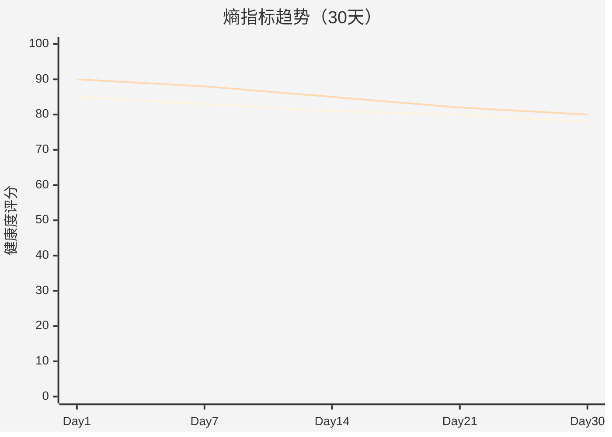
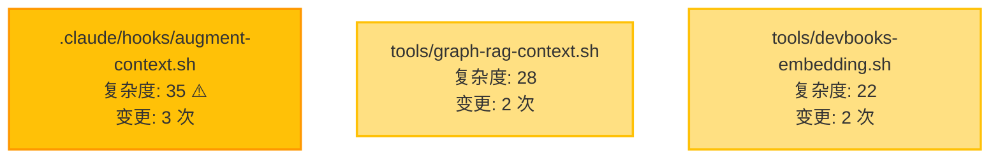
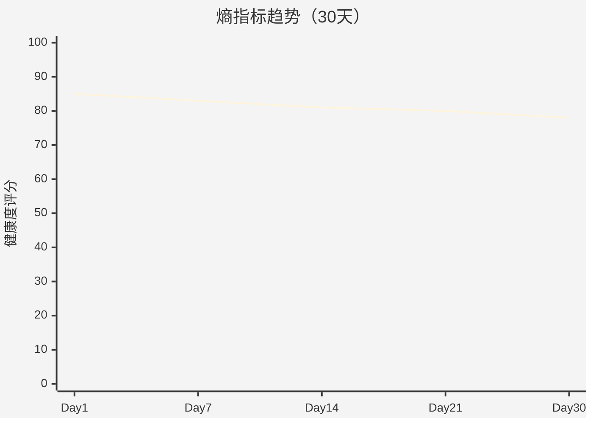
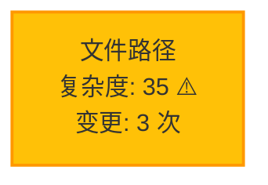
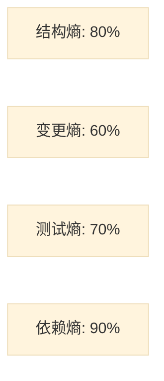

# 规格：熵度量可视化

> **改进项**：P3 - 熵度量可视化（优先级：中）
> **变更包**：boost-local-intelligence
> **版本**：1.0
> **状态**：Draft

---

## 元信息

| 字段 | 内容 |
|------|------|
| Spec ID | SPEC-ENT-001 |
| 对应设计 | `design.md` P3 章节 |
| 涉及组件 | `skills/devbooks-entropy-monitor/SKILL.md`, `tools/devbooks-entropy-viz.sh`（新建） |
| 契约变更 | 熵报告 Markdown 格式 |

---

## ADDED Requirements

### Requirement: REQ-ENT-001 Mermaid 图表支持

**描述**：熵度量报告必须包含 Mermaid 图表，提升可读性。

**优先级**：P0（必须）

**图表类型**：
1. **趋势折线图**：展示熵指标的时间趋势（30 天）
2. **热点条形图**：展示热点文件及其复杂度
3. **雷达图**：展示四类熵（结构熵/变更熵/测试熵/依赖熵）的对比

**验收条件**：
- 报告包含至少 2 个 Mermaid 图表
- Mermaid 代码块语法正确，可被 GitHub/GitLab 渲染
- 图表数据与文本表格一致
- 终端中查看时，Mermaid 代码块不破坏可读性

**关联契约**：CT-ENT-001

#### Scenario: SC-ENT-001
- **Given**: 熵度量工具可用
- **When**: 执行 `./tools/devbooks-entropy-viz.sh --output report.md`
- **Then**: 报告包含至少 2 个 `\`\`\`mermaid` 代码块

---

### Requirement: REQ-ENT-002 ASCII 仪表盘

**描述**：熵度量报告必须包含 ASCII 仪表盘，提供终端友好的实时反馈。

**优先级**：P0（必须）

**仪表盘内容**：
1. **综合健康度评分**：0-100 分，彩色进度条
2. **四类熵指标**：结构熵、变更熵、测试熵、依赖熵，各带进度条与状态图标
3. **阈值预警**：超过阈值时显示警告标识

**验收条件**：
- 仪表盘使用 ANSI 颜色码（绿色 ✅、黄色 ⚠️、红色 🔴）
- 支持 `NO_COLOR` 环境变量（禁用彩色时降级到纯文本）
- 进度条长度固定（40 字符），避免终端换行
- 状态图标清晰易懂

**关联契约**：CT-ENT-002

#### Scenario: SC-ENT-002
- **Given**: 熵度量工具可用
- **When**: 执行 `./tools/devbooks-entropy-viz.sh --output report.md`
- **Then**: 报告包含综合健康度评分和进度条字符

---

### Requirement: REQ-ENT-003 向后兼容

**描述**：新增可视化内容必须保持向后兼容，不破坏原有文本表格。

**优先级**：P0（必须）

**兼容性要求**：
- 原有文本表格保持不变（位置、格式、内容）
- 新增可视化作为独立章节插入
- 旧版本渲染器不支持 Mermaid 时，仍可阅读文本表格
- 配置项 `features.entropy_visualization` 可关闭可视化

**验收条件**：
- 关闭可视化后，报告格式与原版一致
- 旧版本熵报告解析脚本仍可读取
- 新增章节不影响原有章节

**关联契约**：CT-ENT-003

#### Scenario: SC-ENT-003
- **Given**: 配置 `features.entropy_visualization: false`
- **When**: 执行熵度量工具
- **Then**: 报告不包含 Mermaid 图表和 ASCII 仪表盘

---

### Requirement: REQ-ENT-004 终端兼容性

**描述**：ASCII 仪表盘必须在各种终端环境下正常显示。

**优先级**：P1（高）

**兼容性测试**：
- macOS Terminal
- iTerm2
- Linux gnome-terminal
- Windows Terminal
- VS Code 终端
- SSH 远程终端

**验收条件**：
- 所有测试终端都能正确显示 ANSI 颜色
- 支持 `NO_COLOR` 环境变量
- 不依赖 Unicode 特殊字符（避免乱码）
- 宽度适配 80 列终端

**关联契约**：CT-ENT-004

#### Scenario: SC-ENT-004
- **Given**: `NO_COLOR=1` 环境变量已设置
- **When**: 执行熵度量工具
- **Then**: 报告不包含 ANSI 颜色码

---

### Requirement: REQ-ENT-005 配置化

**描述**：可视化功能必须可配置，支持用户自主选择。

**优先级**：P1（高）

**配置项**：
- `features.entropy_visualization`：是否启用可视化（默认：`true`）
- `features.entropy_mermaid`：是否生成 Mermaid 图表（默认：`true`）
- `features.entropy_ascii_dashboard`：是否生成 ASCII 仪表盘（默认：`true`）

**验收条件**：
- 配置项生效
- 禁用可视化后，报告仅包含文本表格
- 配置项有注释说明

**关联契约**：无（配置要求）

#### Scenario: SC-ENT-005
- **Given**: 配置 `features.entropy_mermaid: false`
- **When**: 执行熵度量工具
- **Then**: 报告不包含 Mermaid 图表但包含 ASCII 仪表盘

---

### Requirement: REQ-ENT-006 测试覆盖

**描述**：熵可视化功能必须有充分的测试覆盖。

**优先级**：P1（高）

**测试要求**：
- 熵可视化测试用例 ≥ 3（批准条件）
- 覆盖 Mermaid 图表生成
- 覆盖 ASCII 仪表盘生成
- 覆盖终端兼容性

**验收条件**：
- 所有测试用例通过
- 测试覆盖率 > 80%

**关联契约**：CT-ENT-005

#### Scenario: SC-ENT-006
- **Given**: 熵可视化测试套件可用
- **When**: 运行所有熵可视化测试
- **Then**: 测试用例 ≥ 3 且全部通过

---

## 2. Scenarios（场景）

### SC-ENT-001: 生成带可视化的熵报告

**场景描述**：用户执行 `devbooks-entropy-monitor` Skill，生成包含 Mermaid 图表和 ASCII 仪表盘的报告。

**Given（前置条件）**：
- 配置 `features.entropy_visualization: true`
- 项目有足够的历史数据（至少 7 天）
- 工具 `devbooks-entropy-viz.sh` 已创建

**When（操作）**：
```bash
# 通过 Skill 执行
/devbooks-entropy-monitor
```

**Then（预期结果）**：
- 产出报告：`openspec/specs/_meta/entropy/entropy-report-2026-01-09.md`
- 报告包含以下章节：
  1. **健康度评分**（ASCII 仪表盘）
  2. **熵趋势**（Mermaid 折线图）
  3. **热点文件**（Mermaid 条形图或节点图）
  4. **详细指标**（原有文本表格）
- Mermaid 代码块语法正确
- ASCII 仪表盘彩色显示（如果终端支持）

**关联需求**：REQ-ENT-001, REQ-ENT-002

---

### SC-ENT-002: 在终端中查看报告

**场景描述**：用户在终端中使用 `cat` 或 `bat` 查看熵报告，ASCII 仪表盘正常显示。

**Given（前置条件）**：
- 熵报告已生成
- 终端支持 ANSI 颜色

**When（操作）**：
```bash
cat openspec/specs/_meta/entropy/entropy-report-2026-01-09.md
```

**Then（预期结果）**：
- ASCII 仪表盘彩色显示：
  ```
  综合健康度: 78/100 ⚠️
  ━━━━━━━━━━━━━━━━━━━━━━━━━━━━━━━━━━━━━━━━
  结构熵: ████████░░  80% ✅
  变更熵: ██████░░░░  60% ⚠️
  测试熵: ███████░░░  70% ⚠️
  依赖熵: █████████░  90% ✅
  ━━━━━━━━━━━━━━━━━━━━━━━━━━━━━━━━━━━━━━━━
  ```
- 绿色、黄色、红色显示正常
- Mermaid 代码块原样显示（终端不渲染）

**关联需求**：REQ-ENT-002, REQ-ENT-004

---

### SC-ENT-003: 在 GitHub 中查看报告

**场景描述**：用户在 GitHub PR 或 Web UI 中查看熵报告，Mermaid 图表正常渲染。

**Given（前置条件）**：
- 熵报告已提交到 GitHub
- GitHub 支持 Mermaid 渲染

**When（操作）**：
- 在 GitHub Web UI 中打开 `entropy-report-2026-01-09.md`

**Then（预期结果）**：
- Mermaid 图表正常渲染为可视化图形
- ASCII 仪表盘在代码块中显示（但无彩色）
- 文本表格正常显示

**关联需求**：REQ-ENT-001

---

### SC-ENT-004: 禁用可视化

**场景描述**：用户配置禁用可视化，报告仅包含原有文本表格。

**Given（前置条件）**：
- 配置 `features.entropy_visualization: false`

**When（操作）**：
```bash
/devbooks-entropy-monitor
```

**Then（预期结果）**：
- 报告不包含 Mermaid 图表
- 报告不包含 ASCII 仪表盘
- 报告格式与原版一致（仅文本表格）

**关联需求**：REQ-ENT-003, REQ-ENT-005

---

### SC-ENT-005: NO_COLOR 环境变量

**场景描述**：用户设置 `NO_COLOR` 环境变量，ASCII 仪表盘降级到纯文本。

**Given（前置条件）**：
- 环境变量 `NO_COLOR=1`

**When（操作）**：
```bash
cat openspec/specs/_meta/entropy/entropy-report-2026-01-09.md
```

**Then（预期结果）**：
- ASCII 仪表盘无彩色：
  ```
  综合健康度: 78/100 [WARNING]
  ━━━━━━━━━━━━━━━━━━━━━━━━━━━━━━━━━━━━━━━━
  结构熵: [########  ]  80% [OK]
  变更熵: [######    ]  60% [WARNING]
  测试熵: [#######   ]  70% [WARNING]
  依赖熵: [######### ]  90% [OK]
  ━━━━━━━━━━━━━━━━━━━━━━━━━━━━━━━━━━━━━━━━
  ```
- 不使用 ANSI 颜色码
- 状态用文本标识：`[OK]`, `[WARNING]`, `[ERROR]`

**关联需求**：REQ-ENT-002, REQ-ENT-004

---

### SC-ENT-006: 历史数据不足时的降级

**场景描述**：项目历史数据不足（< 7 天），无法生成趋势图，自动降级。

**Given（前置条件）**：
- 项目 Git 历史 < 7 天

**When（操作）**：
```bash
/devbooks-entropy-monitor
```

**Then（预期结果）**：
- 报告中 Mermaid 趋势图被替换为提示：
  ```markdown
  ## 熵趋势（30天）

  > ⚠️ 历史数据不足（< 7 天），无法生成趋势图。
  > 建议至少保留 7 天的 Git 历史后再查看趋势。
  ```
- 其他图表正常生成（如热点文件图）
- ASCII 仪表盘正常显示

**关联需求**：REQ-ENT-001

---

## 3. Output Specification（输出规范）

### 3.1 报告结构

#### 完整报告示例

````markdown
# 熵度量报告 - 2026-01-09

> 项目：dev-playbooks
> 分析时间范围：2025-12-10 至 2026-01-09（30 天）

---

## 健康度评分

```ascii
综合健康度: 78/100 ⚠️
━━━━━━━━━━━━━━━━━━━━━━━━━━━━━━━━━━━━━━━━
结构熵: ████████░░  80% ✅
变更熵: ██████░░░░  60% ⚠️
测试熵: ███████░░░  70% ⚠️
依赖熵: █████████░  90% ✅
━━━━━━━━━━━━━━━━━━━━━━━━━━━━━━━━━━━━━━━━

⚠️ 警告：变更熵超过阈值（50%），建议关注热点文件。
```

---

## 熵趋势（30天）



**分析**：
- 综合健康度从 85 下降至 78（-8%），呈下降趋势
- 结构熵保持稳定（80），良好
- 变更熵从 70 下降至 60（-14%），需关注

---

## 热点文件



**风险评估**：
- ⚠️ `.claude/hooks/augment-context.sh` - 热点排名 #1，复杂度 35（阈值: 30），需重构
- `.tools/graph-rag-context.sh` - 热点排名 #2，复杂度 28，接近阈值
- `.tools/devbooks-embedding.sh` - 热点排名 #3，复杂度 22，良好

---

## 详细指标

| 指标 | 当前值 | 阈值 | 状态 | 趋势 |
|------|-------|------|------|------|
| 圈复杂度均值 | 8.2 | < 10 | ✅ 良好 | → 稳定 |
| 热点文件占比 | 0.12 | < 0.1 | ⚠️ 警告 | ↑ 上升 |
| 测试覆盖率 | 72% | > 70% | ✅ 良好 | → 稳定 |
| 依赖循环数 | 0 | 0 | ✅ 优秀 | → 稳定 |

---

## 建议

1. **高优先级**：重构 `.claude/hooks/augment-context.sh`，降低复杂度至 < 30
2. **中优先级**：增加 `tools/graph-rag-context.sh` 的测试覆盖
3. **低优先级**：定期监控热点文件占比，避免持续上升

---

**生成时间**：2026-01-09 10:30:00
**生成工具**：devbooks-entropy-monitor v1.0
````

---

### 3.2 Mermaid 图表规范

#### 趋势折线图

**使用场景**：展示熵指标的时间趋势

**Mermaid 语法**：


**数据来源**：
- X 轴：时间点（每 7 天采样一次）
- Y 轴：综合健康度评分（0-100）
- 折线：历史评分数据

---

#### 热点文件图

**使用场景**：展示热点文件及其复杂度

**Mermaid 语法**：


**节点颜色规则**：
- 红色（`#FF5252`）：复杂度 > 40
- 黄色（`#FFC107`）：复杂度 30-40
- 绿色（`#4CAF50`）：复杂度 < 30

---

#### 雷达图（可选）

**使用场景**：展示四类熵的对比

**Mermaid 语法**：


---

### 3.3 ASCII 仪表盘规范

#### 彩色版本（默认）

**ANSI 颜色码**：
- 绿色：`\033[32m` ✅
- 黄色：`\033[33m` ⚠️
- 红色：`\033[31m` 🔴
- 重置：`\033[0m`

**进度条字符**：
- 填充：`█` (U+2588)
- 空白：`░` (U+2591)
- 分隔：`━` (U+2501)

**示例**：
```ascii
综合健康度: 78/100 \033[33m⚠️\033[0m
━━━━━━━━━━━━━━━━━━━━━━━━━━━━━━━━━━━━━━━━
结构熵: \033[32m████████░░\033[0m  80% \033[32m✅\033[0m
变更熵: \033[33m██████░░░░\033[0m  60% \033[33m⚠️\033[0m
```

---

#### 纯文本版本（NO_COLOR）

**状态标识**：
- `[OK]`：良好
- `[WARNING]`：警告
- `[ERROR]`：错误

**进度条字符**：
- 填充：`#`
- 空白：` ` (空格)
- 边界：`[` 和 `]`

**示例**：
```ascii
综合健康度: 78/100 [WARNING]
━━━━━━━━━━━━━━━━━━━━━━━━━━━━━━━━━━━━━━━━
结构熵: [########  ]  80% [OK]
变更熵: [######    ]  60% [WARNING]
```

---

### 3.4 配置 Schema

#### `.devbooks/config.yaml` - features 部分

**新增字段**：

```yaml
features:
  # 熵度量可视化（新增）
  entropy_visualization: true  # 是否启用可视化
  entropy_mermaid: true         # 是否生成 Mermaid 图表
  entropy_ascii_dashboard: true # 是否生成 ASCII 仪表盘

  # 原有字段
  complexity_weighted_hotspot: true
  ckb_status_hint: true
  hotspot_limit: 5
```

---

## 4. Quality Attributes（质量属性）

### 4.1 可读性

| 指标 | 目标值 | 测量方式 |
|------|--------|---------|
| Mermaid 图表可读性 | 用户可理解 | 人工评审 |
| ASCII 仪表盘可读性 | 用户可理解 | 人工评审 |
| 终端显示兼容性 | 100% | 6 个终端测试 |

### 4.2 性能

| 指标 | 目标值 | 测量方式 |
|------|--------|---------|
| 可视化生成延迟 | < 1s | 计时统计 |
| 报告文件大小增长 | < 50% | 对比原版报告 |

### 4.3 兼容性

| 指标 | 目标值 | 测量方式 |
|------|--------|---------|
| Markdown 渲染器支持 | GitHub, GitLab, VS Code | 人工测试 |
| 终端兼容性 | macOS, Linux, Windows | 人工测试 |
| 旧版本兼容 | 100% | 回归测试 |

---

## 5. Contract Tests（契约测试计划）

### CT-ENT-001: Mermaid 图表生成

**测试类型**：功能测试

**测试步骤**：
1. 执行：`/devbooks-entropy-monitor`
2. 打开报告：`openspec/specs/_meta/entropy/entropy-report-*.md`
3. 验证：
   - 包含至少 2 个 Mermaid 代码块
   - Mermaid 语法正确（通过语法检查器）
   - 图表数据与文本表格一致

**通过标准**：
- Mermaid 代码块语法正确
- GitHub 可正常渲染
- 数据一致性 100%

---

### CT-ENT-002: ASCII 仪表盘生成

**测试类型**：功能测试

**测试步骤**：
1. 执行：`/devbooks-entropy-monitor`
2. 在终端中查看：`cat entropy-report-*.md`
3. 验证：
   - 包含 ASCII 仪表盘
   - 彩色显示正常（ANSI 颜色码）
   - 进度条长度 40 字符
   - 状态图标清晰

**通过标准**：
- 仪表盘显示正常
- 彩色输出正确
- 无终端换行

---

### CT-ENT-003: 向后兼容性

**测试类型**：回归测试

**测试用例 3.1**：禁用可视化

**步骤**：
1. 配置：`features.entropy_visualization: false`
2. 执行：`/devbooks-entropy-monitor`
3. 验证：报告格式与原版一致

**测试用例 3.2**：旧版本解析

**步骤**：
1. 使用旧版本熵报告解析脚本
2. 解析新版本报告
3. 验证：能正确提取原有字段

---

### CT-ENT-004: 终端兼容性

**测试类型**：兼容性测试

**测试环境**：
- macOS Terminal
- iTerm2
- Linux gnome-terminal
- Windows Terminal
- VS Code 终端
- SSH 远程终端

**测试步骤**：
1. 在每个终端中执行：`cat entropy-report-*.md`
2. 验证：
   - ANSI 颜色正确显示
   - 进度条正常显示
   - 无乱码

**通过标准**：
- 所有终端显示正常
- 支持 `NO_COLOR` 环境变量

---

### CT-ENT-005: 可视化测试覆盖

**测试类型**：单元测试 + 集成测试

**测试用例 5.1**：Mermaid 图表生成函数

**步骤**：
1. 调用 `generate_mermaid_chart()` 函数
2. 输入：熵数据数组
3. 验证：输出 Mermaid 代码块

**测试用例 5.2**：ASCII 仪表盘生成函数

**步骤**：
1. 调用 `generate_ascii_dashboard()` 函数
2. 输入：四类熵指标
3. 验证：输出彩色仪表盘

**测试用例 5.3**：NO_COLOR 降级

**步骤**：
1. 设置 `NO_COLOR=1`
2. 调用 `generate_ascii_dashboard()`
3. 验证：输出纯文本仪表盘

**通过标准**：
- 所有测试用例通过
- 测试覆盖率 > 80%

---

## 6. Migration & Rollback（迁移与回滚）

### 6.1 迁移步骤

#### 对现有用户

1. **零配置用户**（使用默认配置）：
   - 无需任何操作
   - 自动启用可视化
   - 报告向后兼容（旧字段保持不变）

2. **不希望可视化的用户**：
   - 配置：`features.entropy_visualization: false`
   - 报告恢复到原版格式

### 6.2 回滚策略

#### 配置回滚

**方法 1**：禁用可视化
```yaml
features:
  entropy_visualization: false
```

**方法 2**：分别禁用
```yaml
features:
  entropy_mermaid: false        # 仅禁用 Mermaid 图表
  entropy_ascii_dashboard: false # 仅禁用 ASCII 仪表盘
```

#### 代码回滚

- 新功能封装在独立工具 `devbooks-entropy-viz.sh`
- 通过 `git revert` 可完全回滚
- 回滚后自动恢复到原有格式

---

## 7. Dependencies（依赖）

### 7.1 外部依赖

| 依赖 | 版本 | 必须？ | 说明 |
|------|------|--------|------|
| Mermaid 渲染器 | - | 否 | GitHub/GitLab 自带，或使用 Markdown 编辑器 |
| ANSI 颜色支持 | - | 否 | 终端默认支持，可通过 `NO_COLOR` 禁用 |

### 7.2 内部依赖

| 组件 | 依赖关系 | 说明 |
|------|---------|------|
| `devbooks-entropy-viz.sh` | `devbooks-entropy-monitor` | 被调用，负责生成可视化 |
| `devbooks-entropy-monitor` | `devbooks-entropy-viz.sh` | 调用方，负责整体流程 |

---

## 8. Open Issues（待解决问题）

| 问题 ID | 问题描述 | 状态 | 优先级 |
|--------|---------|------|--------|
| ISSUE-ENT-001 | Mermaid 图表类型选择：折线图 vs 雷达图 vs 条形图？需实测可读性 | Open | P1 |
| ISSUE-ENT-002 | ASCII 仪表盘是否需要动画效果？（通过 `tput` 实现） | Open | P2 |
| ISSUE-ENT-003 | 是否需要生成 HTML 版本报告？（可作为后续迭代） | Open | P3 |

---

## 9. References（参考资料）

| 资料 | 路径/链接 |
|------|---------|
| 设计文档 | `openspec/changes/boost-local-intelligence/design.md` |
| Mermaid 官方文档 | https://mermaid.js.org/ |
| ANSI 颜色码规范 | https://en.wikipedia.org/wiki/ANSI_escape_code |
| 原有熵度量实现 | `skills/devbooks-entropy-monitor/SKILL.md` |

---

## 10. Approval & Sign-off（批准与签署）

| 角色 | 姓名 | 日期 | 签名 |
|------|------|------|------|
| Spec Owner | - | 2026-01-09 | Draft |
| Design Owner | - | - | Pending |
| Test Owner | - | - | Pending |

---

**变更历史**：

| 日期 | 作者 | 变更 |
|------|------|------|
| 2026-01-09 | Spec Owner | 初稿 |

---

**状态**：Draft → 等待 Test Owner 产出契约测试 → 等待 Coder 实现
