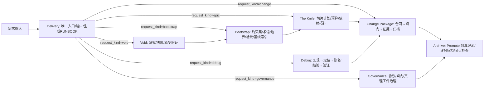
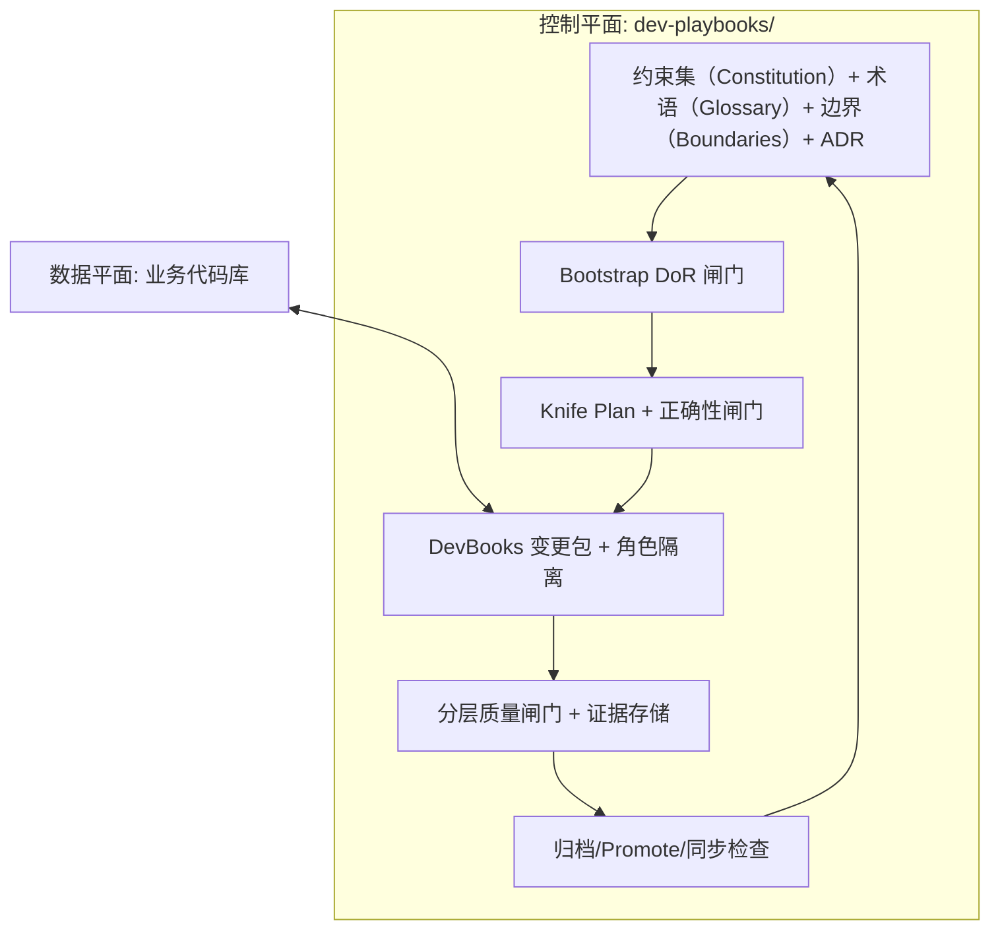

# AI 软件工程开发框架设计（AI‑Native Software Engineering Protocol）

> **版本**：v1.1.1
> **最后更新**：2026-02-02
> **适用范围**：将"人类高价值直觉"转化为"可验证、可执行、可演进"的工程产物，面向具备文件系统与版本控制的真实软件项目（含存量项目/强合规项目）。
> **输入来源**：多轮专家评审与整合建议、系统完备性分析报告、以及当前 `dev-playbooks-cn` 的 DevBooks 现状。
> **SSOT 声明**：本文件是 `dev-playbooks-cn` 的框架设计 SSOT（Design SSOT）与索引入口；“协议条款 → 规格 → 接线 → 证据”的仓库落地映射见 §10.2。
> **快速导航**：§0.1（不变量/SSOT）｜§9（目录）｜§10（落地对齐）｜§11（只记一个入口：Delivery）

---

## 0. 规范性关键字（用于消除歧义）

为避免“应该/尽量/最好”这类不可验证措辞，本协议使用如下关键字：

- **MUST**：强制要求；不满足则不得进入下一阶段或不得归档。
- **SHOULD**：推荐要求；不满足允许继续，但必须记录偏离与风险。
- **MAY**：可选能力；仅在配置启用或命中触发条件时适用。

### 0.1 P0 工程不变量（MUST）

为避免“协议在文档里成立、在执行时走样”，以下不变量被视为 P0 级约束（必须满足）：

1. **协议语义与入口解耦**：协议权威由落盘工件与闸门语义定义；任何对话指令/CLI/IDE/Hook 仅是入口适配器，可替换，但不得改变协议语义。
2. **SSOT + 缓存可丢弃**：`dev-playbooks/specs/` 与变更包工件为 SSOT；索引/embedding/图数据库/上下文压缩/可视化导出均视为缓存。审计/调试路径必须允许忽略缓存回源到 SSOT，并能解释回退原因。
   - **项目级 SSOT（MUST）**：若项目没有独立的上游 SSOT 文档库，Bootstrap MUST 在 Truth Root 下创建最小可寻址 SSOT 包：`ssot/SSOT.md` + `ssot/requirements.index.yaml`（只写索引与可裁判条目，禁止复制长文档原文）。
   - **新增工件约束（MUST）**：任何新增工件/文件/图示/清单必须满足其一：
     1) **SSOT 工件**：极稳定，且只承担“索引/引用/最小约束”职责（不得复制大量事实）；或
     2) **派生缓存工件**：可丢弃、可重建，并且必须声明生成入口与一致性/新鲜度裁判（通常落在变更包 `RUNBOOK.md` 托管块或 `evidence/`）。
     禁止引入需要长期手工维护的“第二份真理”（例如手写全景架构图/系统百科）。
3. **状态变更入口 + 干预事件**：对 SSOT 的写入（Promote/回滚/真理工件修改）必须通过可审计入口执行并产生可追溯证据；任何绕过入口的人工修改必须作为“干预事件”落盘并触发再校准/再规划。
4. **密封工件边界**：允许以“引用 + 元数据”把不可解析/不应解析输入纳入流程，但其内容不得被自动采信为事实依据；若高影响决策依赖其内容，必须升级到 Human‑in‑the‑loop 或 Void。
5. **不可裁决即升级**：当信息缺口、证据冲突、风险超阈值或验证锚点不可复现时，必须阻断并回流到 Void/Bootstrap/Knife（按场景），并在变更包状态中记录阻断原因与 `next_action`。
6. **意图锁定 + 反弱化**：用户意图必须编译为 `Completion Contract` 并在执行期锁定；任何降低交付质量级别、移除义务、或把语义验收移出验证范围的变更都必须触发显式 Decision 并重新校验闸门，不得静默通过。

执行性要求（MUST）：

- 本节每一条 P0 不变量都必须拥有“可裁判的落点”：对应的机读合同/规格条款（SSOT）+ 至少一个可执行检查（Gate/脚本）+ 可复验的证据落点。
- 若某条 P0 不变量仅存在于框架叙述而无法映射到上述三元组，则视为“未实现的协议能力”，不得以“已集成/已完成”宣称闭环。

---

## 1. 系统宣言（System Manifesto）

### 1.1 系统定性：这是一个工程协作协议（Protocol）

本框架不是某个业务系统的需求文档，而是一套**面向 AI 的工程协议（Protocol）**，用于约束与组织“人类—AI”协作的全部生命周期：

- 将对话中的意图、约束、决策、验证证据**外化为可版本化文件**（Truth‑in‑Files）。
- 用**可执行质量闸门**替代“自我声明完成”，避免 AI 的幻觉/短视/自证循环。
- 用**角色隔离与交接契约**替代“同一代理自写自验”，避免自我批准。
- 用**切片预算与熔断**把“复杂需求”转换为“AI 可处理的原子变更包队列”。

### 1.1.1 默认交互模型：AI 作为执行者（Human‑in‑the‑loop）

本协议默认场景是：**AI 具备文件系统与终端执行能力**，并作为编排器执行流程；人类提供需求材料与必要裁决。

- **AI（默认执行者）**：读取真理工件、生成/更新变更包、运行闸门、落盘证据、输出可复现验证锚点。
- **人类（委托方/裁决者）**：提供输入材料、回答 Delivery 追问；当 `risk_level=high` 或 `request_kind∈{epic,governance}` 时，对关键取舍做批准/拒绝并留下可审计记录。

### 1.2 核心价值观（可落盘、可验证）

- **消除信息差**：任何会影响实现与验收的关键知识，必须存在于真理源（Truth Root）中，且可被引用与校验。
- **证据定义完成**：完成（Done）由 Completion Contract 的义务满足性 + Green Evidence + 闸门日志共同定义，而不是口头确认。
- **约束优先于产出速度**：任何绕过闸门的"快"都被视为技术债务与风险债务。
- **失败是协议输入**：失败原因必须沉淀为协议/约束集/闸门的增量修订（N→N+1）。

### 1.2.1 基础假设：LLM 输出不可靠

**结论**：提示词优化不能替代可审计的控制面（真理工件、闸门、证据、角色隔离）。

软件工程的本质是**在不可靠的组件之上构建可靠的系统**：
- 传统工程：不可靠的硬盘（RAID）、网络（TCP 重传）、人类程序员（Code Review）
- AI 工程：不可靠的 LLM 输出（需要闸门与证据闭环约束）

**LLM 常见失效模式**（短期难以完全消除）：

| 失效模式 | 表现 | 本系统的防御机制 |
|------|------|------------------|
| 上下文遗忘 | 忽略早期约束 | 真理工件持久化记忆（Constitution/Glossary/Boundaries）+ 强制注入 |
| 幻觉 | 编造不存在的 API | 7 层验证闸门（语法→类型→测试→契约） |
| 迎合倾向 | 同意错误决策/回避冲突 | 审查角色（Challenger 至少列出 3 条缺口/风险） |
| 短期优化倾向 | 堆叠实现、忽略长期结构 | 强制显式规划（Plan）+ 模块边界约束 |
| 不一致性 | 风格/约定漂移 | 约束集（Constitution）作为单一真理源 + 静态检查强制 |
| 缺乏因果理解 | 为通过测试而硬编码/绕过约束 | TDD + 角色隔离（Coder 禁止修改 tests/） |

### 1.2.2 认知输入与控制面：把“漏/忘/漂移”变成可裁判失败（MUST）

即使你已经能防住“幻觉/上下文遗忘/自我声明完成”，仍会出现一类典型交付事故：**漏任务、尾部步骤遗忘、弱连接漏同步、长对话漂移**。这些事故通常不是“能力不够”，而是**输入形态与接线点不足**导致的系统性失败。

诊断（常见根因）：

1. **缺少封面（全景轮廓）**：执行者只能看到碎片，局部最优破坏整体边界与依赖方向。
2. **检索路径依赖**：不知道“必须去哪里找”，Unknown Unknowns 只能靠关键词碰运气。
3. **弱连接不可见**：文档、模板、发布说明、监控、回滚、兼容策略等往往没有强引用，默认会被漏掉。
4. **尾部步骤易遗忘**：只要归档/同步/审计仍依赖记忆，就会复现“看起来绿了就收工”。

控制面原则（MUST）：

- **全局图景必须外化**，并能快速加载（提供封面视图）。
- **检索路线必须制度化**，不能靠灵感（提供默认必看清单）。
- **弱连接必须被编译成义务**，并由闸门裁判（缺证据即失败）。
- **尾部步骤必须机器强制**，不能靠记忆（End‑step = Gate）。
- **注意力是稀缺资源**：能让确定性工具做的，不要让模型做；让模型只处理需要语义判断的部分。

为落实上述原则，协议引入四类“认知输入”（全部必须可落盘、可裁判、可丢弃可重建）：**封面视图（Cover View）**、**Context Capsule**、**范围证据包（Scope Evidence Bundle）**、**弱连接义务（Weak‑Link Obligations）**。它们分别落在 `RUNBOOK.md`、`completion.contract.yaml` 与 `evidence/gates/`，并由交接闸门与 G6 裁决器强制执行（详见 4.2.7、4.7.2、7.3、11.4）。

### 1.3 Non‑Goals（明确不做什么）

- 不假设 AI 能一次性完成复杂系统；必须依赖闸门与证据闭环控制风险。
- 不把聊天记录视为权威；聊天只是临时计算空间，权威必须落盘。
- 不把“更多文档”视为解法；每个文档必须有明确消费者与消费时机，否则禁止引入（见 4.2）。

---

## 2. 全局概念模型（Global Concept Model）

### 2.1 知识收敛漏斗（Knowledge Convergence Funnel）

本框架将软件开发建模为**分层熵减过程**。每一层的输出是下一层的输入；**禁止越级**。

| 层级 | 收敛域 | 核心问题 | 主要产物（示例） | 主要负责协议 |
|---|---|---|---|---|
| L1 | 问题域（Problem） | Why/What：要解决什么 | 目标/边界、术语、不变量、核心场景与 AC | Bootstrap（基线）/ Proposal（变更对齐） |
| L2 | 方案域（Solution） | How：用什么结构解决 | 模块边界、依赖方向、关键 ADR、对外契约策略 | Design/ADR（增量对齐）/ Bootstrap（基线）/ Void（高熵） |
| L3 | 实现域（Implementation） | How：如何构建与迁移 | 变更类型、切片计划、验证锚点、回滚策略 | The Knife |
| L4 | 运行域（Operation） | 如何稳定交付与运行 | 证据链、闸门日志、发布/回滚演练、归档到真理 | DevBooks |

**关键结论**：AI 的"可交付能力"取决于 L1-L3 是否被外化为可验证工件；否则下游必然发生上下文爆炸与伪收敛。

### 2.1.1 职责分离：真理维护 / 执行交付 / 校验阻断

将真理维护、执行交付、校验阻断三类职责分离，以降低自我批准与漂移风险：

| 职责域 | 对应组件 | 职责 | 变更频率 | 变更约束（MUST） |
|---|---|---|---|---|
| 真理维护 | Bootstrap | 维护约束集与真理工件（Constitution/Glossary/Boundaries） | 低频/增量 | 只能通过变更包归档（Archive/Promote）写入 Truth |
| 执行交付 | DevBooks | 执行变更包并产出证据 | 高频 | 必须通过闸门并落盘 Green Evidence |
| 校验阻断 | Knife + Gates | 校验切片计划与闸门结果（边界/预算/可验证性） | 自动化/每次变更 | 失败即阻断并给出 `next_action` 回流层 |

**核心工件：约束集（Constitution）**
- 位置：`dev-playbooks/constitution.md`（人读约束集：GIP/逃生舱口）+ `dev-playbooks/specs/_meta/`（机读真理工件：术语/边界/决策…）
- 形式：AI 可读、可验证的结构化数据（Markdown/YAML）
- 作用：单一真理来源（Single Source of Truth, SSOT）
- 演进：任何代码变更必须满足约束集中的硬约束；若约束本身需要调整，必须先按 3.5 的约束变更流程更新约束集

### 2.2 生命周期总览（端到端）：Void → Bootstrap → Knife → DevBooks → Archive

本框架统一 0→1 与 1→n：差异不在“阶段名称”，而在**进入闸门的前置工件是否齐备**。



### 2.2.1 入口与流程重量：建议优先，允许覆盖

本框架提供**唯一入口（Delivery）**，用于把“任意输入”路由到**最小充分闭环**；同时承认复杂度是上下文函数（代码库状态、隐藏依赖、未知技术债务等），因此 Delivery MAY 追问 1–3 个关键问题来降低误判代价。

入口只做三件事：

1. 询问最小关键问题（request_kind + 风险信号 + 可验证性）
2. 输出推荐路径与升级/降级触发条件
3. 保留多入口：允许直接进入任一后续协议，但必须提示缺失的护栏与回流路径

#### 请求类型（`request_kind`）

流程重量的主轴是“你想交付什么闭环”，而不是“多少人参与”。`request_kind` 必须命中以下之一（MUST）：

- **debug**：先复现/定位，必要时再转为修复变更包
- **change**：单变更包执行（默认）
- **epic**：必须先 Knife 切片，再按 Slice 队列执行多个变更包
- **void**：高熵问题（研究/原型验证/Freeze‑Thaw）
- **bootstrap**：基线对齐（术语/边界/场景/约束）
- **governance**：协议/闸门/真理工件治理变更（更严格证据与归档）

#### 决策门（Decision Gates）

无论路径如何分流，任何变更最终都必须回答四类决策，只是表达“厚度”不同：

1. **价值门（Value）**：为什么要做？不做会怎样？
2. **影响门（Impact）**：可能破坏什么？失败代价与回滚路径是什么？
3. **认知门（Cognition）**：我们真的理解它吗？不理解就先进入 Void/原型验证
4. **验证门（Verification）**：如何客观判断“做对了”？对应的验证锚点与证据落点是什么？

这些决策门可作为“是否需要升级流程”的稳定锚点：当你无法用简短可验证的方式回答任一决策门时，就不应强行走轻量路径。

### 2.3 核心模块职责矩阵（控制平面组件）

| 模块 | 阶段 | 主要职责 | 典型输入 | 典型输出（落盘） | 强制闸门（示例） |
|---|---|---|---|---|---|
| The Void | -1 → 0 | 处理高熵问题，产出可追溯决策/结论 | 难题描述、外部资料、失败证据 | 调研报告、ADR、验证结论 | Freeze/Thaw（阻塞项未解则冻结） |
| Delivery | 入口 | 统一入口：识别 request_kind 并路由到最小充分闭环（允许覆盖） | 用户输入、项目画像、真理索引 | 路由建议、升级触发条件、最小工件清单 | Routing Sanity（不做自动裁判） |
| Bootstrap | 0 → 1 | 建立/更新真理工件基线（SSOT 的上游） | Idea、Void 工件、既有文档索引 | Essential Five + 扩展工件 | Bootstrap DoR（输入就绪） |
| The Knife | n → n+1（规划） | 将 Epic 转为可拓扑排序的切片队列 | Epic.AC、边界/契约、模型画像 | Knife Plan、Slice 队列 | Knife Correctness / Change Size |
| DevBooks | n → n+1（执行） | 以角色隔离与证据闭环执行单个变更包 | 单个 change package | 代码变更、Spec Delta、Evidence | G1‑G5（结构/构建/安全/测试/性能） |
| Archive | Promote | Promote 到真理源并完成审计闭环 | 变更包 + Green Evidence | 真理更新、归档证据、同步日志 | G6（证据完备 + 同步检查） |
| Extension Packs | 跨阶段 | 把专有流程映射为风险/闸门/证据 | pack 配置与协议条款 | 附加检查项、模板片段、术语映射 | Pack Integrity（映射可执行） |

---

## 3. 核心协议一：Bootstrap（项目初始化与基线对齐协议）

### 3.1 目标与边界

Bootstrap 的目标是把“人类高价值直觉/隐性知识”编译成**可引用、可校验、可版本化**的真理工件集合（Truth Package），并为后续变更提供稳定的“共同语言与边界”。

Bootstrap 是低频协议，典型触发场景包括：

- 新项目（0→1）初始化
- 存量项目接入控制平面（Brownfield onboarding）
- 架构级重构/迁移，导致术语/边界/契约策略需要重新对齐

日常变更的“需求对齐”主要在变更包的 `brief/proposal/design` 中完成；只有当出现“缺基线/基线失真/需要重建边界”的信号时，才升级为 Bootstrap。

- Bootstrap **MUST** 输出进入 Knife（Epic 切片）或高风险/治理/切片类变更包执行所需的最小信息集（DoR）（例如 `risk_level=high` 或 `request_kind∈{epic,governance}`）。
- Bootstrap **MUST NOT** 输出实现步骤（那属于变更包的 tasks.md 或执行期脚手架）。

### 3.2 四个收敛域（必须显式交付）

> 约束：每个收敛域都必须有“输入/输出/验证方式”，否则视为未收敛。

#### 3.2.1 问题域（Problem Domain）

- **职责**：固定“要解决什么”，消除语义歧义与目标漂移。
- **输入**：需求描述、业务直觉、现有文档（存量项目）。
- **输出（MUST，问题域）**：
  - 统一语言（术语 + 禁用词 + “不是什么”反例）
  - 系统边界（In/Out）
  - 核心场景与验收标准（AC，Given‑When‑Then 或等价可测试表达）
- **验证（MUST）**：术语可引用、场景可验收、边界无冲突。

#### 3.2.2 方案域（Solution Domain）

- **职责**：固定“采用什么结构/边界解决”，避免大泥球与越界修改。
- **输入**：问题域产物、Void 的决策记录（如有）、现有架构约束。
- **输出（MUST，方案域）**：
  - 模块边界与依赖方向（Bounded Context/层级规则）
  - 关键架构决策记录（ADR）及其影响
  - 对外契约策略（版本、兼容、迁移、回滚）
- **验证（MUST）**：边界可检查（至少规则可表述）、关键决策可追溯。

#### 3.2.3 实现域（Implementation Domain）

- **职责**：为 Knife 与 DevBooks 提供可执行的工程约束与契约。
- **输入**：方案域产物、项目画像（技术栈/命令/闸门能力）。
- **输出（SHOULD，按需增强）**：
  - 变更类型分类（feature/refactor/migration/compliance/hotfix/spike/docs…）
  - 代码与目录约束（命名、模块组织、禁止依赖）
  - 对外 API/数据/事件契约的“指针 + 约束摘要”（不强制把全文复制进来）
- **验证（MUST）**：任何硬约束必须绑定“可执行检查点”（闸门/脚本/人工仲裁记录）。

#### 3.2.4 运行域（Operation Domain）

- **职责**：把“可运行/可回滚/可观测”前置为进入执行期的必要条件。
- **输入**：方案域产物、合规/安全约束（如有）。
- **输出（MUST，运行域）**：
  - 发布与回滚策略（至少：触发条件、操作负责人、验证窗口）
  - 观测与告警基线（至少：关键指标/日志事件/错误语义）
  - 风险登记（风险级别 + 缓解 + 回滚/止损）
- **验证（MUST）**：存在可执行的验证计划与证据落点定义。

### 3.3 Bootstrap 产物最小集（避免上下文爆炸）

为了兼容不同项目规模，Bootstrap 采用**“最小必要集 + 可选扩展”**：

#### 3.3.1 Essential Five（默认建议）

在大多数项目中，Bootstrap 只强制五个核心工件（MUST）：

1. `constitution`：硬约束与逃生舱口（Escape Hatches）
2. `glossary`：统一语言（含禁用词与反例）
3. `boundaries`：模块职责 In/Out 与依赖方向
4. `scenarios`：核心场景 + AC（可验收）
5. `decisions`：关键 ADR（含风险/假设/开放问题）

#### 3.3.2 扩展工件（MAY，按触发条件启用）

当命中下列触发条件时，必须启用对应扩展（MUST when triggered）：

| 触发条件 | 必需扩展 |
|---|---|
| 强合规/多法域 | `compliance/`（控制项→证据计划）、`jurisdiction-matrix` |
| 外部集成/对外 API | `contracts/`（版本与兼容策略） |
| 大型迁移/重构 | `epics/`（Knife 计划的 SoT）、迁移范式与兼容窗口声明 |
| UI/设计系统为硬约束 | `design-system/`（可验收 token/组件/可访问性规则） |

### 3.4 Bootstrap DoR（Definition of Ready，进入 Knife/高风险变更包执行的硬闸门）

满足以下条件，才允许进入 Knife 产出切片，或启动高风险/治理/切片类变更包执行：

1. 术语表非空，且关键术语可引用（禁止自造词）
2. 核心场景覆盖主流程与关键异常路径，并具备可验收 AC
3. 模块边界与依赖方向已声明，且不存在明显冲突
4. 对外契约策略明确（至少：认证、错误语义、重试/超时）
5. 质量属性底线已声明（安全/性能/可观测）；不适用也必须显式标注为 none
6. 发布/回滚/观测窗口已声明（运行域就绪）
7. 风险/假设/开放问题已落盘并绑定 owner 与预期解决阶段
8. 关键决策记录（ADR）存在且可追溯
9. 若存在高熵难题：对应 Void 工件已 RESOLVED，或已触发人工仲裁并记录

失败回退（MUST）：任意 DoR 不满足 → 回到 Bootstrap 补齐；禁止在 high-risk/epic 路径上“先写代码再补真理”。

### 3.5 真理工件版本化与约束变更治理（N→N+1）

Bootstrap 产物之所以能在长期迭代中降低“上下文遗忘”带来的偏差，关键在于**版本化与可追溯变更治理**。

协议要求（MUST）：

1. **真理工件必须可版本化**：至少包含 `version` 与 `last_updated`（无论是 YAML front matter 还是独立元数据文件）。
2. **执行必须引用版本**：每个变更包必须声明其依赖的 Truth 版本（至少：Constitution/Glossary/Boundaries/Knife Plan）。
3. **约束变更必须走变更包**：对 Constitution/Glossary/Boundaries/协议与闸门规则的任何修改，都必须作为独立变更类型执行（例如 `protocol` / `constitution-change`），并通过更严格的闸门与决策记录。
4. **约束变更必须可回滚**：约束变更包必须提供回滚策略（例如恢复上一版本真理工件）。

最小治理闭环（MUST）：

- Proposal：说明约束变更原因、替代方案、影响范围（含向后兼容策略）。
- Decision：记录裁决（Proceed/Revise/Reject）与理由（Decision Log 或 ADR）。
- Archive：Promote 后必须更新真理版本号，并写入变更摘要与兼容性说明。

---

## 4. 核心协议二：DevBooks（1‑n 迭代执行协议）

### 4.1 核心概念：变更包（Change Package）

变更包是本框架的最小**可审计**执行单元：一次变更的关键决策、验证方式与证据必须可定位、可复现、可归档。

变更包不再按“工作人数/介入深度”划分。流程重量由以下可裁判输入共同决定（MUST）：

- `request_kind`：请求类型（debug/change/epic/void/bootstrap/governance）
- `change_type`：变更类型（feature/refactor/migration/compliance/hotfix/spike/docs/protocol…）
- `risk_level`：风险等级（low/medium/high）
- `completion.contract.yaml`：完成合同（义务→检查→证据）
- `gate_profile`：闸门强度（light/standard/strict）

共同底线（MUST）：

- 必须存在至少一个可复现的验证锚点（命令/脚本/测试/清单），用于客观判定 Pass/Fail
- 任何进入 Archive 的变更包，必须具备可归档的 Green Evidence（见 4.3）
- 允许在执行中升级 `risk_level` 或切换 `request_kind`（例如 change→epic），但**不允许**静默弱化完成合同；弱化必须显式 Decision 并重新校验闸门（见 0.1.6）
- 变更包允许以 VCS/PR 作为轻量承载（MAY）；当需要更强审计与归档闭环时，再落盘为 `dev-playbooks/changes/<id>/` 目录（SHOULD）

### 4.2 变更包的必需工件（输入/输出清晰）

本协议不要求所有变更都生成同样“厚度”的文档。默认应尽可能轻量，但当风险或不确定性上升时，必须升级为更重的工件集合。

#### 4.2.1 `request_kind=debug`（诊断/修复闭环）

适用：定位原因、产出最小复现与修复（可能最终落为 `change_type=hotfix` 或 `change_type=spike`）。

必需工件（MUST）：

- 至少 1 个确定性验证锚点（复现/回归其一即可）：命令/脚本 + 可判定成功条件（写入 `verification.md` 或 `completion.contract.yaml#checks[]`）
- `evidence/red-baseline/`：复现失败证据（如适用）
- `evidence/green-final/`：修复后通过证据（如发生代码变更或进入归档）
- 最小对齐文本（`brief.md` 或等价）：期望行为/影响边界/验证锚点

升级触发（MUST）：

- 命中对外契约/迁移/高风险/不可复现/范围过大 ⇒ 路由到 `request_kind=change` 或 `request_kind=epic`（由 Delivery 入口裁判）

#### 4.2.2 `request_kind=change`（单变更包：默认）

适用：绝大多数“改系统”请求：功能、重构、迁移、合规、文档、协议等都属于单变更包执行（按 `change_type + risk_level + 合同` 派生闸门）。

必需工件（MUST）：

- `proposal.md`（含 YAML front matter 元数据合同，见 4.2.4）
- `completion.contract.yaml`（锁定义务→检查→证据，见 4.2.5）
- 至少 1 个可复现验证锚点 + 对应证据落点（`verification.md` 或合同 checks）
- 进入 Archive 时：必须具备 `evidence/green-final/` 与 Gate 报告（见 4.3 与 4.7）

按风险升级（MUST when triggered）：

- `risk_level>=medium`：必须补齐回滚策略与风险证据（见 4.8），并扩展验证范围
- `risk_level=high`：必须有人类审批记录（`approvals.*`），并满足更严格的证据新鲜度与一致性裁判（G6）

#### 4.2.3 `request_kind=epic`（Knife 切片变更包）

适用：Epic 的单个 Slice 变更包；其 `epic_id/slice_id/ac_ids[]` 必须与 Knife Plan 对齐（见 5.8）。

必需工件（MUST）：

- `proposal.md` 必须声明：`request_kind=epic` + `epic_id` + `slice_id` + `ac_ids[]`
- Truth 中必须存在 Knife Plan：`<truth-root>/_meta/epics/<epic_id>/knife-plan.(yaml|json)`（缺失则 strict/archive 阻断）
- 必须通过 Epic Alignment Gate（G3）：`ac_ids[]` 与 Knife Plan 的 `slice.ac_subset[]` 一致

说明：Epic 的“切片规划/预算熔断/MECE 正确性”由 Knife 协议负责；Delivery 入口会先产出 Knife Plan，再按 Slice 队列驱动多个变更包执行与归档。

### 4.2.4 变更包元数据合同（Machine‑readable Change Metadata）

为了让闸门能做“硬校验”（例如 Epic Alignment、风险闸门、审批要求），每个变更包必须具备**可机读的元数据**（MUST）。

协议不强制具体载体（YAML 文件或 Markdown front matter 均可），但字段合同必须一致（MUST）：

| 字段 | 类型 | 必需 | 说明 |
|---|---:|---:|---|
| `change_id` | string | MUST | 变更包唯一 ID（与目录名一致） |
| `request_kind` | enum | MUST | `debug|change|epic|void|bootstrap|governance`（请求类型主轴，用于路由与闸门派生） |
| `change_type` | enum | MUST | 变更类型（feature/refactor/migration/compliance/hotfix/spike/docs…） |
| `risk_level` | enum | MUST | `low/medium/high` |
| `state` | enum | MUST | 变更包状态（必须落入 4.5 状态机集合） |
| `state_reason` | string | SHOULD | 当 `blocked/failed/rollback/suspended/cancelled` 时必须提供 |
| `next_action` | enum | SHOULD | 回流路由：Void/Bootstrap/Knife/DevBooks（与 Gate 报告一致） |
| `epic_id` | string | SHOULD | 关联 Epic（存在 Knife Plan 时必须提供） |
| `slice_id` | string | SHOULD | 关联 Slice（存在 Knife Plan 时必须提供） |
| `ac_ids[]` | list | SHOULD | 本变更包覆盖的验收点 ID 集合（可使用 AC‑xxx 或 checklist ID）；当 `request_kind=epic` 时 MUST 与 Knife Plan 的 `slice.ac_subset[]` 对齐 |
| `truth_refs.*` | object | SHOULD | 引用的真理版本（Constitution/Glossary/Knife Plan 等） |
| `risk_flags.*` | object | MUST | 显式风险旗标（可为空但不得缺失） |
| `required_gates[]` | list | SHOULD | 本变更需执行的 Gate 列表（可由 `Completion Contract` + gate_profile + risk_level 推导） |
| `completion_contract` | string | MUST for archive | 指向 `completion.contract.yaml` 的路径（或逻辑引用），用于锁定“义务→检查→证据”的完成合同（Completion Contract） |
| `deliverable_quality` | enum | MUST | `<outline|draft|complete|operational>`，必须与 Completion Contract 一致 |
| `approvals.*` | object | MUST when risk_level=high | 审批记录索引（Security/DevOps/Compliance…） |
| `escape_hatch` | enum/null | MAY | 若使用逃生舱口（EH‑01/02/03），必须填并提供证据 |

一致性要求（MUST）：

- 若声明 `epic_id/slice_id`，则必须通过 Epic Alignment Gate（见 5.8）。
- 当 `request_kind=epic` 时，`epic_id/slice_id/ac_ids[]` 必须完整且与 Knife Plan 对齐（G3 阻断项）。
- `ac_ids[]` 必须可追溯到 `design.md`（AC‑xxx 或 checklist）与 `verification.md` 的验收映射（见 4.9）。

#### 4.2.4.1 仓库落地（可执行校验接线）

> 目标：让“元数据合同/基线回流/高风险审批”不止存在于叙述，而是能被 `change-check.sh --mode strict` 机器裁判并落盘证据。

- 元数据载体：`dev-playbooks/changes/<change-id>/proposal.md` 顶部 YAML front matter（第 1 行必须为 `---`）。
- G0 合同校验器：`skills/devbooks-delivery-workflow/scripts/change-metadata-check.sh`（strict/archive 强制）。
  - 基线缺失回流：校验 `dev-playbooks/specs/_meta/{project-profile.md,glossary.md,key-concepts.md,verification-anchors.md}`；缺失则 `status=fail` 且 `next_action=Bootstrap`。
  - 高风险 approvals：当 `risk_level=high`，强制 `approvals.{security,compliance,devops}` 指向存在且安全的相对路径证据文件。
  - 输出报告：`dev-playbooks/changes/<change-id>/evidence/gates/change-metadata-check.json`
- 接线入口：`skills/devbooks-delivery-workflow/scripts/change-check.sh` 在 `--mode strict|archive` 且存在 `.devbooks/config.yaml` 时启用上述 G0 检查（保证对未接入 DevBooks 的仓库零行为变化）。

### 4.2.5 Completion Contract（完成合同）：意图锁定与反弱化

仅有 “Gate 通过 + Green Evidence 存在” 并不等价于 “委托目标已完成”。结构/链接/占位符扫描等检查最多证明**形式成立**，无法证明**语义完成**；一旦把 Done 近似为“闸门全绿”，系统会自然演化出对闸门的投机（优化可测指标而非真实目标）。

因此，本协议将“完成定义”提升为一等公民：把用户意图编译为**可机器裁判**的完成合同（Completion Contract），并以此锁定义务、派生闸门、约束归档裁决。

#### 4.2.5.1 第一性原理：Done = Obligation → Check → Evidence

完成（Done）必须能还原为三元组闭环：

- **Obligation（义务）**：必须交付/必须证明的目标集合（来自用户意图与硬约束）。
- **Check（检查）**：对义务的可判定检查（自动化为主，必要时允许人工核验但必须可审计）。
- **Evidence（证据）**：检查的可复验输出（日志/报告/签署/截图等），必须落盘可归档。

两个不变量（MUST）：

1. **义务可枚举**：所有需要完成的事必须可枚举为义务集合 `O = {o1..on}`；禁止用“完成了/对齐了/差不多”替代义务列表。
2. **义务可证明**：每个 `MUST` 义务必须至少绑定一个可判定检查，并产生可归档证据；高风险场景下 `manual` 不能作为唯一证明。

#### 4.2.5.2 工件落点与最小字段合同（YAML）

建议文件名与落点：

- 合同载体：`dev-playbooks/changes/<change-id>/completion.contract.yaml`
- 元数据引用：`proposal.md` front matter 的 `completion_contract`/`deliverable_quality`（见 4.2.4）

最小字段合同（MUST）：

```yaml
schema_version: 1.0.0
change_id: "<change-id>"
intent:
  summary: "<一句话目标>"
  deliverable_quality: "<outline|draft|complete|operational>" # 必须显式选择；不可默认
deliverables:
  - id: "D-001"
    kind: "<markdown|code|config|data|spec|other>"
    path: "<repo-relative-path>"
    quality: "<inherit|outline|draft|complete|operational>"
obligations:
  - id: "O-001"
    describes: "<可验证的义务描述>"
    applies_to:
      - "D-001"
    severity: "<must|should>"
checks:
  - id: "C-001"
    type: "<test|build|lint|security|perf|manual|custom>"
    invocation_ref: "<指向可执行入口的引用：脚本路径/任务名/逻辑引用>"
    covers:
      - "O-001"
    artifacts:
      - "evidence/gates/C-001.log"
decision_locks:
  forbid_weakening_without_decision: true
```

关键约束（MUST）：

- `intent.deliverable_quality` 必须显式：这是防止“你以为是写完，我以为是骨架”的控制点。
- `invocation_ref` 是“入口引用”而非硬编码命令：允许本地/CI/不同工具实现，但协议语义不变（符合 0.1 的“协议语义与入口解耦”）。
- `decision_locks.forbid_weakening_without_decision=true` 时：任何降低质量级别、移除 `MUST` 义务、或把语义验收移出验收面的变更，必须产出显式决策记录并重新跑闸门（见 0.1.6）。

#### 4.2.5.3 质量级别（deliverable_quality）的语义（MUST）

质量级别用于把“交付深度”从隐式误解变为可裁判事实：

- `outline`：允许交付骨架/结构与引用对齐，但必须显式声明为 outline；并把“补全路径”写入后续切片或 `next_action`（不得被误归档为最终完成）。
- `draft`：交付物必须包含可读内容与可验证主张的最小集；合同必须包含至少一个“内容义务”并绑定机器锚点，否则归档阻断（见 4.4.1 docs 行规则）。
- `complete`：交付物在协议定义的范围内“写完/做完”，不得以模板句或占位符替代关键内容；关键主张必须能被验证或有可审计依据。
- `operational`：除 complete 外，必须满足运行域义务（如回滚/观测/运维手册/风险确认等）并提供相应证据。

#### 4.2.5.4 上游宣称（Upstream Claims）：把“里程碑完成”变成可裁判合同

当变更包做出任何“对齐/完成上游任务（路线图/阶段/协议合同）”的宣称时，系统必须能裁判该宣称（MUST）。仅在 `proposal/design` 中叙述“已对齐/已符合”不构成完成。

为此，引入一类真理工件：**Requirement Set Index（上游义务索引，机读）**，用于把上游叙述编译为稳定义务 ID 列表。

- 文件名建议：`requirements.index.yaml`
- 落点（SSOT，MUST）：与被索引上游文档同一真理域（例如 `dev-playbooks/specs/**`），确保其受 Promote/归档控制

最小字段合同（MUST）：

```yaml
schema_version: 1.0.0
set_id: "<stable-id>"         # 例如 ARCH-P3 或 PROVIDERS-CONTRACT
source_ref: "truth://<path>"  # 被索引上游文档/规格的逻辑引用
requirements:
  - id: "R-001"
    severity: "must|should"
    anchor: "<section|heading|line-hint>"   # 仅用于可读性；裁判以 id 为准
    statement: "<可验证义务陈述>"
```

Completion Contract 扩展字段（MUST when claiming upstream completion）：

```yaml
upstream_claims:
  - set_ref: "truth://<path>/requirements.index.yaml"
    claim: "complete|subset"
    covered:
      - "R-001"
      - "R-002"
    deferred:
      - "R-003"      # claim=subset 时 MUST 提供
    next_action_ref: "truth://<knife-plan>|change://<next-change>/proposal.md"
```

规则（MUST）：

- `claim=complete` ⇒ `deferred` 必须为空，且 Requirement Set 中所有 `severity=must` 的条目必须出现在 `covered`。
- `claim=subset` ⇒ `deferred` 必须非空，且 `next_action_ref` 必须可解析并指向后续切片（Knife Plan 或下一变更包）。
- `covered/deferred` 必须形成分割（不重叠）；不得用“未知/其他”逃逸。
- 若上游文档无法稳定被索引，应先升级：将关键合同迁移到 SSOT（specs/），或为其建立规范性片段（normative excerpt）再索引。

仓库落地（可复用入口）：

- 模板：`templates/dev-playbooks/requirements/requirements.index.yaml`
- 生成器：`scripts/requirements-index-gen.sh`（生成最小可用骨架）
- 样例真理工件：`dev-playbooks/specs/_meta/requirements/requirements.index.yaml`
- 上游宣称校验入口：`skills/devbooks-delivery-workflow/scripts/check-upstream-claims.sh`（读取合同的 `upstream_claims` 并做可解析性/覆盖检查）

### 4.2.6 ICGC（Intent → Contract → Gates）编译流程（MUST）

ICGC 的目标是把“用户意图”稳定编译为可裁判控制面输入，并把“类型/风险/闸门”从硬编码升级为可计算事实：

**输入**：用户需求（brief/proposal/design）+ 项目画像 + `gate_profile` + 风险旗标  
**输出**：`completion.contract.yaml` + `verification.md`（映射表）+ `required_gates[]`（可计算）  

算法要点（MUST）：

1. **显式质量级别选择**：若用户未明确“交付到什么程度”，必须追问并冻结到合同（MUST）。
2. **义务模板化**：按工件类型 + 质量级别生成最小义务集，避免靠个案经验拼凑。
3. **反弱化一致性检查**：若发现后续修订试图移除/降级义务，必须阻断并要求显式决策记录（MUST）。
4. **检查最小充分性**：每个 `MUST` 义务必须至少有一个可判定检查；高风险下 `manual` 不能作为唯一证明。

仓库落地（可执行接线）：

- 编译器：`skills/devbooks-delivery-workflow/scripts/icgc-compile.sh`
  - 默认 `dry-run`：只生成报告，不改写工件
  - `--apply`：对齐 `proposal.md` front matter（`completion_contract/deliverable_quality/required_gates`）
  - 报告落点：`dev-playbooks/changes/<change-id>/evidence/gates/icgc-compile.json`
- 推导器：`skills/devbooks-delivery-workflow/scripts/required-gates-derive.sh`
  - 报告落点：`dev-playbooks/changes/<change-id>/evidence/gates/required-gates-derive.json`

### 4.2.7 认知控制面输入（Cognitive Inputs）：防漏/防忘/防漂移（MUST）

本节定义“认知输入”的规范性落点：让执行者不必自己拼全景、不必猜检索路线、不必凭记忆做尾部步骤；并把弱连接与范围缺口从“提醒”升级为“缺证据即失败”的裁判口径。

硬标准（MUST）：

- 每类认知输入都必须满足三元组：**落点（文件/章节）+ 裁判入口（Gate/脚本）+ 证据落点（evidence/）**。
- 认知输入不得成为第二份 SSOT：真理仍在 `dev-playbooks/specs/`；认知输入只能是“索引/约束摘要”或“派生缓存”。
- 若作为派生缓存，则必须可丢弃可重建，并提供明确生成入口与新鲜度/一致性裁判（见 0.1.2）。

#### 4.2.7.1 封面视图（Cover View，派生缓存）

**目的**：提供可快速加载的系统轮廓，避免“只看局部就动手”导致的越界与依赖方向错误。  
**约束**：封面视图必须可从 SSOT 派生；不得要求长期手工维护全景图（MUST NOT）。

允许的 SSOT 来源（示例，MUST 只引用/拼装，不复制大量事实）：

- `dev-playbooks/specs/_meta/project-profile.md`
- `dev-playbooks/specs/architecture/file-system.md`
- `dev-playbooks/specs/architecture/module-graph.md`
- `dev-playbooks/specs/_meta/key-concepts.md`
- `dev-playbooks/specs/_meta/capabilities.yaml`
- `dev-playbooks/specs/_meta/glossary.md`

派生落点（二选一，SHOULD）：

1. 写入变更包 `RUNBOOK.md` 的固定小节 `## Cover View`（推荐，最少实体）；或
2. 写入变更包 `evidence/derived/cover-view.md`（缓存，可丢弃可重建）。

最小内容（MUST，越短越好）：

- 入口（Entry）：本项目/本能力常见入口（脚本/命令/目录）。
- 主干（Main）：3–7 个核心 capability（优先用 capability_id 表达）。
- 禁区（Forbidden）：关键边界/依赖方向（与 fitness rules 一致）。
- 工件流（Flow）：只列“名字与方向”，不展开细节。

#### 4.2.7.2 Context Capsule（RUNBOOK 固定小节，不新增文件）

**目的**：让不同角色会话拿到同一份“最小上下文”，对抗碎片拼凑与对话漂移。  
**落点（MUST）**：`dev-playbooks/changes/<change-id>/RUNBOOK.md` 必须包含固定小节 `## Context Capsule`。

最小内容（MUST）：

1. 本变更一句话目标（对齐 `completion.contract.yaml: intent.summary`）
2. 3–7 条不可变约束（来自 constitution/glossary/design）
3. 影响边界：允许改什么/禁止改什么（至少到目录或模块级）
4. 必跑验证锚点（只列 `invocation_ref`，不贴长输出）
5. 默认检索路线（入口/配置/脚本/模板的“必看清单”）
6. 偷懒路径黑名单（常见违规动作清单）

长度约束（SHOULD）：

- Context Capsule 超过 2 页应视为失效信号：优先回流到 Knife（切片）或 Void（澄清/验证），而不是继续堆上下文。
- 禁止把长日志/长输出粘贴到 Context Capsule：只写索引、约束、入口与锚点。

#### 4.2.7.3 范围证据包（Scope Evidence Bundle）

**目的**：对抗 Unknown Unknowns，但不把维护成本转嫁成“手写搜索日志”。  
**原则**：优先用确定性检查证明“至少看过必须看的东西”；自由文本只作为补充（MAY）。

触发条件（MUST when triggered）：

- `risk_level>=medium`，或
- `request_kind∈{epic,governance}`，或
- `intervention_level∈{team,org}`

要求（MUST when triggered）：

- 必须存在可机读的 Gate 报告，且被 G6 链路消费（位于 `evidence/gates/`）。
- 建议的最小证据集合（SHOULD，按优先级）：
  1) `evidence/gates/reference-integrity.report.json`
  2) `evidence/gates/check-completion-contract.log`
  3) `evidence/gates/G6-archive-decider.json`
  4) 当变更触及文档/模板/对外说明或被弱连接义务触发时：`evidence/gates/docs-consistency.report.json`

自由文本补充（MAY，高风险且需要解释“为何无影响”时）：

- `evidence/notes/scope-notes.md`：只写“我检查了哪些入口/为何判定无影响”，禁止粘贴长输出、禁止堆查询清单。

#### 4.2.7.4 弱连接义务（Weak‑Link Obligations）

**目的**：把“代码外契约/同步点”（文档、模板、发布说明、监控/回滚/迁移策略等）编译成可失败的义务，避免漏同步。  
**关键约束（MUST）**：不得发明第二套义务系统；必须复用 Completion Contract 的 `obligations[]` + `checks[]`，用标签表达“弱连接”。

表达方式（示例）：

```yaml
obligations:
  - id: O-010
    describes: "更新对外文档：说明行为变更与迁移策略"
    applies_to:
      - D-001
    severity: must
    tags:
      - weak_link
      - docs
checks:
  - id: C-010
    type: custom
    invocation_ref: "scripts/docs-consistency-check"
    covers:
      - O-010
    artifacts:
      - "evidence/gates/docs-consistency.report.json"
```

裁判口径（MUST）：

- `severity=must` 且带 `weak_link` 标签的义务必须被 `checks[].covers` 覆盖，且其 `checks[].artifacts[]` 必须存在；否则不得归档（G6 阻断）。
- 证据必须新鲜：artifact 的 mtime 不得早于其所覆盖 deliverable 的最后修改；否则 G6 必须失败（或在 strict 下阻断）。

#### 4.2.7.5 失败模式 → 裁判映射（让“防漏/防忘/防漂移”可阻断）

| 失败模式 | 必须存在的输入/工件 | 裁判入口（示例） | 证据落点（示例） | 缺失/失败时 next_action |
|---|---|---|---|---|
| coverage gap（漏任务） | Completion Contract 的 obligations/checks 覆盖 MUST | `check-completion-contract.sh` + G6 | `evidence/gates/check-completion-contract.log` + `evidence/gates/G6-archive-decider.json` | DevBooks / Knife |
| end-step amnesia（忘尾部） | G6 裁决报告存在且通过 | `archive-decider.sh` 链路 | `evidence/gates/G6-archive-decider.json` | DevBooks |
| weak links（弱连接漏同步） | `weak_link` MUST 义务 + 对应 artifacts | G6：义务→artifacts→freshness | `evidence/gates/*`（由 checks.artifacts 指定） | DevBooks |
| context drift（对话漂移） | RUNBOOK 中存在 `## Context Capsule` 固定小节 | `handoff-check.sh` +（可选）G6 | `handoff.md` 含 `RUNBOOK.md#Context Capsule` | DevBooks / Void |

#### 4.2.7.6 落地顺序（SHOULD）

1. **先固化落点，再谈体验**：优先把 Cover View/Context Capsule/弱连接义务/范围证据包落到 `RUNBOOK.md`、`completion.contract.yaml` 与 `evidence/gates/`，避免新增第二份真理。
2. **先接 G6 再做自动化**：让 G6 能阻断“缺范围证据/缺弱连接证据/缺 RUNBOOK 关键小节”，再逐步补齐生成器与更好的引导体验。
3. **最后再做派生（可选）**：由确定性脚本从 SSOT + 变更包元数据派生 Cover View 与 Context Capsule，写回 RUNBOOK（派生缓存，可丢弃可重建）。

### 4.3 Green Evidence：完成定义（Protocol‑level）

Green Evidence 是“可归档”的唯一合法证明，至少包括：

1. 关键闸门结果快照（结构/构建/测试/安全/归档检查）
2. 测试通过的可复现输出（日志、报告、TAP 等）
3. 风险声明与回滚计划（按风险等级要求）
4. 变更摘要（Diff Summary）与影响说明（Impact Summary）

建议的证据目录最小结构（MUST for archive）：

```text
evidence/
  red-baseline/   # 基线失败证据（如适用）
  green-final/    # 归档前最终通过证据（强制）
  gates/          # 各闸门输出快照
    G6-archive-decider.json   # 归档裁决器输出（合同满足性/新鲜度/一致性）
  risks/          # 风险/回滚/人工批准记录
```

当触发 higher‑scope（例如 `risk_level>=medium` 或 `request_kind∈{epic,governance}` 或 `intervention_level∈{team,org}`）时，`evidence/gates/` 应至少包含范围证据包的最小集合（见 4.2.7.3），以便 G6 做确定性裁判。

### 4.4 变更类型（Change Type Taxonomy）

为解决完备性缺失（变更类型/状态机/闸门），变更包 **MUST** 声明类型与风险级别：

| 变更类型 | 核心产出 | 必需额外字段（示例） |
|---|---|---|
| feature | 行为新增/变更 | AC 子集、回滚策略 |
| refactor | 等价重构 | 不变量声明、回归范围 |
| migration | 数据/契约迁移 | 迁移范式、兼容窗口、回滚路径 |
| compliance | 合规/政策变更 | 控制项→证据计划、审批人 |
| hotfix | 紧急修复 | EH‑01 记录、事后补齐计划 |
| spike/prototype | 原型验证 | VQ/阈值/停止条件、禁止上生产条款 |
| docs | 文档/协议调整 | 同步检查与引用更新 |

### 4.4.1 变更类型 → 必需工件/闸门矩阵（最小可执行合同）

为避免“有类型无约束”，协议要求对常见类型给出最小可执行合同（MUST）。

> `required_gates[]` 默认由 `Completion Contract` + `gate_profile` + `risk_level` 推导生成；类型矩阵仅提供模板选择与最小下限，不再作为唯一真理。

下表为默认基线；项目可通过 `gate_profile` 或扩展包追加/收紧，但不得放宽 P0 类别（secrets/依赖锁/越权修改）。

| 类型 | 额外必需工件（在 4.2 基础上） | 归档前必需 Gate（最小下限） | 备注 |
|---|---|---|---|
| feature | 无（默认集即足够） | G1+G2+G4+G6 | 必须有 AC 追溯与 Green Evidence |
| refactor | 不变量声明 + 回归范围说明 | G1+G2+G4+G6 | 明确“行为不变”的验收方式 |
| migration | 迁移范式 + 兼容窗口 + 回滚策略 | G1+G2+G4+G6（命中风险旗标则含 G3/G5） | 必须声明清理时机（Contract/Expand‑Contract 等） |
| compliance | 控制项→证据计划 + 审批记录索引 | G1+G3+G4+G6 | 证据必须可审计；专有要求应来自扩展包 |
| hotfix | EH‑01 记录 + 事后补齐计划 | G1+G2+G4+G6 | 允许走逃生舱口，但不得无证据归档 |
| spike/prototype | `validation.md`（VQ/阈值/停止条件）+ 验证报告 | G1+G2+G6（G4 按类型定义为可选但需可复现证据） | 明确“禁止直上生产”，结论必须回写为真理或下一步切片 |
| docs | 同步检查清单/引用更新记录 | 由合同决定（至少 G1+G6） | 若涉及协议/约束集，按 3.5 走约束变更治理（且不得以“仅结构同步”宣称完成） |

docs 行的质量级别规则（MUST）：

- 当 `deliverable_quality=outline`：允许只做结构/引用同步（G1+G6），但必须在合同中显式声明质量级别为 outline。
- 当 `deliverable_quality>=draft`：合同必须包含至少一个“内容义务”（例如章节非空、可验证主张条目），并绑定机器锚点（可归类为 `lint` 或 `test`），否则归档阻断。

这不是针对 docs 的特例修复，而是“质量级别→义务模板→检查生成”的通用规则在 docs 类工件上的自然体现。

#### 4.4.1.1 仓库落地：required_gates[] 的确定性推导与强制校验

- 推导器：`skills/devbooks-delivery-workflow/scripts/required-gates-derive.sh`
  - 输入：proposal front matter（request_kind/change_type/risk_level）+ `completion.contract.yaml`（deliverable_quality/check types）+ `gate_profile`（来自 `.devbooks/config.yaml`）
  - 规则：`类型矩阵最小下限 ∪ profile 最小下限 ∪ 风险触发项 ∪ 合同触发项`（输出可审计的 derived_required_gates）
  - 输出：`dev-playbooks/changes/<change-id>/evidence/gates/required-gates-derive.json`
- 强制校验器：`skills/devbooks-delivery-workflow/scripts/required-gates-check.sh`
  - 规则：`proposal.required_gates` 必须覆盖推导结果（缺失即 FAIL）
  - 输出：`dev-playbooks/changes/<change-id>/evidence/gates/required-gates-check.json`
- ICGC 编译器辅助：`skills/devbooks-delivery-workflow/scripts/icgc-compile.sh`（dry-run 默认；`--apply` 可自动对齐 proposal 元数据的 required_gates/completion_contract/deliverable_quality）。
- 接线入口：`skills/devbooks-delivery-workflow/scripts/change-check.sh` 在 `--mode strict|archive` 且存在 `.devbooks/config.yaml` 时启用上述 required_gates 合同检查（G1）。

### 4.5 变更包状态机（必须覆盖异常路径）

状态机的目的是把“失败/阻塞/回滚/挂起”变成**显式一等公民**，避免只有“快乐路径”。

**状态集合（MUST）**：

- 正常：`pending → in_progress → review → completed → archived`
- 异常：`blocked | failed | rollback | suspended | cancelled`
- 恢复动作（作为转换触发而非独立状态）：`retry | resume | escalate`

**最小转换约束（MUST）**：

- `in_progress → blocked`：当依赖/信息缺口使得无法继续时；必须写明阻塞原因与 next_action（回流到 Void/Bootstrap/Knife/DevBooks 哪一层）。
- `in_progress → failed`：当闸门失败且不可在当前 slice 内修复时；必须记录失败分类与回退策略。
- `failed → retry/escalate`：达到重试阈值必须升级为人工仲裁或回到上游补信息。
- `any → rollback`：触发回滚必须生成回滚证据与结果，回滚后不得直接归档为 success。

#### 4.5.1 仓库落地：状态转换审计与异常转换校验

- 审计工件（Draft 工件，随变更包归档）：`dev-playbooks/changes/<change-id>/state.audit.yaml`
  - 以追加式记录 `from_state/to_state/reason/evidence[]`，用于审计异常路径与重试/回滚证据。
- 校验器（严格语义阻断）：`skills/devbooks-delivery-workflow/scripts/state-audit-check.sh`
  - 强制“无跳跃转换（no jump）/异常态必须 reason/rollback 必须 evidence/禁止从异常态直接 archived”等约束。
  - 输出报告：`dev-playbooks/changes/<change-id>/evidence/gates/state-audit-check.json`
- 接线入口：`skills/devbooks-delivery-workflow/scripts/change-check.sh` 在 `--mode strict|archive` 且存在 `.devbooks/config.yaml` 时启用（G0 子检查）。

### 4.6 三层同步：Draft → Staged → Truth

为保证“真理源唯一权威”且可审计，本协议采用三层同步模型：

适用范围提示：

- 当变更需要写入 Truth（例如修改 `dev-playbooks/specs/`、更新约束集、对外契约演进）时，本模型为 **MUST**
- 当变更不触及 Truth（典型 `risk_level=low` 且 `request_kind∈{debug,change}` 的变更）时，可只保留可复现验证与 VCS 审计链；一旦决定 Promote，必须回到本模型

- **Draft**：变更包工作区（`dev-playbooks/changes/<id>/`），允许频繁修改与试错。
- **Staged**：暂存规格区（如 `dev-playbooks/specs/_staged/`），用于“Promote 前的最终一致性检查”。
- **Truth**：真理源（`dev-playbooks/specs/`），只允许通过 Archive Promote 写入。

规则（MUST）：

- 任何对 Truth 的写入必须通过 Archive Promote，且必须具备 Green Evidence。
- Draft→Staged→Truth 的每次推进都必须产生可定位的闸门日志与差异摘要，落盘到 `evidence/`。

### 4.6.1 真理源一致性：能力注册表（Capability Registry，防止规格分叉）

长期迭代中，一个常见问题是：两个独立变更包对“同一能力/同一机制”各自新增了一个名称相近的 spec 目录，导致真理源出现语义重复的规格。这会造成引用分叉、归档难以去重、以及注入时的术语/命名漂移。

为防止规格分叉，真理源 **SHOULD**（多人/长期项目为 MUST）维护一个可机读的“能力注册表”，并把“创建新 capability / 重命名 capability”变成受控动作。

能力注册表（MUST when enabled）：

- 位置（推荐）：`dev-playbooks/specs/_meta/capabilities.yaml`
- 最小字段：`schema_version`、`capabilities.<capability_id>.path`、`aliases[]`（可选：`owner/description`）

不变量（MUST）：

1. 一个 `capability_id` 只能对应一个 canonical `path`（单一真理）
2. `aliases` 只做兼容/重命名映射，不产生第二份真理
3. 任何 Spec Delta 写入 Truth 时，目标路径必须能映射到 registry 的 canonical path；否则归档必须失败或要求显式裁决

透明性（MUST）：

- 对用户（人类）透明：日常只通过 Delivery 提交需求，不需要手工选择/创建 spec 目录
- Delivery/Archiver 是唯一接触面：入口根据 registry 路由 spec 变更；遇到歧义时最多追问 1–3 个关键问题，并把裁决落盘（Decision Log/ADR）

执行与校验（SHOULD；MUST for archive when enabled）：

- 归档前运行 `Capability Registry Check`：
  - 检测：未注册的新目录、同义近似目录、重复 capability
  - 处理：提示合并/迁移；需要新 capability 时要求在 proposal/decision log 中显式批准，并更新 registry（含 alias/redirect）
- 兼容策略：未启用 registry 的旧项目可先以 warn 运行；一旦创建 `capabilities.yaml` 即切换为阻断（presence‑based enforcement）

### 4.7 分层质量闸门模型（G0‑G6）

质量闸门是协议的控制面；其输出必须可复现、可归档、可审计。

| Gate | 名称 | 目标 | 最小输入 | 最小输出 | 典型阻断条件（MUST） |
|---|---|---|---|---|---|
| G0 | Input（Bootstrap Readiness） | 防止未收敛进入执行 | DoR 工件 | DoR 校验结果 | DoR 未满足 / 存在 BLOCKING 难题 |
| G1 | Structure | 防止工件缺失/路径不合法 | change package | 结构检查日志 | 缺少必需文件/章节（按变更类型） |
| G2 | Closure（Green Evidence & Tasks） | 防止“任务未闭合/绿证据缺失” | tasks.md + evidence | 任务完成率/绿证据检查日志 | Green Evidence 缺失/为空；任务未 100%；Green 中出现失败证据 |
| G3 | Knife（epic/high） | 防止切片与锚点不确定 | Knife Plan + completion contract | Knife/锚点合同 Gate 报告 | 缺少 Knife Plan；锚点字段不全；epic/slice/ac 子集不一致 |
| G4 | Integrity（Fitness/Docs/Packs） | 防止扩展包/文档/结构不一致 | 扩展包/文档清单/适应度规则 | 完整性/一致性报告 | strict 下 fitness 失败；扩展包不可执行；文档清单未完成 |
| G5 | Risk & Coverage | 防止风险证据与协议覆盖缺失 | risks + coverage | 风险证据/覆盖报告 | risk_level=medium|high 缺少依赖审计；risk_level=high 或协议旗标触发时缺少覆盖报告或 uncovered>0 |
| G6 | Archive | 防止“证据不全即归档”与“真理分叉” | evidence + 同步规则 | 归档审计日志 | Green Evidence 缺失 / 同步检查失败 / Completion Contract 未满足 / 证据新鲜度失败 / 状态一致性失败 / 上游宣称未达标（当合同存在 upstream_claims） / 引用完整性失败（Reference Integrity Check） / higher-scope 范围证据包缺失或无效 / higher-scope RUNBOOK 缺少 `## Cover View` 或 `## Context Capsule` / 弱连接 MUST 义务未满足（weak_link） / Capability Registry 冲突（若启用） |


#### 4.7.1 引用与身份层（Reference Layer）：避免断链与路径耦合

本节用于解决 v1.1 在“引用层”上的结构性缺陷：当系统用**物理路径**表达“语义引用”，一旦归档迁移/目录演进，就会出现断链，进而诱发补丁式修复与闸门失真。

状态声明（Normative vs Enforced）：

- 本节条款为协议的**规范性要求**（Normative）。是否已接线为硬阻断取决于具体工程的脚本/配置演进；在接线完成前，禁止以任何方式暗示“已接线/已强制阻断/已纳入 gate/已实现”。

##### 第一性原理（MUST）

- 协议必须提供**稳定身份**（Identity）与**可解析引用**（Resolvable Reference）。
- 语义引用必须可被机器裁判：引用必须可解析、解析结果必须满足状态合法性约束（例如：Truth 不得隐式依赖 Draft 工件）。

##### 通用抽象接口（建议，不绑定具体实现）

将引用表达升级为“逻辑引用”，由解析器根据配置发现（truth_root/change_root）与状态（Draft/Archive）解析到真实工件：

- Truth 工件：`truth://<path>`（以 truth_root 为基准）
- 变更包工件：`change://<change_id>/<relpath>`（解析器负责定位 Draft/Archive 的实际位置）
- Capability：`capability://<capability_id>`（通过能力注册表映射到 canonical path）

##### 示例（无占位符）

```text
truth://protocol-core/protocol-v1.1-coverage-mapping.yaml
change://20260129-1500-update-protocol-v1-1-backwrite-completion-contract/proposal.md
capability://reference-integrity-check
```

##### 回写（与闸门集成）

1. **G1/G6 增加 Reference Integrity Check（MUST for archive）**：扫描合同/闸门/真理引用，执行“可解析性 + 状态合法性”校验，并把结果落盘到 `evidence/gates/`。
2. **SSOT 工件 provenance 去路径化（SHOULD）**：来源信息优先通过元数据字段表达（例如 `source_change` / `source_ref`），避免在正文中硬写具体 `changes/` 路径；解析器可根据 `source_change` 反查来源工件而不引入路径耦合。

**Gate 输出合同（MUST）**：每个 Gate 都必须输出可归档的“闸门报告”工件，用于机器审计与归档阻断。最小字段如下：

- `gate_id`、`mode`、`status`（pass/fail/warn）、`timestamp`
- `inputs`（引用哪些工件/版本）、`checks[]`（检查项摘要）、`artifacts[]`（证据文件清单）
- `failure_reasons[]`（可操作的失败原因）、`next_action`（回流到哪一层：Void/Bootstrap/Knife/DevBooks）

执行时机（建议，MUST when applicable）：

- **低风险（`risk_level=low`）**：至少执行 G2+G4（或等价 CI）；若进入 Archive，则补齐 G1+G6
- **中风险（`risk_level=medium`）**：至少执行 G1+G2+G4，并包含 G5（风险证据）；命中切片/依赖类风险时包含 G3
- **高风险/治理/切片（`risk_level=high` 或 `request_kind∈{epic,governance}`）**：
  - `proposal`：至少执行 G0+G1（输入与结构），并冻结未决难题
  - `apply`：至少执行 G1+G2+G4；按风险旗标包含 G3/G5
  - `archive`：必须执行 G6（含“证据完备 + 同步检查 + 变更摘要”）

#### 4.7.2 G6：Archive Decider（归档裁决器，MUST）

归档（Archive）不是“把文件从 Draft 拷贝到 Truth”，而是一次**可审计的裁决**：是否允许把本变更包的产物 Promote 为真理、并把变更包状态推进到 `archived`。

为避免“闸门测错目标/证据投机/过时证据/状态不一致”导致的假完成，G6 必须由一个统一裁决器给出最终结论（MUST）：

- 裁决器输出：`dev-playbooks/changes/<change-id>/evidence/gates/G6-archive-decider.json`
- 约束：未生成该裁决输出或裁决为 fail，则不得进入 `archived`，不得 Promote（MUST）。

##### 输入（最小集合，MUST）

- `completion.contract.yaml`（义务/检查/证据落点 + `deliverable_quality`）
- 关键 Gate 报告与 Green Evidence（见 4.3）
- 变更包状态与元数据（`proposal.md` front matter、`state.audit.yaml` 等）
- 引用解析上下文（truth_root/change_root、Reference Layer 解析器、Capability Registry（若启用））
- 当触发 higher-scope 时：`RUNBOOK.md`（至少包含 `## Cover View` 与 `## Context Capsule`，并用于约束与检索路线固化）

##### 阻断条件（BLOCK，MUST）

1. **合同未满足**：存在任一 `severity=must` 的义务未被覆盖、未通过，或缺少可归档证据（“义务→检查→证据”链条断裂）。
2. **证据不新鲜**：任一用于归档裁判的 evidence 产物时间戳早于其所声明覆盖的关键工件的最后修改时间（防止“先跑一次、后改文件”）。
3. **状态不一致/未闭合**：变更包宣称归档，但合同引用的必需项仍未闭合（例如 tasks 未 100%、验收追溯仍 Pending、MANUAL 未签署、被要求为 complete 的工件仍标注 Draft/TBD 等）。
4. **上游宣称未达标**：当合同存在 `upstream_claims`（见 4.2.5.4）：
   - Requirement Set 不可解析或不在 Truth 合法状态；
   - `claim=complete` 但存在未覆盖的 `severity=must`；
   - `claim=subset` 但缺失 `deferred` 或缺失可解析的 `next_action_ref`。
5. **引用完整性失败**：合同与元数据中的逻辑引用（`truth://`/`change://`/`capability://`）不可解析，或解析后违反状态合法性约束（例如 Truth 隐式依赖 Draft）。
6. **Capability Registry 冲突（若启用）**：新写入真理源的能力路径无法映射到 canonical path，或出现重复/分叉且缺失显式裁决。
7. **范围证据包缺失/无效**：当 `risk_level>=medium` 或 `request_kind∈{epic,governance}` 或 `intervention_level∈{team,org}` 时：
   - 缺失或无效的 `evidence/gates/reference-integrity.report.json`
   - 缺失或无效的 `evidence/gates/check-completion-contract.log`
   - 当需要文档一致性裁判时，缺失或无效的 `evidence/gates/docs-consistency.report.json`
8. **RUNBOOK 结构缺失**：在 higher-scope 触发时，`RUNBOOK.md` 缺少 `## Cover View` 或 `## Context Capsule` 小节标题（防止“认知输入未上电”）。
9. **弱连接义务未满足**：合同中存在 `tags` 含 `weak_link` 的 `severity=must` 义务，但缺少覆盖检查或缺少可归档 artifacts（或被新鲜度裁判判定过期）。

##### 告警信号（WARN，SHOULD）

- **Context Capsule 过长**：超过 2 页应视为失效信号，优先回流到 Knife（切片）或 Void（澄清/验证），而不是继续堆上下文；该信号应被写入裁决器输出的 `context_capsule_length_evaluation`。

##### 输出合同（最小字段，MUST）

`G6-archive-decider.json` 必须至少包含：

- `schema_version`、`gate_id=G6`、`mode`、`status`、`timestamp`
- `inputs`（关键输入引用）、`checks[]`、`artifacts[]`
- `failure_reasons[]`（可操作的失败原因）、`next_action`（Void/Bootstrap/Knife/DevBooks）
- `unmet_obligations[]`（未满足义务 ID 列表）
- `freshness_evaluation`（证据新鲜度裁判）
- `scope_evidence_bundle_evaluation`（范围证据包裁判；higher-scope 触发时必须）
- `runbook_structure_evaluation`（RUNBOOK 结构裁判；higher-scope 触发时必须）
- `context_capsule_length_evaluation`（Context Capsule 长度信号）
- `weak_link_evaluation`（弱连接义务裁判；当存在 weak_link 标签义务时必须）
- `state_consistency_evaluation`（状态一致性裁判）
- `upstream_claims_evaluation`（上游宣称裁判；无宣称时允许为空数组）

示例（结构示意）：

```json
{
  "schema_version": "1.0.0",
  "gate_id": "G6",
  "status": "pass",
  "timestamp": "2026-02-02T00:00:00Z",
  "next_action": "DevBooks"
}
```

### 4.8 风险等级与回滚/证据要求（Risk Control）

每个变更包必须声明风险等级（MUST）：`low | medium | high`。

- **low**：允许最小证据集；回滚策略 SHOULD 提供。
- **medium**：回滚策略 MUST 提供；安全/依赖审计 MUST 执行并落盘证据；验证范围 MUST 扩展（至少覆盖关键回归）。
- **high**：除 medium 要求外，必须有人类批准记录（MUST），并提供更强的止损策略（例如分阶段发布/隔离开关/回滚演练证据）。

### 4.9 追溯合同（AC Traceability：Design → Tasks → Tests → Evidence）

为把“完成定义”从主观宣称变为可计算事实，协议要求建立可审计的追溯链，但其表达厚度随 `risk_level` 与 `request_kind` 变化（MUST）。

#### `request_kind=epic`（强追溯：AC‑xxx）

1. `design.md` **MUST** 定义 AC‑xxx（不可缺失、不可重复、不可含糊）
2. `tasks.md` **SHOULD** 将每个任务绑定到一个或多个 AC‑xxx（避免任务漂移）
3. `verification.md` **MUST** 提供 AC‑xxx → 验证方式/证据落点的映射（包括自动化测试与必要的人工核验项）
4. tests（若存在）**MUST** 能指向其覆盖的 AC‑xxx（命名、注释或映射表均可，但必须可审计）
5. `evidence/green-final/` **MUST** 能证明关键 AC 已被验证（报告引用或追溯摘要）

#### `request_kind=change`（中等追溯：验收点/清单）

1. `brief.md` **MUST** 列出 1–N 条可验收点（可复用 AC‑xxx，也可使用 checklist ID），并声明验收方式
2. `verification.md` **MUST** 映射“可验收点 → 验证锚点/证据落点”
3. 绿色证据 **MUST** 可复现（本地日志或 CI 输出）

#### `request_kind=debug`（最小追溯：三要素）

1. `brief.md` **MUST** 包含“期望行为/影响边界/验证锚点”三要素
2. 绿色证据 **MUST** 可复现（本地日志或 CI 输出）

最小可审计输出（MUST for archive）：

- `request_kind=epic`：AC 覆盖率摘要（覆盖/未覆盖列表）+ 未覆盖处置（高风险不得跳过）
- 其他：可验收点/验证锚点清单 + 对应证据引用（缺口必须记录理由与风险）

### 4.9.1 AC‑ID（AC‑xxx）唯一性与作用域规则

本节定义 AC‑ID 的**命名、唯一性、作用域与演进规则**，用于避免“追溯链断裂/ID 冲突/AC 漂移”。

#### 格式（MUST）

- AC‑ID 必须匹配：`AC-<number>`，其中 `<number>` 为十进制整数（允许前导零）。
- 同一项目内 AC‑ID 的大小写必须一致（固定为大写 `AC-`，MUST）。

#### 作用域与唯一性（MUST）

- **全局唯一**：AC‑ID 在单一真理源范围内必须全局唯一（不得在不同 Epic/不同变更包重复使用同一 AC‑ID 表示不同含义）。
- **含义稳定**：一旦 AC‑ID 进入 `Active`（被归档并 Promote），其语义不得被“悄然替换”；语义变更必须走显式变更（见下文）。

#### 分配与引用规则（MUST）

- **新增 AC**：必须在 `design.md` 中新增 AC‑ID，并在 `verification.md` 中建立对应验证映射；归档时必须通过“AC 唯一性检查”和“AC 覆盖检查”。
- **引用现有 AC**：若变更属于 N→N+1（修正/增强既有行为），应优先引用现有 AC‑ID，并在 Spec Delta 中声明“修改需求”（而非新建 AC 造成重复语义）。
- **AC 子集声明**：每个变更包的机读元数据 `ac_ids[]` 必须列出其覆盖的 AC 子集；若属于 Knife Slice，则必须等于 Knife Plan 中该 slice 的 AC 子集（见 5.8）。

#### AC 演进（Rename/Deprecate/Remove）（MUST）

当 AC 的语义发生变化或被废弃时，必须显式落盘并可追溯：

- **Rename（重命名）**：保留旧 AC‑ID 的历史引用，新增“指向新 AC‑ID 的重定向/替代关系”，并在归档摘要中记录（避免下游引用断裂）。
- **Deprecate（弃用）**：标记弃用原因与替代 AC‑ID（如有），并定义“最后允许引用版本/日期”或“弃用窗口”（二选一，MUST）。
- **Remove（移除）**：只有当所有引用已迁移或明确保留为历史行为时才允许移除；移除必须通过更严格的审批与影响分析（MUST when risk_level=high）。

#### 冲突处理（MUST）

若发现 AC‑ID 冲突（同一 ID 表示不同语义）：

- 归档必须阻断（BLOCK），并要求回流到 Bootstrap（统一语言/场景/AC 修订）或 Void（若牵涉高熵争议）。
- 冲突修复必须产出 Decision 记录（ADR 或 proposal Decision Log），并更新真理工件版本（见 3.5）。

---

## 5. 连接机制：The Knife（n→n+1 切片协议）

### 5.1 定位：把非线性需求变为线性可执行队列

The Knife 是连接“复杂需求（Epic）”与“可收敛变更包（Change Package）”的唯一合法通道，解决两类硬约束：

1. **认知带宽约束**：AI 上下文窗口有限，必须预算化。
2. **工程正确性约束**：变更必须保持系统在每一步都可验证、可回滚。

### 5.2 输入/输出接口（模块级契约）

**输入（MUST）**：

- Epic 目标与范围（来自 Bootstrap 基线与增量 Proposal/Design 对齐）
- Epic 的完整 AC 集合（Epic.AC）
- 已声明的边界/依赖规则（Boundaries）
- 项目画像与可用闸门能力（Profile/Gates）
- 模型能力画像（Model Profile）与切片预算阈值

**输出（MUST）**：Knife Plan（机读）+ 可选人读说明，包含：

- Slices 列表（每个 slice 对应一个 DevBooks 变更包）
- `Slice.AC`（该 slice 覆盖的 AC 子集）
- 依赖拓扑（DAG）
- 预算分数与超限处置（熔断/递归切分）
- 验收锚点（Verification Anchors）
- 回滚策略与风险旗标

### 5.3 Knife 的硬正确性不变量（必须可检查）

1. **MECE 覆盖（MUST）**
   - `Union(Slice.AC) == Epic.AC`
   - 任意两个 slice 的 AC 子集不重叠
2. **可独立 Green（MUST）**
   - 每个 slice 至少一个确定性验证锚点
   - 不允许引入“中间态不可编译/不可运行”的 slice
3. **拓扑可排序（MUST）**
   - 依赖图必须无环；执行顺序必须为拓扑序
4. **风险迁移一致性（MUST when risk flagged）**
   - 迁移/替换/大重构必须采用已知迁移范式，并声明兼容窗口与清理时机
5. **预算熔断（MUST）**
   - 超预算 slice 必须递归切分，或回流 Bootstrap/Void 补信息；禁止“硬做”。

#### 5.3.1 仓库落地：Knife Correctness Gate（硬不变量机器校验）

- 校验器：`skills/devbooks-delivery-workflow/scripts/knife-correctness-check.sh`（strict/archive）。
- 输入：
  - 变更包元数据：`dev-playbooks/changes/<change-id>/proposal.md`（risk_level/request_kind/epic_id/ac_ids…）
  - Knife Plan 真理实体：`dev-playbooks/specs/_meta/epics/<epic_id>/knife-plan.(yaml|json)`
  - 预算阈值：`.devbooks/config.yaml` 的 `slice_limits` + `model_capacity_factor`（由 `scripts/config-discovery.sh` 归一化输出）
- 输出报告：`dev-playbooks/changes/<change-id>/evidence/gates/knife-correctness-check.json`
- 接线入口：`skills/devbooks-delivery-workflow/scripts/change-check.sh`（G3）在 `risk_level=high` 或 `request_kind=epic` 且 strict/archive 时强制执行。

### 5.4 切片策略（The Knife 算法：非代码、可执行定义）

The Knife 的切片过程定义为下列可审计步骤（顺序为 MUST）：

1. **规格归一化**：把需求转换为可引用的 AC 集合与关键约束集合。
2. **风险旗标标注**：显式标注 data/security/compliance/migration/perf 等风险维度（即使为空）。
3. **工件图构建**：基于边界与契约，推导“必须先有 X 才能有 Y”的依赖关系，形成 DAG。
4. **垂直切片生成**：优先生成可端到端验证的垂直 slice（而非按技术层水平切）。
5. **预算评分**：对每个 slice 计算可收敛预算分数（见 5.5）。
6. **熔断与递归切分**：若超限，必须选择切分维度递归重切（场景/工件/生命周期/质量属性）。
7. **拓扑排序与队列化**：输出可执行顺序队列与并行窗口（若允许）。
8. **不变量校验**：MECE、DAG、可独立 Green、回滚与锚点齐备，否则回到第 1/3/4/6 步。

### 5.5 切片预算模型（Budgeted Planning）

预算不是“代码行数”单指标，而是多信号组合的可检查合同：

- `files_touched`：触达文件数
- `modules_touched`：跨模块数
- `risk_flags`：安全/数据/契约/迁移/合规等
- `verification_cost`：需要的测试类型/人工检查项数量
- `hotspot_weight`：触碰高 churn/高复杂度区域的加权

**协议要求（MUST，预算模型）**：

- Knife Plan 必须显式包含：阈值（budget）、得分（score）、超限处置（overload_action）。
- 预算阈值必须可配置，且与模型能力画像关联（模型升级只改变阈值，不改变闸门原则）。

#### 5.5.1 复杂度预算公式

复杂度预算采用加权多信号组合计算：

$$Score = w_1 \cdot Files + w_2 \cdot Modules + w_3 \cdot RiskFlags + w_4 \cdot HotspotWeight$$

- 若 $Score > Budget$（如默认阈值 100）：**强制递归切分**
- **硬不变量**：任何 Slice 必须能独立编译通过并运行测试（Green），禁止"半成品"提交

**推荐权重配置（SHOULD）**：

| 信号 | 权重 | 说明 |
|------|------|------|
| `files_touched` | 1.0 | 每个文件计 1 分 |
| `modules_touched` | 5.0 | 跨模块风险高 |
| `risk_flags` | 10.0 | 每个风险旗标计 10 分 |
| `hotspot_weight` | 2.0 | 高 churn 区域加权 |

### 5.6 风险迁移范式

Knife **MUST** 为高风险变更选择迁移策略，而非直接修改：

| 范式 | 适用场景 | 核心策略 | 示例 |
|------|---------|---------|------|
| **Expand-Contract** | 数据库/API 变更 | 先增后删，保持向后兼容 | 新增字段 → 迁移数据 → 删除旧字段 |
| **Strangler Fig** | 遗留系统替换 | 旁路拦截，逐步替换 | 新服务代理旧接口 → 逐步迁移流量 |
| **Branch by Abstraction** | 核心逻辑重构 | 抽象层隔离，并行实现 | 引入接口 → 新实现 → 切换 → 删除旧实现 |
| **Feature Toggle** | 功能发布控制 | 开关控制，灰度发布 | 配置开关 → 灰度验证 → 全量发布 |

**协议要求（MUST，迁移范式）**：

- 当变更类型为 `migration` 或命中 `data/security/compliance` 风险旗标时，必须在 Knife Plan 中声明采用的迁移范式
- 迁移范式必须包含：兼容窗口、清理时机、回滚路径

### 5.7 特殊切片：Research / Prototype（与 Human‑in‑the‑loop 贯通）

当 slice 的验证锚点无法明确、或风险不可接受时，Knife **MUST** 产出非交付型 slice：

- **Research Slice**：产出调研/决策/结论与证据；用于高熵难题攻关。
- **Prototype/Spike Slice**：产出可复现原型与验证报告；禁止直接进入生产路径。

### 5.8 Knife Plan 机读合同（最小字段）

为支持 Knife Correctness Gate 与 Epic Alignment Gate，Knife Plan 必须提供最小机读字段（MUST）。协议不强制具体文件格式，但必须具备 `schema_version`（MUST）与以下语义字段：

| 字段 | 类型 | 必需 | 说明 |
|---|---:|---:|---|
| `schema_version` | string | MUST | 版本化以支持演进与向后兼容 |
| `epic_id` | string | MUST | Epic 唯一标识 |
| `goal` / `non_goals` | string/list | MUST | 目标与非目标（防止范围漂移） |
| `epic_ac_ids[]` | list | MUST | Epic.AC 完整集合 |
| `slices[]` | list | MUST | Slice 清单（对应 DevBooks 变更包） |
| `slices[].slice_id` | string | MUST | Slice ID |
| `slices[].change_id` | string | MUST | 对应 change package ID |
| `slices[].ac_subset[]` | list | MUST | Slice.AC 子集（用于 MECE 校验） |
| `slices[].depends_on[]` | list | MUST | 依赖拓扑（DAG） |
| `slices[].risk_flags.*` | object | MUST | 风险旗标（显式） |
| `slices[].budget.*` | object | MUST | 阈值/得分/超限处置 |
| `slices[].verification_anchors[]` | list | MUST | 确定性验证锚点（命令/测试/证据路径） |
| `slices[].rollback_strategy` | string | MUST | 回滚策略摘要（可链接详细说明） |
| `slices[].status` | enum | SHOULD | planned/in_progress/completed/blocked/cancelled（用于计划维护） |

### 5.8.1 标识符命名与引用规则（ID & Reference Rules）

本节定义 `epic_id`、`slice_id`、`change_id` 的**命名、稳定性与互相引用规则**，用于避免“计划与执行断链”。

#### 规范化与可移植性（MUST）

所有 ID 必须满足：

- **文件系统安全**：仅允许 `A-Z`、`a-z`、`0-9`、`-`；不得包含空格、斜杠；建议全大写或全小写（避免大小写敏感/不敏感环境歧义）。
- **可读且可审计**：ID 必须可在日志与目录结构中直接定位到对应工件。
- **不可变**：一旦产生并进入执行（`in_progress` 及以后），ID 不得修改；需要“改名”视为新工件（MUST）。

#### `change_id`（变更包 ID）

- **语义**：变更包目录名与元数据的主键。
- **MUST**：与目录名严格一致：`dev-playbooks/changes/<change_id>/`。
- **MUST（默认兼容 DevBooks）**：采用时间可排序格式：`YYYYMMDD-HHMM-<verb>-<slug>`。
  - `<verb>` **MUST** 属于：以脚手架 `change-scaffold.sh` 的 `verb_pattern` 为准（包含 `feat`，且允许仓库既有动词如 `complete/enhance/sync/...`）。
  - `<slug>` **MUST** 为短语化主题（例如 “add-xxx”、“harden-yyy”），且不应携带专有名词（专有名词必须通过扩展包术语映射引入）。

#### `epic_id`（Epic ID）

- **语义**：Knife Plan 的主键；用于聚合 slices 与 MECE 校验范围。
- **MUST**：在 Epic 生命周期内稳定；Knife Plan 的多次修订使用“计划修订号”而不是更换 `epic_id`。
- **推荐格式（SHOULD）**：`epic-<slug>` 或 `epic-YYYYMM-<slug>`（便于长期维护与归档检索）。
- **物理落点（SHOULD）**：`dev-playbooks/specs/_meta/epics/<epic_id>/`，该目录下存放 Knife Plan 与相关审计工件。

#### `slice_id`（Slice ID）

- **语义**：Epic 内部的稳定切片标识；用于把 Knife Plan 与变更包绑定。
- **MUST**：在同一 `epic_id` 内全局唯一；被取消的 `slice_id` 不得复用（MUST）。
- **推荐格式（SHOULD）**：`<epic_id>-s<nnn>`（例如 `epic-payment-s003`），其中 `<nnn>` 为三位递增序号。
- **映射规则（MUST）**：
  - Knife Plan 中 `slices[].slice_id` ↔ 变更包元数据中的 `slice_id` 必须一致。
  - Knife Plan 中 `slices[].change_id` ↔ 实际变更包目录名必须一致。
  - 若因重切/合并导致需要更换 `change_id`，则必须在 Knife Plan 中更新 `change_id` 并产生计划修订记录；`slice_id` 保持不变（MUST）。

#### 计划修订号（Plan Revision，SHOULD）

为支持审计与回溯，Knife Plan SHOULD 额外包含：

- `plan_revision`：整数递增修订号
- `supersedes`：被替代的修订号或引用
- `revision_reason`：修订原因（例如预算超限重切、依赖拓扑修正、风险旗标变化）

### 5.8.2 确定性验证锚点合同（Deterministic Verification Anchors）

本节定义“确定性验证锚点”的判定标准与字段合同，用于支撑 Knife 的“可独立 Green”不变量与 DevBooks 的 Green Evidence 归档判据。

#### 定义（MUST）

一个验证锚点满足“确定性”，当且仅当：

- **同一输入得到同一判定**：在相同代码修订、相同配置与声明的运行环境前提下，重复执行得到一致的 pass/fail 判定。
- **判定可机器化**：成功/失败条件可由机器判定（退出码、结构化报告、或明确的证据文件存在性与摘要），不得依赖隐式口头判断。
- **非交互、可复现**：执行不需要人工实时输入；所需前置条件必须显式声明并可被满足/检查。
- **有界运行**：必须声明超时与资源边界；超时视为失败（MUST）。

#### 锚点类型（MUST）

每个锚点必须声明类型（枚举，MUST）：

- `test`：自动化测试（单元/集成/契约/属性测试等）
- `build`：构建/编译/类型检查
- `lint`：静态检查/格式/规则检查
- `security`：安全扫描/依赖审计/secret 检查
- `perf`：基准/回归检测（命中性能风险旗标时必须）
- `manual`：人工核验（允许，但必须可审计）

#### 最小字段合同（MUST）

每个 `verification_anchor` 必须至少包含：

| 字段 | 类型 | 必需 | 说明 |
|---|---:|---:|---|
| `anchor_id` | string | MUST | 在 slice 内唯一（建议含类型前缀） |
| `type` | enum | MUST | 见上文锚点类型 |
| `runner` | enum | MUST | `local` / `ci` / `both` |
| `invocation_ref` | string | MUST | 指向“可执行入口”的引用（脚本路径/任务名/配置键），不得直接写入具体命令实现 |
| `timeout_seconds` | number | MUST | 超时即失败 |
| `requires_network` | bool | MUST | 默认应为 `false`；为 `true` 时必须在风险旗标中显式标注并提供替代策略 |
| `artifacts[]` | list | MUST | 该锚点产出的证据文件清单（相对 `evidence/`） |
| `success_criteria` | string | MUST | 机器可判定的成功条件摘要（例如“退出码 0 且报告无失败项”） |
| `failure_next_action` | enum | MUST | 失败时回流：Void/Bootstrap/Knife/DevBooks |

#### 5.8.2.1 仓库落地：确定性锚点合同的机读校验

- 合同载体：`dev-playbooks/changes/<change-id>/completion.contract.yaml` 的 `checks[]`（锚点条目）。
- 校验器：`skills/devbooks-delivery-workflow/scripts/verification-anchors-check.sh`（G3）。
  - 强制字段：`runner/timeout_seconds/requires_network/success_criteria/failure_next_action/artifacts[]`（artifacts 必须非空）。
  - 输出报告：`dev-playbooks/changes/<change-id>/evidence/gates/verification-anchors-check.json`
- 接线入口：`skills/devbooks-delivery-workflow/scripts/change-check.sh` 在 `--mode strict|archive` 且存在 `.devbooks/config.yaml` 时启用（避免对未接入 DevBooks 的仓库产生行为变化）。

#### 人工锚点的审计要求（MUST）

当 `type=manual`：

- 必须提供可审计检查单（例如 UI/流程核验项列表）与产物证据（截图/录屏/链接快照/签署记录）。
- 若 `risk_level=medium|high`，仅有 `manual` 锚点不足以归档：必须至少补充一个 `test/build/lint/security/perf` 类型的机器锚点（MUST）。

#### 不稳定与“伪确定性”处理（MUST）

若锚点出现不稳定（同一输入多次执行出现不一致判定）：

- 该锚点不得作为归档阻断的唯一依据（MUST）。
- 必须采取以下之一（MUST）：
  1) 修复不稳定来源并提供稳定性证据；或  
  2) 将该问题升级为 Void/Prototype（形成验证问题 VQ、阈值与停止条件）；或  
  3) 在高风险变更中，停止归档并触发人工仲裁（EH‑03）记录。

### 5.8.3 Knife Plan 修订记录：落盘位置与最小字段

Knife Plan 必须支持“可审计的多次修订”，用于处理执行期发现的新约束、预算超限重切、依赖拓扑修正等情况。

#### 物理落点（MUST）

每个 Epic 的 Knife 工件必须落盘在单一目录下（MUST）：

- `dev-playbooks/specs/_meta/epics/<epic_id>/`

该目录内必须至少包含（MUST）：

- 当前生效的 Knife Plan（例如 `knife-plan.*`，格式不限定但必须机读）
- 修订记录（Revision Log，机读或可解析）
- 不可变快照（至少保留已执行 slice 所引用的计划版本）

#### 修订记录最小字段（MUST）

每条修订记录必须包含：

- `epic_id`：关联 Epic
- `plan_revision`：递增整数（不可回退）
- `timestamp`：修订时间
- `author_role`：产生修订的角色（例如 Architect/Planner/Archiver）
- `revision_reason`：修订原因（预算超限/依赖修正/新增约束/发现遗漏 AC…）
- `changes_summary`：本次修订的变化摘要（必须可审计，禁止模糊描述）
- `impacted_slices[]`：受影响 slice 列表（至少包含 slice_id 与影响类型：新增/删除/顺序变更/AC 子集变更/锚点变更/预算变更）
- `compatibility_notes`：对已完成 slice 的兼容性说明（是否需要补偿变更/回滚/重新验证）
- `approvals`：当变更影响已归档 slice 或 risk_level=high 时，必须记录审批索引（MUST）

#### 不可变快照规则（MUST）

- 任一变更包一旦进入 `in_progress`，其引用的 Knife Plan 修订号必须被冻结在变更包元数据中（通过 `truth_refs.*` 或等价字段），并在归档时写入 Gate 报告（MUST）。
- 已归档变更包所引用的 Knife Plan 修订内容必须可被回放（不可变快照）；不得因后续修订而丢失（MUST）。

#### 修订对执行的一致性约束（MUST）

- **不得静默重分配已归档 slice 的 AC 子集**：若必须调整，必须产出影响分析与补偿计划，并通过 Epic Alignment Gate 的严格路径（MUST）。
- **允许调整未开始 slice**：对 `planned` 且未对应任何 `in_progress` 变更包的 slice，可在修订中调整其 AC 子集、依赖顺序与锚点，但必须更新 `plan_revision` 与修订记录（MUST）。
- **引用非最新修订的策略**：当变更包引用的 `plan_revision` 不是最新版本时：
  - `gate_profile=strict`：默认阻断，除非有明确批准记录（MUST）。
  - `gate_profile=standard/light`：必须产生警告并要求在交接包中声明是否需要 rebase（MUST）。

### 5.9 Epic Alignment Gate（执行期一致性硬闸门）

当变更包声明 `epic_id/slice_id` 时，必须通过一致性校验（MUST）：

- `change.ac_ids` 必须等于 Knife Plan 中该 slice 的 `ac_subset`（禁止遗漏/重叠/越界 AC）。
- `change.depends_on`（若声明）不得违反 Knife Plan 的拓扑顺序（偏离必须记录决策并更新 Knife Plan 版本）。
- 若 Knife Plan 更新导致已完成 slice 的含义变化，必须产生影响分析并记录回退/补偿计划（MUST）。

#### 5.9.1 仓库落地：Epic Alignment Gate（执行期一致性硬闸门）

- 校验器：`skills/devbooks-delivery-workflow/scripts/epic-alignment-check.sh`（strict/archive）。
- 输入：
  - 变更包元数据：`dev-playbooks/changes/<change-id>/proposal.md`（epic_id/slice_id/ac_ids/depends_on…）
  - Knife Plan 真理实体：`dev-playbooks/specs/_meta/epics/<epic_id>/knife-plan.(yaml|json)`
- 输出报告：`dev-playbooks/changes/<change-id>/evidence/gates/epic-alignment-check.json`
- 触发规则：当 proposal 同时声明 `epic_id` 与 `slice_id`，且 `risk_level=high` 或 `request_kind=epic`，并处于 strict/archive 语义时强制执行。

---

## 6. 异常处理与 Human‑in‑the‑loop（High Entropy Problems）

### 6.1 触发条件（MUST Escalate）

满足任一条件，AI 不得“强行实现”，必须升级到 Void/人工仲裁：

- 多方案取舍且影响高（安全/合规/架构/对外契约）
- 无法给出确定性验证锚点（验收不可定义）
- 依赖外部信息（政策/生态/供应商条款）且无法离线确定
- slice 多次失败（超过重试阈值）或出现反复争议（术语漂移/审美争议）

### 6.2 Void 协议：冻结与解冻（Freeze & Thaw）

Void 是一个只产出“知识与决策”的空间，不产出生产代码：

- **输入**：难题描述、现有证据、开放问题。
- **输出（MUST，Void）**：
  - `research_report`：结论、外部约束、对系统的具体影响、证据来源
  - `decision_record (ADR)`：Context/Options/Decision/Consequences
- **冻结规则（MUST）**：存在 BLOCKING 级别未解决难题时，Bootstrap/Knife/DevBooks 不得继续推进相关范围。
- **解冻规则（MUST）**：难题标记为 RESOLVED 且链接 ADR/报告；Bootstrap 必须吸收并修订真理工件（约束集/协议元数据）。

#### 6.2.1 仓库落地：Void 协议工件 + Freeze/Thaw 阻断

- Void 专用 Skill：`skills/devbooks-void/SKILL.md`（约定产物目录与模板）。
- 触发条件：变更包元数据 `next_action=Void`（proposal front matter）。
- 必需工件（变更包内）：`dev-playbooks/changes/<change-id>/void/`
  - `research_report.md`（调研/证据/外部约束 → 对系统影响）
  - `ADR.md`（Context/Options/Decision/Consequences）
  - `void.yaml`（`status: frozen|thawed`）
- 校验器：`skills/devbooks-delivery-workflow/scripts/void-protocol-check.sh`
  - 若 `void.enabled != true`（来自 `.devbooks/config.yaml`），则 `next_action=Void` 在 strict/archive 下视为非法并阻断。
  - 当 `void.status=frozen` 时，禁止变更包状态推进到 `in_progress|review|completed|archived`（避免“冻结但继续推进”的假闭环）。
  - 输出报告：`dev-playbooks/changes/<change-id>/evidence/gates/void-protocol-check.json`

### 6.3 原型验证（Prototype Validation）：禁止“原型直上生产”

原型验证的完成判据不是“功能跑了”，而是：

- 验证问题（VQ）可证伪、阈值明确、证据可复现
- 验证报告明确给出：Proceed / Revise / Reject 的决策建议
- 若 Proceed：必须转换为 Knife 的交付型切片并重新进入 DevBooks 闸门

### 6.4 人类建议校准（Human Advice Calibration：固定输出合同）

当触发 6.1 的升级条件时，AI 必须输出“人类建议校准包”（MUST），用于让人类在高影响决策上提供偏好与裁决，避免 AI 以幻觉填补空白。

#### Role Definition: The Critical Co-Pilot

在本框架中，AI 的定位不是“盲从执行者”，而是“批判性的合伙人”：
- 先解码人类输入的最终意图与硬约束（What/Why）
- 再指出实现建议中偏离最佳实践/不可验证/高风险的部分
- 最后给出可执行的替代方案与约束，并用固定字段落盘为可审计工件

落盘约束（MUST）：

- 校准包必须写入可审计工件（例如 proposal 的 Decision Log、或独立 ADR）。
- 校准包必须使用固定字段行首（便于扫描与自动检查）：
  - `直觉价值：`（确认人类意图/价值点）
  - `偏离最佳实践/不成熟点：`（指出风险与缺陷）
  - `推荐方案：`（给出可执行的替代方向与约束）
- 校准包不得包含实现步骤（实现细节必须留给 tasks.md）。

---

## 7. 工作流与角色分工（Role Model & Boundaries）

### 7.1 核心角色（协议内置）

| 角色 | 主要职责 | 关键约束 |
|---|---|---|
| Design Owner | 产出 `design.md`（What/Constraints + AC） | 禁止写实现步骤 |
| Spec Owner | 产出 Spec Delta（`specs/`） | 必须可 Promote 到真理 |
| Planner | 从 design 推导 `tasks.md` | 不得引用 tests/ 实现细节 |
| Test Owner | 从 design/spec 推导可执行验收（`verification.md`/tests） | 与 Coder 必须隔离 |
| Coder | 按 tasks 实现 | 禁止修改 `tests/**` |
| Reviewer | 可读性/一致性/依赖健康审查 | 不改 tests/ 不改设计 |
| Test Reviewer | 只评审 tests/ 质量 | 不改实现 |
| Archiver | Promote 到真理源并归档证据 | 证据不全不得归档 |

#### 7.1.1 角色隔离的实现方式（工具能力无关）

“与 Coder 必须隔离”指的是**上下文隔离**，不是指“必须不同人”。允许同一位开发者扮演多个角色，但必须满足：

- Test Owner 与 Coder 在**不同对话/不同实例/不同工作区**中执行（不可在同一上下文里先写验收再写实现）
- 两者之间只能通过**落盘工件**交接（例如 `tasks.md`、`verification.md`、测试失败日志、`evidence/`），禁止口头/隐式共享“实现意图”

常见落地方式：

1. **多代理编排模式（推荐）**：由编排器创建多个独立子代理/会话分别执行角色，并把产物写入文件系统。
2. **单代理/无子代理模式（仍可合规）**：由人类手动开两个独立对话/实例分别运行 Test Owner 与 Coder；编排器只能给出步骤与校验，不得在同一会话内完成两个角色的思考与产出。

若运行环境无法提供“第二个独立上下文”（既不能多代理，也不能手动开新会话/新实例），则：

- **不得**执行任何需要角色隔离的闭环并宣称合规完成（例如需要 Test Owner/Coder 分工的变更）
- 只能执行不需要新增/修改 `tests/` 的低风险变更（依赖既有测试与可复现验证），或走原型/紧急修复路径并承诺事后补齐合规闭环

### 7.2 扩展角色（按风险旗标启用）

> 规则：不允许“列很多角色但无强制点”。任何扩展角色必须绑定闸门/签署点。

| 角色 | 启用条件 | 强制工件/闸门 |
|---|---|---|
| Security Officer | security risk_flag | 安全闸门签署/证据快照 |
| DevOps | deploy/operability risk_flag | 发布/回滚演练证据 |
| Compliance Officer | compliance risk_flag | 控制项→证据计划与审批记录 |
| Auditor | high risk 或外部审计 | 归档审计清单与抽样验证 |

#### 7.2.2 仓库落地：高风险 approvals 签署点与阻断裁判

- 元数据入口：`dev-playbooks/changes/<change-id>/proposal.md` front matter 的 `approvals.{security,compliance,devops}`（相对路径索引，指向变更包内证据文件）。
- 证据落点（示例约定）：`dev-playbooks/changes/<change-id>/evidence/risks/approvals/{security,compliance,devops}.md`
- 阻断执行器：
  - `skills/devbooks-delivery-workflow/scripts/change-metadata-check.sh`（G0）：当 `risk_level=high` 且 strict/archive 语义下，缺失 approvals 或证据文件不存在则 FAIL。
  - `skills/devbooks-delivery-workflow/scripts/risk-evidence-check.sh`（G5）：当 `risk_level=medium|high`，强制 `rollback-plan.md` 与 `evidence/risks/dependency-audit.log`（并可按 Extension Pack 追加证据要求）。

### 7.2.1 对抗性角色

对抗性角色的核心目标是**防止 AI 的谄媚与自我确认**，通过强制性的质疑机制提高系统鲁棒性。

| 角色 | 代号 | 职责 | 权限 | 核心指令 |
|------|------|------|------|---------|
| **Challenger** | CHL | 质疑提案，找出漏洞 | Read Only | "找到 Proposal 的 3 个漏洞，否则任务失败" |
| **Devil's Advocate** | DVA | 反向论证，挑战假设 | Read Only | "假设这个方案会失败，列出 5 个可能原因" |

**Challenger 协议要求（MUST）**：

1. **强制输出**：Challenger 必须输出至少 3 个质疑点，否则视为任务失败
2. **禁止提出解决方案**：Challenger 只能指出问题，不能提出修复方案（避免角色混淆）
3. **质疑清单格式**：
   - `漏洞描述`：具体问题是什么
   - `影响范围`：可能导致什么后果
   - `证据/依据`：为什么认为这是问题
4. **触发条件**：当 `risk_level=medium|high` 或变更类型为 `migration/compliance` 时，必须启用 Challenger

### 7.3 角色交接协议（Handoff Contract）

每次角色切换（例如 Test Owner → Coder → Reviewer → Archiver）必须通过**落盘交接记录**完成（MUST），以避免“口头交接/隐式共享/对话漂移”导致的信息丢失与自我批准。

交接记录载体（MUST）：

- `dev-playbooks/changes/<change-id>/handoff.md` 必须存在
- 必须包含确认签名（checkbox）以证明交接发生；默认要求参与方全部确认（除非明确启用宽松模式）

交接包最小内容（MUST）：

- 当前状态机状态与下一步 owner（本次交接后由谁继续）
- 已知风险与未决事项（Open Questions / Blockers）
- 必需闸门清单与证据落点（下一角色必须跑什么、输出落到哪里）
- 关联的真理工件版本（Constitution/Glossary/Knife Plan 等）

higher-scope 交接附加要求（MUST when triggered）：

- 触发条件：`risk_level=medium|high` 或 `request_kind∈{epic,governance}` 或 `intervention_level∈{team,org}`
- `handoff.md` 必须包含 `RUNBOOK.md#Context Capsule` 字样（保证交接指向同一份最小上下文）
- `handoff.md` 必须包含以下三段（中文或英文标题均可），且每段必须至少包含一个真实条目或显式标注 `N/A/None/无`：
  - 续做点（Continuation Points / Remaining Work）
  - 必跑锚点（Must-run Anchors）
  - 弱连接义务（Weak-Link Obligations）
- 仅保留占位符（例如 `<...>`）不得视为有效内容

裁判入口（可执行接线）：

- `skills/devbooks-delivery-workflow/scripts/handoff-check.sh` 负责做上述硬校验；higher-scope 条件下缺失则必须失败并阻断推进。

### 7.4 角色权限矩阵（RACI）

| 阶段/角色 | Proposal Author | Challenger | Judge | Designer | Spec Owner | Planner | Test Owner | Coder | Reviewer | Archiver |
|----------|----------------|------------|-------|----------|------------|---------|------------|-------|----------|----------|
| Proposal | R | C | A | I | I | I | I | I | I | I |
| Challenge | I | R | A | I | I | I | I | I | I | I |
| Design | I | C | I | R | I | I | I | I | I | I |
| Spec | I | I | I | C | R | I | I | I | I | I |
| Plan | I | I | I | C | C | R | I | I | I | I |
| Test | I | I | I | I | C | C | R | I | I | I |
| Code | I | I | I | I | I | C | C | R | I | I |
| Review | I | I | I | I | I | I | I | C | R | I |
| Archive | I | I | I | I | I | I | I | I | C | R |

**图例**：R=Responsible（负责执行）, A=Accountable（最终负责）, C=Consulted（咨询）, I=Informed（知情）

### 7.5 人类与 AI 的分工边界

| 决策类型 | 人类负责 | AI 负责 | 协作方式 |
|---------|---------|--------|---------|
| **战略决策** | ✓ | ✗ | 人类定义 Constitution |
| **架构决策** | ✓ | 建议 | AI 提出方案，人类裁决 |
| **设计决策** | ✓ | 建议 | AI 生成 design.md，人类审批 |
| **实现决策** | 建议 | ✓ | 人类定义 AC，AI 实现代码 |
| **测试设计** | 审批 | ✓ | AI 写测试，人类审查覆盖率 |
| **代码审查** | 最终审批 | ✓ | AI 自动审查，人类抽查 |
| **异常处理** | ✓ | 报告 | AI 检测异常，人类决策 |

**核心原则**：
- AI 是工具，不是智能体
- 人类作为意图发出者和结果验收者，不是代码审查员
- 高影响决策（安全/合规/架构）必须有人类最终审批

---

## 8. 扩展与适配机制（Configuration & Extension Packs）

### 8.1 设计目标：让“特定项目 特异性”以配置/插件存在

框架主干只定义**通用协议与合同**；任何项目特异性流程（比如生态难关/政策调研/专有策略库）必须通过扩展机制挂载，禁止硬编码进主干。

### 8.2 扩展包（Extension Pack）契约

扩展包是一组可版本化的映射文件，用于把外部协议/组织机制映射为：

- 额外风险旗标（risk_flags）
- 额外闸门检查项（gate_additions）
- 额外证据要求（evidence_requirements）
- 额外模板片段（templates）

扩展包 **MUST** 声明：

- `pack_id`、`schema_version`、适用范围
- 触发条件（何时必须启用）
- 与主干统一语言的术语映射（避免专有词污染主干）

### 8.2.1 扩展包物理结构合同（File System Contract）

为确保扩展包“可配置但可验证”，扩展包建议采用以下最小结构（MUST）：

- `pack.yaml`：包元信息（`pack_id/schema_version/version/applicability/trigger_conditions`）
- `mappings/`：协议条款 → 风险旗标/闸门附加检查/证据要求的映射表
- `templates/`：可选模板片段（proposal/design/verification 的附加段）
- `gates/`：可选闸门附加清单（不改变主闸门，只追加检查项）
- `glossary-map.*`：专有术语 → 主干术语的映射（避免污染主干）

完整性要求（MUST）：

- 扩展包启用后，所有新增检查项必须能映射到具体 Gate 与证据落点，否则视为无效配置。

### 8.2.2 仓库落地：Extension Pack 实体与 Pack Integrity（映射可执行）

- 真理实体落点（SSOT）：`dev-playbooks/specs/_meta/extension-packs/`
  - 样例扩展包：`dev-playbooks/specs/_meta/extension-packs/security-audit/`
    - `pack.yaml`：包含 `schema_version/pack_id/version/applicability/trigger_conditions`
    - `mappings/*.yaml`：包含 `risk_flags` 与 `gate_additions`（追加检查项与证据要求）
    - `templates/`、`gates/`：目录存在性作为结构合同的一部分（便于后续扩展模板/闸门追加清单）
    - `glossary-map.*`：专有术语映射（避免污染主干术语）
- Pack Integrity 校验器：`skills/devbooks-delivery-workflow/scripts/extension-pack-integrity-check.sh`
  - 校验结构合同：pack.yaml/mappings/templates/gates/glossary-map.* 必须存在，且 mappings 至少一个文件
  - 校验“映射可执行”：`gate_additions` 条目必须具备 `gate_id/check_id/evidence_paths[]`，且 evidence_paths 必须是 `evidence/**` 的安全相对路径
  - 输出报告：`dev-playbooks/changes/<change-id>/evidence/gates/extension-pack-integrity-check.json`
- 接线入口：`skills/devbooks-delivery-workflow/scripts/change-check.sh` 在 `--mode strict|archive` 且存在 `.devbooks/config.yaml` 时启用（G4）。
  - 启用开关：`.devbooks/config.yaml` 的 `extensions.enabled_packs[]`（由 `scripts/config-discovery.sh` 输出为 `EXTENSIONS_ENABLED_PACKS_CSV`）
  - 扩展包对风险证据的影响：`skills/devbooks-delivery-workflow/scripts/risk-evidence-check.sh` 会读取 enabled packs 的 `gate_additions (gate_id=G5)`，追加校验对应 evidence 文件存在（例如样例包要求 `evidence/risks/security-audit.log`）。

### 8.3 特定项目适配（示例：以配置表达，而非硬编码）

对特定项目（例如复杂适应系统，Complex Adaptive System），建议启用：

- Void 的难关分类：engineering / ecosystem / compliance
- 合规研究闭环工件（controls→evidence plan）
- 策略库的“能力注入（Skill Injection）”：把可复用策略（规则/清单/决策树）映射为可调用能力，并绑定触发器（何时注入/注入什么/边界/证据要求）

注：这里的“策略库”属于项目私有资产，应通过扩展包与配置接入；主干协议只定义“注入机制”，不绑定任何具体策略库名称或内容。

关键点：适配层只做“映射与约束提取”，不复制原始长文档；真理源保存**索引与摘要约束**，保证可维护与可校验。

### 8.4 配置接口（静态配置：字段级合同）

为保证“可扩展但不硬编码”，框架以静态配置作为唯一入口。以下为推荐的最小扩展字段（不破坏既有 DevBooks 配置）：

| 字段（逻辑路径） | 类型 | 默认 | 含义 | 约束/影响 |
|---|---:|---:|---|---|
| `gate_profile` | enum | `standard` | 闸门强度配置（`light/standard/strict`） | 影响哪些 Gate 为阻断（BLOCK） |
| `model_profile` | string | `default` | 模型能力画像 ID | 关联 slice 预算阈值 |
| `model_capacity_factor` | number | `1.0` | 容量乘子（环境/工具增强） | 只影响阈值，不影响闸门原则 |
| `slice_limits.*` | object | 从画像推导 | 切片预算阈值集合 | Knife 超限必须熔断重切 |
| `void.enabled` | bool | `false` | 是否启用 Void 难题协议 | 启用后允许冻结/解冻 |
| `extensions.enabled_packs[]` | list | `[]` | 启用的扩展包 ID 列表 | 影响风险旗标/附加闸门 |
| `truth_mapping.*` | object | 空 | Brownfield 导入映射（索引源文档→Bootstrap 工件） | 只索引，不复制长文档 |
| `skill_injection[]` | list | `[]` | 策略库→能力注入映射（例如组织/项目策略库） | 需要绑定触发器与使用边界 |
| `platform_targets[]` | list | `[]` | 目标平台（AI 工具/运行时）清单，用于生成并同步平台工件（指令文件、commands/rules、ignore） | 空则 Delivery 追问并落盘；启用后按 presence‑based enforcement 强制校验 |

兼容策略（MUST）：

- 新字段必须有默认值；未启用时不得改变既有工作流。
- 任何“机读合同”必须携带 `schema_version`，并允许向后兼容（未知版本至少给出明确告警）。
- `platform_targets[]` 属于“交互层/工具层”配置：它只影响指令文件与忽略/规则等平台工件的生成与同步，不得改变业务行为语义；典型取值示例：`claude/codex/cursor/windsurf/gemini/github-copilot/...`。

#### 8.4.1 仓库落地：字段落点/解析/生效链路（单一入口）

- 唯一配置入口：`.devbooks/config.yaml`（本仓库已提供并启用字段：gate_profile/model_profile/model_capacity_factor/slice_limits/void/extensions/truth_mapping/skill_injection/platform_targets）。
- 解析与归一化输出：`scripts/config-discovery.sh`（保持 v2 固定字段顺序不变，扩展字段仅追加输出）。
  - 关键输出（追加字段）：`GATE_PROFILE`、`MODEL_PROFILE`、`MODEL_CAPACITY_FACTOR`、`SLICE_LIMITS_JSON`、`VOID_ENABLED`、`EXTENSIONS_ENABLED_PACKS_CSV`、`TRUTH_MAPPING_JSON`、`SKILL_INJECTION_CSV`、`PLATFORM_TARGETS_CSV`
- 生效路径（示例）：
  - `gate_profile` → `skills/devbooks-delivery-workflow/scripts/change-check.sh`（BLOCK/WARN 合并裁判）
  - `extensions.enabled_packs[]` → `skills/devbooks-delivery-workflow/scripts/extension-pack-integrity-check.sh`（G4 Pack Integrity）+ `risk-evidence-check.sh`（G5 追加证据）
  - `void.enabled` → `skills/devbooks-delivery-workflow/scripts/void-protocol-check.sh`（next_action=Void 合法性）
  - `slice_limits/model_capacity_factor` → `skills/devbooks-delivery-workflow/scripts/knife-correctness-check.sh`（预算熔断裁判）
  - `platform_targets[]` → `scripts/platform-sync.sh`（Delivery/Scaffold 同步平台工件 + RUNBOOK 可审计摘要）

**`gate_profile` 默认语义（MUST unless overridden）**：

| profile | 阻断（BLOCK） | 警告（WARN） |
|---|---|---|
| light | G1、G4、G6 | G0、G2、G3、G5（命中风险旗标时可升级为 BLOCK） |
| standard | G0、G1、G2、G3（命中风险旗标时）、G4、G6 | G5（除非显式声明性能为关键质量属性） |
| strict | G0‑G6 全部 BLOCK | 无（仅允许显式批准的例外） |

#### 8.4.2 仓库落地：gate_profile 的 BLOCK/WARN 合并语义执行器

- 执行器位置：`skills/devbooks-delivery-workflow/scripts/change-check.sh`
  - `gate_severity()`：根据 `gate_profile + required_gates + risk_level + request_kind` 计算每个 Gate 的 `block|warn|skip`
  - `gate_issue()`：将 Gate 内部失败统一折算为 `warn` 或 `fail`（并决定最终退出码）
- 分工边界（避免 profile 与 mode 混用）：
  - `--mode`：阶段语义（proposal/apply/review/archive/strict）
  - `gate_profile`：强度语义（light/standard/strict），决定“失败是否阻断”
- 可审计输出：strict 下每个 Gate 的结果落盘到 `dev-playbooks/changes/<change-id>/evidence/gates/G0..G6-strict.report.json`（包含 status、failure_reasons、next_action）。

---

## 9. 物理形态（File System View：控制平面/数据平面分离）

### 9.1 目录职责（协议级定义）

- **数据平面（Data Plane）**：业务代码仓库本身（src/、services/、…）。
- **控制平面（Control Plane）**：DevBooks 目录、协议工件、闸门与变更包。

### 9.2 建议的最小目录结构（与 DevBooks 兼容）

```text
project_root/
├── .devbooks/
│   └── config.yaml                  # 协议发现入口（单一入口）
├── dev-playbooks/                   # 控制平面根
│   ├── constitution.md              # 人读约束集（GIP/逃生舱口）
│   ├── project.md                   # 项目上下文（技术栈/约定/闸门能力）
│   ├── specs/                       # 真理源（SSOT，只能 Promote 写入）
│   │   ├── _meta/                   # Bootstrap/Void/Knife/扩展包等长期真理
│   │   │   ├── glossary.*           # 统一语言（人读+机读任选其一作为 SoT）
│   │   │   ├── boundaries.*         # 模块边界
│   │   │   ├── capabilities.yaml    # capability_id → canonical path + aliases（防止规格分叉）
│   │   │   ├── decisions/           # ADR（Void/Bootstrap 输出）
│   │   │   ├── void/                # 难题与调研/决策（可选但推荐）
│   │   │   └── epics/               # Knife 计划（Epic/Slices）
│   │   └── ...                      # 其他规格（质量闸门/协议发现/一致性等）
│   ├── changes/                     # 变更包根（一次变更的全部产物）
│   │   └── <change-id>/
│   │       ├── brief.md             # debug/change：最小对齐与验证说明
│   │       ├── proposal.md
│   │       ├── design.md
│   │       ├── tasks.md
│   │       ├── verification.md
│   │       ├── specs/...            # 仅当触及对外行为/契约/数据不变量时
│   │       └── evidence/...
│   └── scripts/                     # 闸门与校验脚本入口（可选）
└── (your codebase...)
```

---

## 10. dev-playbooks-cn：参考实现与 SSOT 对齐（演进已完成）

> 本章不再是“从旧 DevBooks 演进到新设计”的路线图：`dev-playbooks-cn` 已完成对本协议 v1.1.x 的落地与接线。  
> 本章提供“协议条款 → 规格（Truth Root） → 执行器（脚本/Skills） → 证据落点”的索引，作为本项目的**人读 SSOT 入口**（Cover View）。

### 10.1 现状基线（本仓库已具备）

- 配置发现：`.devbooks/config.yaml`（v2）
- 变更包：`dev-playbooks/changes/<id>/`（proposal/design/tasks/verification/evidence…）
- 约束集：`dev-playbooks/constitution.md`（角色隔离、tests 不可改、SSOT、逃生舱口）
- 闸门：`change-check.sh` 等（Green Evidence、角色边界、任务完成率等）
- 归档：Archive→Promote→Truth（`dev-playbooks/specs/` 为唯一权威）

### 10.2 协议能力落地矩阵（协议 → 规格 → 接线 → 证据）

下表列出本协议在 `dev-playbooks-cn` 的主要落地链路。若你在代码/脚本里看到与本表不一致的行为，视为**SSOT 漂移缺陷**：必须以变更包修正（更新规格/接线/本文其一或多项），不得口头“约定算了”。

| 优先级 | 能力（摘要） | SSOT（规格） | 执行器 / 校验器（示例） | Gate / 证据落点（示例） |
|---|---|---|---|---|
| P0 | 变更包状态机与异常转换 | `dev-playbooks/specs/change-package/spec.md` | `skills/devbooks-delivery-workflow/scripts/check-state-consistency.sh`、`skills/devbooks-delivery-workflow/scripts/state-audit-check.sh` | G0 / `dev-playbooks/changes/<change-id>/evidence/gates/` |
| P0 | 变更类型矩阵 + 必需字段 + required_gates 约束 | `dev-playbooks/specs/change-types/spec.md`、`dev-playbooks/specs/quality-gates/spec.md` | `skills/devbooks-delivery-workflow/scripts/required-gates-derive.sh`、`skills/devbooks-delivery-workflow/scripts/required-gates-check.sh` | G1 / `.../evidence/gates/` |
| P0 | 依赖审计（必需）+ 安全审计（扩展包可选） | `dev-playbooks/specs/audit-tools/spec.md`、`dev-playbooks/specs/_meta/extension-packs/**` | `scripts/dependency-audit.sh`、`skills/devbooks-delivery-workflow/scripts/risk-evidence-check.sh`、`skills/devbooks-delivery-workflow/scripts/extension-pack-integrity-check.sh` | G5 / `.../evidence/risks/` + `.../evidence/gates/` |
| P1 | Knife Plan 机读合同 + Correctness/Alignment | `dev-playbooks/specs/knife/spec.md`、`dev-playbooks/specs/_meta/epics/**` | `skills/devbooks-delivery-workflow/scripts/knife-correctness-check.sh`、`skills/devbooks-delivery-workflow/scripts/epic-alignment-check.sh` | G3 / `.../evidence/gates/` |
| P1 | Bootstrap DoR（基线工件缺失触发回流） | `dev-playbooks/specs/bootstrap/spec.md` | `skills/devbooks-delivery-workflow/scripts/change-metadata-check.sh` | G0 / `.../evidence/gates/`（`next_action=Bootstrap`） |
| P1 | 回滚/高风险证据合同（含协议覆盖报告） | `dev-playbooks/specs/risk-control/spec.md` | `skills/devbooks-delivery-workflow/scripts/risk-evidence-check.sh`、`scripts/generate-protocol-v1.1-coverage-report.sh` | G5+G6 / `.../evidence/risks/` + `.../evidence/gates/` |
| P1 | 项目级 SSOT 包与维护闭环 | `dev-playbooks/specs/ssot/spec.md` | `skills/devbooks-delivery-workflow/scripts/ssot-scaffold.sh`、`skills/devbooks-delivery-workflow/scripts/requirements-ledger-derive.sh` | Bootstrap+Archive / `dev-playbooks/specs/ssot/` |

### 10.3 当前架构形态（已集成）



### 10.4 用户视角的最短使用路径（保持可采用性）

1. **`request_kind=debug`（日常排查/修复）**：从 Delivery 输入需求 → 生成本次 `change-id` 与 `RUNBOOK.md` → 复现/定位 → 必要时落为修复变更包 → 验证 → 归档
2. **`request_kind=change`（单变更包：默认）**：从 Delivery 输入需求 → 冻结合同与闸门（ICGC）→ 执行验证锚点 → 产出 Green Evidence → 归档
3. **`request_kind=governance`（协议/真理工件治理）**：从 Delivery 输入需求 → 生成治理变更包（含必要裁决与证据）→ Archive/Promote 回写 Truth
4. **`request_kind=epic`（复杂变更）**：从 Delivery 输入需求 → 补齐 Bootstrap DoR → 产出 Knife Plan → 按 Slice 队列执行多个变更包 → 归档回写 Knife Plan/约束集
5. **`request_kind=void`（高熵难题/原型验证）**：从 Delivery 输入需求 → 路由到 Void（研究/原型）→ 形成 ADR/验证报告 → 再回到 Bootstrap/Knife/变更包执行

### 10.5 兼容与迁移策略（非破坏集成）

为避免“新增能力 = 破坏旧项目”，本仓库采用以下策略（并将其编译为闸门语义）：

- **存在即强制（presence‑based enforcement）**：当相关工件存在且被引用时（如 Knife Plan、风险旗标、扩展包映射），对应闸门才升级为 MUST；否则保持 warn，不阻塞既有路径。
- **P0 类别默认阻断**：对 secrets 与依赖锁文件等高风险类别，即使未启用扩展也建议默认阻断并要求证据。
- **协议版本化**：所有新增机读工件必须有 `schema_version`，闸门按已知版本执行，并对未知版本给出可操作的迁移提示。

### 10.6 交互层收敛（降低认知负担）

默认交互目标是：**用户只运行一个入口即可完成闭环**（除关键裁决点需要人工介入外），不要求用户手动编排多角色、多阶段步骤。

为兼顾“一键闭环”和“可调试/可续跑”，交互层采用两级接口：

1. **默认接口（面向大多数用户）**：只暴露一个入口 `devbooks delivery`，由主代理负责路由与全流程编排校验。
2. **高级接口（面向资深用户/断点续跑）**：只暴露少量“节点直达”（proposal/design/spec/plan/test/code/review/archive/bootstrap/knife/void），用于从特定节点继续执行或单独重跑，不要求新用户记忆。

#### 10.6.1 默认入口：`devbooks delivery`（主推）

- `devbooks delivery`：唯一默认入口（推荐所有任务从这里进入）。输入“需求文本/文档/文件夹”，输出路由结果，并为本次变更生成 `change-id` 目录与 `RUNBOOK.md`。在环境支持多代理时，Delivery 还应负责自动编排并驱动闭环执行。

#### 10.6.2 节点直达（高级/断点续跑）

节点直达不是入口分流主轴：**`request_kind` 仍以 Delivery 为准**。它们只用于断点续跑/重跑某一节点。

- 典型节点：Proposal / Design / Spec / Plan / Test Owner / Coder / Review / Archive / Bootstrap / Knife / Void
- 执行约束：
  - 必须遵守角色隔离（Test Owner vs Coder）与闸门要求
  - 任何需要“裁决/归档”的动作，必须落盘可审计工件（Decision Log / Gate Reports / Green Evidence）

实现说明（MUST）：

- **扁平编排拓扑（MUST）**：
  - 为适配“子代理通常无法再创建子代理”的平台限制，编排必须采用**扁平拓扑**：主代理直接创建并调度各角色子代理；角色子代理不得再创建子代理。
  - 若当前环境无法创建足够的独立上下文，则必须“失败即阻断”：把变更包状态置为 `blocked`，并生成“手动隔离方案”的 `RUNBOOK.md`；不得伪装为已完成隔离闭环（见 7.1.1）。

- **多代理环境下的一键闭环（主推，MUST when available）**：
  - Delivery 应优先走“一键闭环”：自动触发必要节点，并在需要人工裁决时暂停，等待用户批准/拒绝后继续。

- **无多代理环境下的降级策略（MUST）**：
  - 允许用户手动开多个独立对话/实例分别执行角色技能；Delivery 仅提供步骤与校验，不得在同一上下文内完成互斥角色的思考与产出。

- **重要**：本文把 `devbooks <subcommand>` 当作“入口名称”（可实现为对话指令、Slash Command、或 CLI 包装）。如果你的环境没有对应终端命令，请按后文标注的【AI】提示词执行，不以终端可用性作为前提。

#### 10.6.3 入口映射（MUST 明确）

为避免“入口名字像命令/像技能但语义不清”，必须在文档中明确映射关系：

| 入口 | 对应 Skill | 主要输出（落盘） |
|---|---|---|
| `devbooks delivery` | `devbooks-delivery-workflow` | `proposal.md`（含 request_kind）+ `RUNBOOK.md` + 产物缺口与下一步路由 |

---

## 11. 用户视角：只记住一个入口（Delivery）

### 11.0 读前说明：哪些需要 AI 对话，哪些需要终端

本节所有步骤都会显式标注执行位置：

- **【AI】**：在 AI 对话框中输入/粘贴（由 AI 生成/更新文件、输出路由建议、生成操作指南）
- **【CMD】**：在终端执行（运行测试/构建/脚本；或执行项目提供的 CLI 包装）
- **【文件】**：表示会生成/更新的落盘产物路径（以文件为权威）

重要约定：

- 本文出现的 `devbooks <subcommand>` 统一指“入口名称”（可实现为对话指令、Slash Command、或 CLI 包装）。如果你的环境没有相应终端命令，请直接按本节提供的【AI】提示词执行。
- 新手不需要记任何命令：**只要运行一次 Delivery，后续照着生成的 `RUNBOOK.md` 做即可。**

### 11.1 统一入口：Delivery（输入 → 路由 → 生成 change‑id + RUNBOOK）

Delivery 的目标是把“输入的需求与资料”变成**本次可执行的操作指南（RUNBOOK）**，并为你创建本次变更包目录。

#### 11.1.1 Delivery 支持的输入形态

Delivery 输入可以是任意组合（按你手边材料来即可）：

- 一句话需求/一段话
- 一篇或多篇文档（粘贴内容，或给出文件路径）
- 若干文件夹路径（让 AI 读取并提取约束/入口/测试命令/模块边界线索）
- 关键文件列表（例如 `README`、配置文件、CI 文件、脚本目录）

如果 AI 环境不能读取本地文件系统：Delivery 必须提示你把关键内容粘贴到对话中（而不是假设已读取）。

#### 11.1.2 Delivery 的默认输出（MUST）

Delivery 必须完成以下输出（以文件为准）：

1. 判定本次路由：`request_kind`、`change_type`、`risk_level`，并说明升级触发条件
2. 生成 `change-id`（动词开头的 `动词-名词-修饰`，MUST）
3. **【文件】**创建本次变更包目录：`<change-root>/<change-id>/`（推荐默认：`dev-playbooks/changes/<change-id>/`）
4. **【文件】**在该目录生成 `RUNBOOK.md`（操作指南，必须包含“自动闭环/手动闭环”两条路径）
5. 若你提供了文档/文件夹：**【文件】**生成 `inputs/index.md`（只做索引与摘要约束，不复制长文档）
6. 若 `need_spec_delta=yes`：在 `RUNBOOK.md` 中列出 `spec_targets[]`（canonical spec 路径；若启用能力注册表则必须对齐）
7. 若 `platform_targets[]` 非空：同步平台工件（指令文件、commands/rules、ignore），并把变更摘要写入 `RUNBOOK.md`（对用户透明、可审计、幂等）

#### 11.1.2.1 平台工件同步（Platform Sync，默认对用户透明）

`platform_targets[]` 的目标不是让用户记平台细节，而是让系统在每次变更开始时**自动把平台配套文件保持在正确状态**，避免用户反复手工维护 ignore/指令/规则。

同步范围（MUST when enabled）：

- **指令文件**：按平台生成/更新其入口指令文件（例如 `AGENTS.md`、`CLAUDE.md`、`GEMINI.md`、`.github/copilot-instructions.md`）。
- **命令/规则工件**：按平台生成/更新 commands/rules 目录骨架（例如 `.claude/commands/devbooks/`、`.cursor/rules/` 等）。
- **ignore 工件**：更新 `.gitignore` 与 `.npmignore` 的托管块（保留用户自定义内容），托管块至少包含：控制平面目录、工作流临时文件、以及所选平台目录的忽略项。

最小代价（MUST）：

- 同步必须**幂等**：重复执行不得产生无意义 diff；只有当平台清单或模板版本变化时才更新文件。
- 若环境限制不允许自动写入：必须在 `RUNBOOK.md` 中给出“需要手动执行的最少步骤”与预期文件差异摘要。

#### 11.1.2.1.1 仓库落地：Platform Sync 执行器与可审计摘要

- 执行器：`scripts/platform-sync.sh <change-id>`
  - 读取 `.devbooks/config.yaml` 的 `platform_targets[]`（经 `scripts/config-discovery.sh` 输出为 `PLATFORM_TARGETS_CSV`）
  - 输出报告：`dev-playbooks/changes/<change-id>/evidence/gates/platform-sync.json`
  - 将同步摘要写入 `dev-playbooks/changes/<change-id>/RUNBOOK.md`（托管块：`<!-- DEVBOOKS_PLATFORM_SYNC:START --> ... <!-- DEVBOOKS_PLATFORM_SYNC:END -->`，仅在确有变化时更新）
- Delivery/Scaffold 接线：`skills/devbooks-delivery-workflow/scripts/change-scaffold.sh` 在 scaffold 阶段自动触发（当 `scripts/platform-sync.sh` 可执行）。
- 当前支持的 targets（增量实现）：
  - `claude`：同步 `templates/claude-agents/**` → `.claude/agents/`，同步 `templates/claude-commands/devbooks/**` → `.claude/commands/devbooks/`
  - `codex`：同步 `templates/AGENTS.md` → `AGENTS.md`（若模板不存在则退化为最小合同校验：确保 `AGENTS.md` 存在）
  - `cursor`：同步 `templates/cursor-rules/**` → `.cursor/rules/`
  - `github-copilot`：同步 `templates/.github/copilot-instructions.md` → `.github/copilot-instructions.md`
  - `gemini`：同步 `templates/GEMINI.md` → `GEMINI.md`

#### 11.1.3 Delivery 的标准提示词模板（可直接使用）

【AI｜Delivery 入口提示词（必用）】

> 你现在是本项目的 DevBooks Delivery（统一入口/路由器/向导）。  
> 我的输入可能包含：一句话需求、一段话、一篇/多篇文档、若干文件或文件夹路径。  
> 目标：  
> 1) 判断请求类型（request_kind）、变更类型（change_type）与风险等级（risk_level），并判断是否需要 Bootstrap/Void/Knife  
> 2) 生成 change-id（动词-名词-修饰）并创建目录 `<change-root>/<change-id>/`  
> 3) 生成 `<change-root>/<change-id>/RUNBOOK.md`（操作指南），必须包含：  
>    - 本次推荐路径与升级/降级条件  
>    - “自动闭环（支持多代理时）”与“手动闭环（无多代理时）”两条路线  
>    - 每一步需要在哪个对话执行（是否需要新对话/新实例）  
>    - 每一步的复制粘贴提示词（面向新用户）  
>    - 每一步需要在终端运行的命令（用 `<cmd>` 占位并说明如何替换）  
>    - 产物路径清单与 Done 判据（Green Evidence 落点）  
> 约束：  
> - 若当前环境不支持多代理，必须生成“手动隔离方案”（指导我开新对话/新实例）  
> - 若无法获得第二个独立上下文，必须明确限制并给出替代路径（不得宣称“已完成隔离闭环”）  
> 现在开始：请先列出你将使用的输入清单与缺失项（最多 5 个追问），然后生成 change-id 并落盘 RUNBOOK。

### 11.2 Brownfield/Greenfield/日常维护：都从 Delivery 进入（Delivery 自动分流）

你不需要先判断自己属于哪类项目；Delivery 会基于“可用工件与风险信号”自动分流：

- **Brownfield（存量项目首次接入）**：
  - 【AI】Delivery 会先要求你提供/定位：现有文档、测试命令、发布方式、关键模块边界线索
  - 【文件】生成 `inputs/index.md` 与必要的 Bootstrap 增量对齐清单（不复制长文档，只做索引与约束摘要）
- **Greenfield（新项目）**：
  - 【AI】Delivery 会引导你补齐 Bootstrap 的最小工件（Constitution/Glossary/Boundaries/Scenarios/Decisions）
- **日常小变更（`request_kind=change`）**：
  - 【AI】Delivery 会优先走最小充分闭环（可复现验证锚点 + 最小对齐），并在 `RUNBOOK.md` 里给出“何时必须升级到 `request_kind=epic|governance`”的明确触发条件
- **存量大更新/架构级重构**：
  - 【AI】Delivery 会先路由到 Bootstrap（增量模式）或 Void（高熵验证），而不是直接进入实现

### 11.3 当系统卡住时（唯一合法回退路径）

以下回退路径由 Delivery 与 RUNBOOK 固化为“唯一合法动作”，避免陷入“硬做/假完成”：

- DoR 不满足 → 回到 Bootstrap（补齐约束/场景/边界/决策）
- Knife 不变量失败/预算超限 → 回到 Knife（递归重切）或回到 Bootstrap（信息不足）
- 执行期反复失败/外部信息缺失 → 回到 Void（研究/决策/原型验证）

### 11.4 `RUNBOOK.md`：每次变更自动生成的操作指南（必需）

Delivery 生成的 `RUNBOOK.md` 必须让“完全没接触过 DevBooks 的用户”也能按步骤完成本次交付，不需要记忆任何技能名/命令名。

#### 11.4.1 `RUNBOOK.md` 必须包含的结构（MUST）

- **0. 快速开始**：只说“你接下来要做的两件事”
- **1. 本次路由结果**：`request_kind`、`change_type`、`risk_level`、`intervention_level`、`deliverable_quality`、是否需要 Bootstrap/Void/Knife、是否需要 Spec Delta
- **2. 输入清单**：本次需求与参考资料索引（指向 `inputs/index.md`）
- **3. 封面视图（Cover View）**：可快速加载的系统轮廓（派生缓存，可丢弃可重建；不得成为第二份 SSOT）
- **4. Context Capsule**：最小上下文胶囊（固定小节；包含目标/约束/边界/必跑锚点/默认检索路线/黑名单；长度建议 ≤2 页）
- **5. 两条执行路线**：
  - A) 自动闭环（环境支持多代理/独立会话时）
  - B) 手动闭环（无多代理时，必须给出每一步复制粘贴提示词）
- **6. 产物清单与 Done 判据**：本次必须出现哪些文件/证据才算完成
- **7. 回退与止损**：卡住时的回流动作（对齐 11.3）

#### 11.4.2 `RUNBOOK.md` 的模板（节选，Delivery 必须按此风格生成）

```markdown
# RUNBOOK：<change-id>

## 0) 快速开始（只做两件事）
1. 【AI】按“路线 A 或 B”执行（不要自己发明步骤）
2. 【CMD】只运行 RUNBOOK 指定的验证锚点，并把输出落盘到 `evidence/`

## 1) 本次路由结果（自动判定）
- request_kind: <debug|change|epic|void|bootstrap|governance>
- change_type: <feature|hotfix|refactor|migration|compliance|spike|docs|protocol...>
- risk_level: <low|medium|high>
- intervention_level: <local|team|org>
- deliverable_quality: <outline|draft|complete|operational>
- need_bootstrap: <yes/no>
- need_void: <yes/no>
- need_knife: <yes/no>
- need_spec_delta: <yes/no>
- platform_targets: <0..N tool ids; only when configured/enabled>
- spec_targets: <0..N canonical paths; only when need_spec_delta=yes>

## 2) 本次输入清单
- 需求原文：<粘贴或引用>
- 参考资料索引：`inputs/index.md`

## Cover View（派生缓存，可丢弃可重建）

> NOTE：在 `risk_level=medium|high` 或 `request_kind=epic|governance` 或 `intervention_level=team|org` 的变更中，G6 会强制校验本 RUNBOOK 仍包含 `## Cover View` 与 `## Context Capsule` 两个小节标题；不要删除。

<!-- DEVBOOKS_DERIVED_COVER_VIEW:START -->
> 运行 `skills/devbooks-delivery-workflow/scripts/runbook-derive.sh <change-id> --project-root . --change-root dev-playbooks/changes --truth-root dev-playbooks/specs` 自动生成（可丢弃可重建）
<!-- DEVBOOKS_DERIVED_COVER_VIEW:END -->

## Context Capsule（≤2 页；只写索引与约束，禁止贴长日志/长输出）

<!-- DEVBOOKS_DERIVED_CONTEXT_CAPSULE:START -->
> 运行 `skills/devbooks-delivery-workflow/scripts/runbook-derive.sh <change-id> --project-root . --change-root dev-playbooks/changes --truth-root dev-playbooks/specs` 自动生成（可丢弃可重建）
<!-- DEVBOOKS_DERIVED_CONTEXT_CAPSULE:END -->

### 1) 本变更一句话目标（对齐 `completion.contract.yaml: intent.summary`）
- summary: <一句话，语义与 intent.summary 一致>

### 2) 不可变约束（3–7 条；每条附 1 个引用锚点）
- <约束 1>（source: path/to/doc.md#Heading）

### 3) 影响边界（允许/禁止；至少到目录或模块级）
- Allowed:
  - <allowed-1>
- Forbidden:
  - <forbidden-1>

### 4) 必跑验证锚点（只列 invocation_ref；不贴输出）
- <C-xxx> <invocation_ref>

### 5) 默认检索路线（必看清单：入口/配置/脚本/模板）
- Entry（入口）：<入口点与命令>
- Config（配置）：<关键配置文件>
- Scripts（脚本）：<需要阅读/运行的脚本>
- Templates（模板）：<需要同步/更新的模板与生成源>
- SSOT（真理源）：<spec_targets 指向的 canonical spec 路径>

### 6) 偷懒路径黑名单（3–7 条，禁止动作）
- <blacklist-1>

## 3) 路线 A：自动闭环（如果你的环境支持多代理/独立会话）
【AI｜自动闭环提示词（复制即可）】
你现在是编排器。请严格按本 RUNBOOK 执行并落盘所有产物。
若需要角色隔离：
1) 若你能创建独立子代理/会话：请创建并分别执行 Test Owner 与 Coder（以及需要时的 Challenger/Judge）
2) 若你不能创建：请明确告诉我“需要我手动开新对话/新实例”，并暂停等待我确认
禁止：在同一上下文里先写 tests 再写实现，或先写提案再自己裁决。

## 4) 路线 B：手动闭环（无多代理/不能自动分身时）

### B0) 你需要准备的窗口（MUST）
- 窗口 1：Delivery/主对话（只负责汇总与校验）
- 窗口 2：Test Owner（只写 `tests/**` + `verification.md` + `evidence/**`）
- 窗口 3：Coder（只改实现；禁止修改 `tests/**`）
（若需提案对辩/裁决：建议额外开窗口分别扮演 Author/Challenger/Judge）

### B1) 提案与裁决（仅当 `risk_level=high` 或 `request_kind=governance`）
【AI｜窗口 4：Proposal Author 提示词】
你现在只扮演 Proposal Author。
目标：创建/更新 `<change-root>/<change-id>/proposal.md`。
约束：只写 proposal.md；不要写设计/测试/代码；列出决策点与验收锚点。

【AI｜窗口 5：Proposal Challenger 提示词】
你现在只扮演 Proposal Challenger。
输入：`proposal.md` + 真理工件（Constitution/Glossary/Boundaries）。
输出：把质疑报告写到 `<change-root>/<change-id>/challenge.md`。

【AI｜窗口 6：Proposal Judge 提示词】
你现在只扮演 Proposal Judge。
输入：`proposal.md` + `challenge.md`。
输出：给出 Approved/Revise/Rejected，并把裁决写回 `proposal.md` 的 Decision Log（或写入 `<change-root>/<change-id>/judge.md`）。

### B2) Design/Plan（常见）
【AI｜Design 提示词】
请产出 `<change-root>/<change-id>/design.md`，只写 What/Constraints 与可验证验收点（当 `risk_level=high` 或 `request_kind=epic|governance` 时 MUST 用 AC‑xxx；其余场景可用 checklist ID），禁止写实现步骤。

【AI｜Plan 提示词】
请从 design 推导并产出 `<change-root>/<change-id>/tasks.md`，每条任务绑定对应验收点/AC，且可在单次变更内完成。

### B3) Test Owner（必须与 Coder 隔离）
【AI｜窗口 2：Test Owner 提示词（复制即可）】
你现在只扮演 Test Owner。
输入：`<change-root>/<change-id>/design.md`（以及 `dev-playbooks/specs/**` 若存在）。
输出：`verification.md` + `tests/**` + `evidence/red-baseline/`（先跑出 Red 基线）+ `evidence/green-final/`（最终 Green）。
硬约束：不要读取 `tasks.md`；不要修改实现代码。

【CMD｜Test Owner 验证锚点】
<cmd: 运行测试命令并把输出保存到 evidence/>

### B4) Coder（禁止改 tests）
【AI｜窗口 3：Coder 提示词（复制即可）】
你现在只扮演 Coder。
输入：`tasks.md` + tests 失败输出 + 代码库。
目标：让所有验证锚点通过，并把 Green 证据落盘到 `evidence/green-final/`。
硬约束：禁止修改 `tests/**`；如测试需要改动，必须回到 Test Owner 决策。

【CMD｜Coder 验证锚点】
<cmd: 运行测试/构建命令并把输出保存到 evidence/>

## 5) Done 判据（必须满足）
- 关键验证锚点通过（Green Evidence 可复现）
- 必需产物存在且非空（按 request_kind + risk_level + Completion Contract）
- 触及真理工件时：已走 Archive/Promote，并记录同步结果
```

### 11.5 用户角色视图（都以 RUNBOOK 为主线）

#### 11.5.1 架构师视角

**关注点**：Constitution、ADR、架构演进、重要裁决

**日常动作（从 RUNBOOK 获取本次所需）**：

- 【AI】审核并批准高影响关键决策（尤其是 `request_kind=governance|epic` 的 proposal/judge/ADR）
- 【文件】确保 Bootstrap 增量对齐被吸收进真理工件（必要时进行约束变更）
- 【AI】定期审计“越级执行/假完成/绕过证据”的漂移信号

#### 11.5.2 Tech Lead 视角

**关注点**：切片策略、风险旗标、交付节奏、闸门健康

**日常动作（从 RUNBOOK 获取本次所需）**：

- 【AI】确认 Delivery 的 `request_kind` 与升级触发条件是否合理
- 【AI】当出现超预算/争议/高熵难题时，触发回流到 Knife/Void/Bootstrap
- 【文件】关注证据与归档是否完整，而不是只看“是否跑起来”

#### 11.5.3 开发者视角

**关注点**：最少记忆成本下把变更交付到“可验证完成”

**日常动作（从 RUNBOOK 获取本次所需）**：

- 【AI】只做一次 Delivery，让系统生成本次 `RUNBOOK.md`
- 【AI/CMD】严格按 RUNBOOK 执行（该做对话就做对话，该跑命令就跑命令）
- 【AI】若环境不支持多代理：按 RUNBOOK 指示手动开新对话/新实例完成角色隔离（见 7.1.1）

---

## 12. 反模式与禁忌

### 12.1 架构反模式

#### ❌ 反模式 1：越级执行

**表现**：在缺少基线真理工件（Constitution/Glossary/Boundaries）或无法回答关键决策门（价值/影响/认知/验证）时，仍强行执行 `request_kind=governance|epic` 级变更。

**后果**：AI 缺少约束，产出质量不可控。

**正确做法**：先完成 Bootstrap（或补齐必要的 Proposal/Design/Verification 对齐工件），再进入 `request_kind=governance|epic` 路径；低风险场景可走 `request_kind=debug|change` 的最短闭环，但必须以验证锚点与证据为准。

#### ❌ 反模式 2：水平切片

**表现**：先做完所有模型，再做所有服务，最后做 UI。

**后果**：无法端到端验证，集成风险累积。

**正确做法**：垂直切片，每个 Slice 包含完整的用户旅程。

#### ❌ 反模式 3：巨型 Slice

**表现**：单个 Slice 涉及 50+ 文件，2000+ 行修改。

**后果**：超出 AI 上下文窗口，质量下降。

**正确做法**：遵守 Slice 大小约束（max_files: 15, max_lines: 500）。

#### ❌ 反模式 4：忽略证据

**表现**：AI 说"完成了"就归档，不检查证据。

**后果**：伪完成，隐藏 Bug。

**正确做法**：必须有 Green Evidence 才能归档。

### 12.2 流程反模式

#### ❌ 反模式 5：人工代码审查作为主要质量保障

**表现**：依赖人类审查 AI 生成的代码。

**后果**：审查疲劳，效率低下。

**正确做法**：自动化闸门为主，人工审查为辅。

#### ❌ 反模式 6：修改约束集（Constitution）绕过约束

**表现**：遇到约束冲突就直接放宽约束（通过约束变更降低标准）。

**后果**：约束集失去约束力。

**正确做法**：约束变更必须有充分理由，并经过明确审批（例如架构师）。

#### ❌ 反模式 7：跳过 Knife 直接写代码

**表现**：对复杂/Epic 级需求拿到就开始写代码，不做切片规划与验证锚点拆分。

**后果**：需求理解偏差，返工成本高。

**正确做法**：当需求无法在单个变更包内收敛、或存在显著不确定性/高风险时，必须经过 Knife 切片；低风险 `request_kind=debug|change` 不强制使用 Knife（但一旦升级为 `request_kind=epic` 或 `risk_level=high` 则必须）。

#### ❌ 反模式：证据投机（验证错目标）

**表现**：通过把验收口径降级为“结构/链接/无占位符”，产出 Green Evidence 并归档，但交付物仍停留在骨架/模板语句层面。

**后果**：流程表面闭环，真实目标未完成；且会在未来形成“假完成惯性”，持续污染真理源。

**正确做法**：必须用 Completion Contract 锁定质量级别与义务集合；义务必须绑定可判定检查与证据；归档必须运行 Archive Decider 的充分性三角校验。

#### ❌ 反模式：引用绑死物理路径（断链引用）

**表现**：在真理工件/用户文档/合同中硬编码某个固定目录位置作为来源或依赖（例如直接写死某个 `changes/<id>/...` 路径）。

**后果**：变更包归档、目录结构演进或能力重命名后，引用就会断链；系统被迫引入针对单一特例的补丁式修复，闸门与审计逐步失真。

**正确做法**：使用“引用与身份层”（见 4.7）表达语义引用（稳定 ID + 可解析引用），并在 G1/G6 中强制执行引用完整性检查（Reference Integrity Check）。

### 12.3 工具使用反模式

#### ❌ 反模式 8：过度依赖 Prompt Engineering

**表现**：试图通过优化 Prompt 解决所有问题。

**后果**：治标不治本，无法系统性提升质量。

**正确做法**：通过架构约束（Constitution + Gates）防御 AI 缺陷。

#### ❌ 反模式 9：文档堆砌

**表现**：创建大量"以防万一"的文档。

**后果**：维护成本爆炸，AI 上下文污染。

**正确做法**：遵循最小必要知识集原则。

#### ❌ 反模式 10：角色混淆

**表现**：Coder 同时修改代码和测试。

**后果**：AI 自我确认，测试失去防护作用。

**正确做法**：严格执行角色隔离，Coder 禁止修改 tests/。

---

## 13. 结语：框架的长期一致性来自哪里

本框架的长期一致性来自三条闭环：

1. **真理闭环**：所有关键知识落盘并版本化；归档 Promote 回写真理。
2. **证据闭环**：完成由 Green Evidence 定义；失败同样必须沉淀为证据与修正。
3. **约束闭环**：发现的缺陷通过约束变更（更新约束集）/新增闸门转化为系统约束，降低未来同类错误概率。
